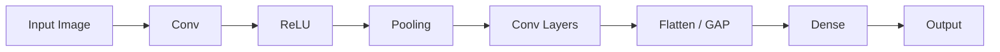

# CNN Pipeline: Preprocessing & Models

- Understand CNN concepts deeply
- Build CNN models step-by-step
- Apply CNNs in assignments using Keras

{}
Think of CNN as a pipeline:
Image → Features → Patterns → Prediction
{}

---

# 1. Image Representation

{}

X \in \mathbb{R}^{H \times W \times C}

{}

- H = Height  
- W = Width  
- C = Channels  

---

# 2. Convolution Operation

{}

Z(i,j) = \sum_{m,n} X(i+m, j+n) \cdot K(m,n)

{}

- Sliding filter extracts features  
- Produces feature maps  

---

# 3. Stride & Padding

{}

Output = \frac{N - F + 2P}{S} + 1

{}

---

# 4. Activation (ReLU)

{}

ReLU(x) = max(0, x)

{}

---

# 5. Pooling

- Max Pooling → strongest feature  
- Average Pooling → smooth  

---

# 6. Global Average Pooling

{}

y_k = \frac{1}{HW} \sum_{i,j} x_{i,j,k}

{}

---

# 7. Loss Function

{}

L = - \sum y \log(\hat{y})

{}

---

# 8. CNN Architecture



---

# 9. Training

- Forward pass  
- Loss computation  
- Backpropagation  
- Weight update  

---

# 10. Keras Implementation

## Model

```python
from tensorflow.keras.models import Sequential
from tensorflow.keras.layers import Conv2D, MaxPooling2D, Dense, Flatten

model = Sequential()

model.add(Conv2D(32, (3,3), activation='relu', input_shape=(64,64,3)))
model.add(MaxPooling2D((2,2)))

model.add(Conv2D(64, (3,3), activation='relu'))
model.add(MaxPooling2D((2,2)))

model.add(Flatten())

model.add(Dense(128, activation='relu'))
model.add(Dense(1, activation='sigmoid'))
```

---

## Compile

```python
model.compile(optimizer='adam', loss='binary_crossentropy', metrics=['accuracy'])
```

---

## Train

```python
model.fit(X_train, y_train, epochs=10, batch_size=32)
```

---

## Predict

```python
pred = model.predict(X_test)
```

---

# 11. Tips

- Normalize images  
- Use small filters  
- Avoid too many dense layers  

---

# 12. Summary

{}
CNN = Automatic feature extractor + classifier
{}

---

 | 
