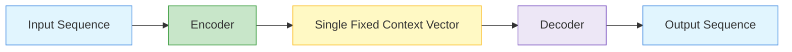
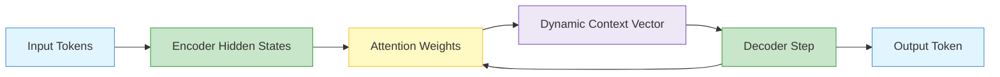
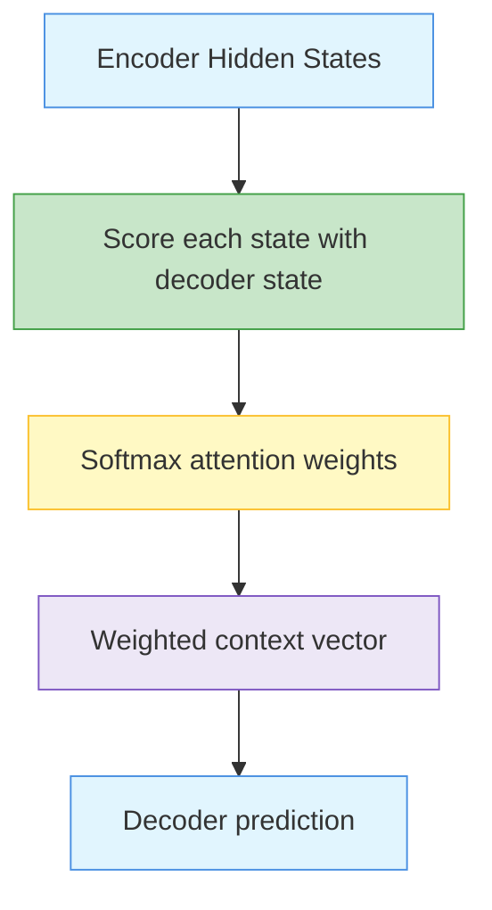

# Attention Mechanism

Attention is a deep learning mechanism that allows a model to focus on the most relevant parts of an input sequence when producing an output.

Instead of compressing the whole input into one fixed vector, attention computes a weighted combination of useful information.

{}
**Key takeaway:**  
Attention answers a simple question:

> For the current prediction, which input tokens should the model focus on most?
{}

- Queries, Keys, and Values 
- Attention Pooling by Similarity 
- Attention Pooling via Nadaraya–Watson Regression 
- Attention Scoring Functions 
- Dot Product Attention 
- Convenience Functions 
- Scaled Dot Product Attention 
- Additive Attention 
- Bahdanau Attention Mechanism 
- Multi-Head Attention 
- Self-Attention 
- Positional Encoding 

---

## Why Attention Is Needed ☆

Traditional encoder-decoder RNN models compress the full input sequence into one context vector.

This creates a bottleneck, especially for long sequences.

Problems include:

- early tokens may be forgotten
- all information must pass through a fixed-size vector
- long-range dependencies are difficult to preserve
- decoder cannot dynamically choose which input positions matter

Attention solves this by giving the decoder a different context vector at each step.

---

## Encoder-Decoder Without Attention

{}
A single context vector is like asking the model to summarise a whole paragraph into one small note and then answer every question using only that note.
{}

---

## Encoder-Decoder With Attention

Now the decoder can selectively attend to different input positions at different output steps.

---

## Query, Key, and Value Framework ☆

Attention is usually described using three objects:

| Term | Meaning | Intuition |
|---|---|---|
| Query | What the model is looking for | Current decoding need |
| Key | What each input position offers for matching | Search label |
| Value | The actual information to retrieve | Content |

A simple analogy:

- query = question
- key = index entry
- value = answer content

---

## Attention Formula ☆

For a query  q , keys  k_i , and values  v_i , attention computes a weighted sum of values.

{}

\text{Attention}(q, K, V) = \sum_{i=1}^{n} \alpha_i v_i

{}

The attention weights are usually produced using softmax.

{}

\alpha_i = \frac{\exp(\text{score}(q, k_i))}{\sum_{j=1}^{n} \exp(\text{score}(q, k_j))}

{}

Because softmax is used, attention weights behave like a probability distribution.

{}

\sum_{i=1}^{n} \alpha_i = 1

{}

---

## Scaled Dot-Product Attention ☆

In transformers, the most important attention formula is scaled dot-product attention.

{}

\text{Attention}(Q,K,V)=\text{softmax}\left(\frac{QK^T}{\sqrt{d_k}}\right)V

{}

Where:

-  Q  is the query matrix
-  K  is the key matrix
-  V  is the value matrix
-  d_k  is the key dimension

The division by  \sqrt{d_k}  prevents dot products from becoming too large.

---

## Dot Product Attention

Dot product attention uses similarity between query and key.

{}

\text{score}(q,k_i)=q^T k_i

{}

High dot product means high similarity.

Low dot product means the key is less relevant to the query.

---

## Additive Attention

Additive attention learns a scoring function using a small neural network.

{}

\text{score}(q,k_i)=v^T \tanh(W_q q + W_k k_i)

{}

This was used in early sequence-to-sequence attention models.

---

## Bahdanau Attention

Bahdanau attention is an additive attention mechanism used in encoder-decoder models.

It allows the decoder to look at all encoder hidden states instead of relying only on the final encoder state.

---

## Self-Attention ☆

Self-attention is attention applied within the same sequence.

The query, key, and value all come from the same input sequence.

This allows each token to communicate with every other token.

Example:

In the sentence:

> The animal did not cross the road because it was tired.

Self-attention helps the model connect `it` with the correct earlier word.

---

## Multi-Head Attention ☆

Multi-head attention runs attention several times in parallel.

Each head can learn a different type of relationship.

For example:

- one head may focus on nearby words
- one head may focus on subject-object relationships
- one head may focus on long-distance dependencies
- one head may focus on positional structure

{}

\text{head}_i = \text{Attention}(QW_i^Q, KW_i^K, VW_i^V)

{}

{}

\text{MultiHead}(Q,K,V)=\text{Concat}(\text{head}_1,\ldots,\text{head}_h)W^O

{}

---

## Positional Encoding ☆

Self-attention does not naturally know word order.

So position information must be added to token embeddings.

{}

PE(pos,2i)=\sin\left(\frac{pos}{10000^{2i/d_{model}}}\right)

{}

{}

PE(pos,2i+1)=\cos\left(\frac{pos}{10000^{2i/d_{model}}}\right)

{}

---

## Attention in Applications

| Application | What attention focuses on |
|---|---|
| Translation | relevant source words for each target word |
| Sentiment analysis | emotionally important words |
| Question answering | facts related to the question |
| Time series forecasting | important previous time steps |
| Vision transformer | important image patches |

---

## Common Mistakes ☆

{}
Do not confuse attention weights with model weights.

Attention weights are dynamic and depend on the current input.

Model weights are learned parameters stored in matrices such as  W^Q ,  W^K , and  W^V .
{}

Other mistakes:

- forgetting softmax in attention
- forgetting the scaling term  \sqrt{d_k} 
- confusing self-attention with cross-attention
- saying attention removes the need for embeddings
- saying positional encoding is optional in transformers

---

## Summary

| Concept | One-line meaning |
|---|---|
| Attention | weighted focus on relevant inputs |
| Query | what we are looking for |
| Key | what each input offers for matching |
| Value | actual content retrieved |
| Self-attention | tokens attend to tokens in the same sequence |
| Cross-attention | decoder attends to encoder output |
| Multi-head attention | several attention mechanisms in parallel |
| Positional encoding | adds order information to tokens |

{}
For exams, remember the flow:

**Query → compare with Keys → softmax scores → weighted sum of Values → context vector**
{}

---
  
## Reference
- **Dive into deep learning. Cambridge University Press.**. ([Ch 10](https://d2l.ai/chapter_builders-guide/model-construction.html), [Ch7](https://d2l.ai/chapter_convolutional-neural-networks/index.html)

---
 | 
