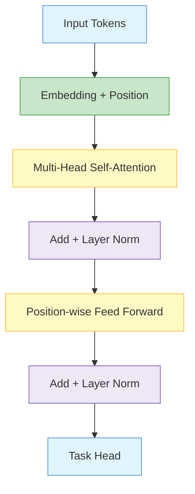
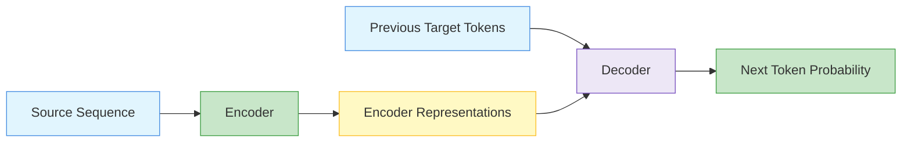
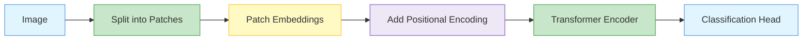

# Transformer

A transformer is a neural network architecture that uses attention as its main mechanism for processing sequences.

Unlike RNNs, transformers do not process tokens one by one.

They process many tokens in parallel and use self-attention to learn relationships between tokens.

- is an architecture of neural networks 
- based on the multi-head attention mechanism
- text is converted to numerical representations called tokens, and each token is converted into a vector via lookup from a word embedding table
- takes a text sequence as input and produces another text sequence as output

- foundation for modern **[Large Language Models (LLMs)](/docs/ai/genai/llm/)** like ChatGPT and Gemini

{}
**Key takeaway:**  
A transformer replaces recurrence with self-attention, making sequence modelling more parallel, scalable, and effective for long-range dependencies.
{}

- Transformer architecture  
- Model, Positionwise Feed-Forward Networks, Residual Connection and Layer Normalization 
- Encoder and Decoder 
- Transformer block 
- Residual view for transformer 
 
- Transformers for Vision 
- Model, Patch Embedding, Vision Transformer Encoder, Training and Evaluation 
- Large-Scale Pretraining with Transformers  
- Encoder-Only, Encoder–Decoder, Decoder-Only 
- Scalability 

---

## Why Transformers Were Needed ☆

RNNs and LSTMs process sequences step by step.

This creates three major problems:

| Problem | RNN issue | Transformer solution |
|---|---|---|
| Parallelisation | sequential processing | parallel token processing |
| Long-range dependencies | vanishing gradients | direct attention connections |
| Memory bottleneck | hidden state compression | attention over all tokens |

---

## Transformer High-Level Structure

```mermaid
flowchart LR
    A["Input Tokens"] --> B["Token Embedding"]
    B --> C["Positional Encoding"]
    C --> D["Encoder Block"]
    D --> E["Contextual Representations"]
    E --> F["Decoder or Task Head"]
    F --> G["Output"]

    style A fill:#E1F5FE,stroke:#4A90E2
    style B fill:#C8E6C9,stroke:#43A047
    style C fill:#FFF9C4,stroke:#FBC02D
    style D fill:#EDE7F6,stroke:#7E57C2
    style E fill:#C8E6C9,stroke:#43A047
    style F fill:#FFF9C4,stroke:#FBC02D
    style G fill:#E1F5FE,stroke:#4A90E2
```

---

## Three Transformer Variants ☆

| Variant | Attention type | Used for | Examples |
|---|---|---|---|
| Encoder-only | bidirectional self-attention | understanding, classification, extraction | BERT-style models |
| Decoder-only | causal masked self-attention | generation | GPT-style models |
| Encoder-decoder | encoder self-attention plus decoder cross-attention | sequence-to-sequence | translation, summarisation |

---

## Encoder-Only Transformer

Encoder-only models read the whole input and produce contextual embeddings.

Each token can attend to tokens on both sides.

Common uses:

- sentiment classification
- named entity recognition
- document classification
- text understanding

---

## Decoder-Only Transformer

Decoder-only models generate one token at a time.

They use masked self-attention so the current token cannot see future tokens.

{}
Masked attention prevents information leakage during generation.

The model must predict the next token using only previous tokens.
{}

---

## Encoder-Decoder Transformer

Encoder-decoder transformers are used when the input and output are different sequences.

Examples:

- English to French translation
- question to answer
- article to summary
- speech to text

---

## Core Transformer Block ☆

A transformer block usually contains:

1. Multi-head attention
2. Residual connection
3. Layer normalisation
4. Position-wise feed-forward network
5. Another residual connection
6. Another layer normalisation

---

## Multi-Head Attention Formula ☆

{}

\text{Attention}(Q,K,V)=\text{softmax}\left(\frac{QK^T}{\sqrt{d_k}}\right)V

{}

For each head:

{}

\text{head}_i = \text{Attention}(QW_i^Q, KW_i^K, VW_i^V)

{}

Then all heads are concatenated:

{}

\text{MHA}(Q,K,V)=\text{Concat}(\text{head}_1,\ldots,\text{head}_h)W^O

{}

---

## Positional Encoding ☆

Transformers need position information because attention alone does not know token order.

{}

X = \text{Embedding}(tokens) + PE(positions)

{}

Sinusoidal positional encoding:

{}

PE(pos,2i)=\sin\left(\frac{pos}{10000^{2i/d_{model}}}\right)

{}

{}

PE(pos,2i+1)=\cos\left(\frac{pos}{10000^{2i/d_{model}}}\right)

{}

---

## Position-wise Feed-Forward Network ☆

The feed-forward network is applied independently to each token position.

It expands the representation, applies non-linearity, then contracts it back.

{}

FFN(x)=\max(0,xW_1+b_1)W_2+b_2

{}

Typically:

- input dimension:  d_{model} 
- hidden dimension: around  4d_{model} 
- output dimension:  d_{model} 

---

## Residual Connection and Layer Normalisation ☆

Residual connections help gradients flow through deep networks.

Layer normalisation stabilises the activation scale.

{}

\text{Output} = \text{LayerNorm}(x + \text{Sublayer}(x))

{}

---

## Vision Transformer

A Vision Transformer processes an image as a sequence of patches.

Instead of using convolution filters, it learns relationships between image patches.

---

## Transformer vs RNN ☆

| Aspect | RNN / LSTM / GRU | Transformer |
|---|---|---|
| Processing | sequential | parallel |
| Memory | hidden state | attention over tokens |
| Long context | difficult | stronger direct connections |
| Training speed | slower | faster on GPUs |
| Position handling | order is natural | needs positional encoding |
| Best use | smaller sequence tasks | large-scale sequence modelling |

---

## Common Mistakes ☆

- forgetting positional encoding
- saying transformers are recurrent networks
- confusing encoder-only and decoder-only models
- forgetting masked attention in decoder-only generation
- ignoring residual connections and layer normalisation
- treating multi-head attention as multiple independent models

---

## Summary

{}
Remember the transformer pipeline:

**Token → Embedding → Positional Encoding → Attention → Add and Norm → Feed Forward → Add and Norm → Output**
{}

| Term | Meaning |
|---|---|
| Encoder | builds contextual representation of input |
| Decoder | generates output tokens autoregressively |
| Self-attention | tokens attend to tokens in the same sequence |
| Cross-attention | decoder attends to encoder output |
| Masked attention | prevents future-token leakage |
| Position-wise FFN | independent MLP applied to each token |
| Layer norm | stabilises activations |
| Residual connection | improves gradient flow |

---
  
## Reference
- **Dive into deep learning. Cambridge University Press.**. ([Ch11](https://d2l.ai/chapter_introduction/index.html)
- R4 - Ch 10.7 

---
 | 
