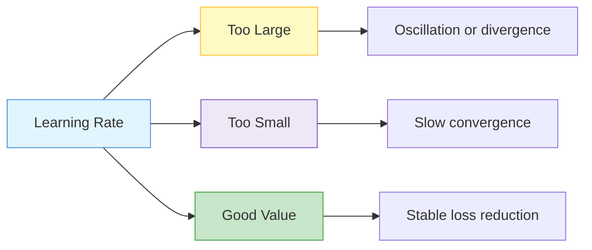
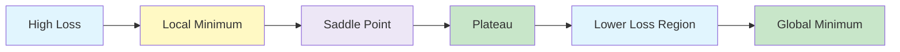
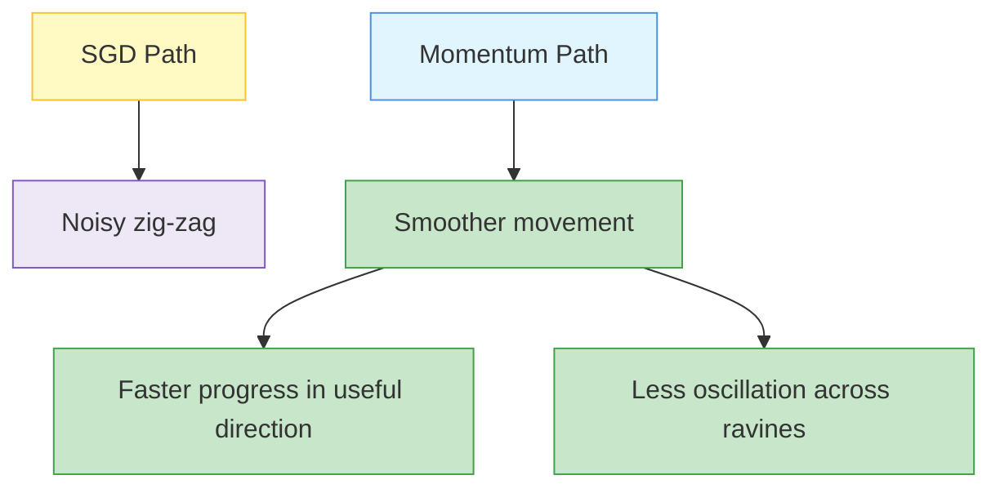

# Optimisation of Deep models

Optimizers are algorithms that update neural network parameters to reduce the loss function.

Deep networks usually have millions or billions of parameters, so there is usually no closed-form solution.

Instead, training uses iterative optimisation.

{}
**Key takeaway:**  
An optimiser decides how the model moves through the loss landscape towards lower loss.
{}

---

- Goal of Optimization 
- Optimization Challenges in Deep Learning 
- Gradient Descent 
- Stochastic Gradient Descent 
- Minibatch Stochastic Gradient Descent 
- Momentum 
- Adagrad and Algorithm 
- RMSProp and  Algorithm 
- Adadelta and  Algorithm 
- Adam and Algorithm 
- Code Implementation and comparison of algorithms  (webinar) 

---


flowchart TD
    A["Optimisers in DNN"] --> B["Gradient Descent Variants"]
    A --> C["Momentum-based Optimiser"]
    A --> D["Adaptive Methods"]
    A --> E["Learning Rate Schedules"]

    D --> D1["Parameter-specific learning rates"]

    E --> E1["Learning rate changes during training"]

    style A fill:#E1F5FE,stroke:#4A90E2,stroke-width:2px
    style B fill:#EDE7F6,stroke:#7E57C2
    style C fill:#C8E6C9,stroke:#43A047
    style D fill:#FFF9C4,stroke:#FBC02D
    style E fill:#F8BBD0,stroke:#D81B60
	

---	

## Goal of Optimisation ☆

The goal is to find parameters  \theta  that minimise the loss.

{}

\theta^* = \arg\min_{\theta} \mathcal{L}(\theta)

{}

Here:

| Symbol | Meaning |
|---|---|
|  \theta  | all model parameters |
|  \mathcal{L}(\theta)  | loss function for the current parameters |
|  \theta^*  | best parameters found by optimisation |

Deep neural networks may contain millions or billions of parameters.
Because of this, it is usually not possible to compute the best parameters directly.
Instead, we use iterative algorithms such as gradient descent, mini-batch gradient descent, momentum, RMSProp, Adam, and learning rate schedules.

Without optimisation, the network keeps random weights, produces random predictions, and does not learn useful patterns.

Without optimisation:

- weights remain random
- predictions remain random
- no learning happens

---

## Gradient Descent Core Idea

Gradient descent moves parameters in the opposite direction of the gradient.

{}

\theta_{t+1}=\theta_t-\eta \nabla_{\theta}\mathcal{L}(\theta_t)

{}

Where:

-  \eta  is the learning rate
-  \nabla_{\theta}\mathcal{L}  is the gradient of loss

---

## Gradient Descent Variants ☆

| Method | Data used per update | Updates per epoch | Memory | Behaviour |
|---|---|---:|---|---|
| Batch GD | full dataset | 1 | high | smooth but slow |
| SGD | one example | many | low | noisy but fast |
| Mini-batch GD | batch of examples | medium | medium | balanced and practical |

---

## Mini-Batch Gradient Descent ☆

Mini-batch gradient descent is the practical default for deep learning.

For mini-batch  B :

{}

\mathcal{L}_B(\theta)=\frac{1}{B}\sum_{i \in B}\ell_i(\theta)

{}

{}

g = \nabla_{\theta}\mathcal{L}_B(\theta)=\frac{1}{B}\sum_{i \in B}\nabla_{\theta}\ell_i(\theta)

{}

{}

\theta \leftarrow \theta - \eta g

{}

Common batch sizes:

- 32
- 64
- 128
- 256

---

## Learning Rate Effects ☆

| Learning rate | Behaviour | Result |
|---|---|---|
| Too large | jumps around, oscillates | may diverge |
| Too small | tiny updates | very slow learning |
| Just right | stable descent | smooth convergence |

---

## Loss Functions Review ☆

The loss function measures how wrong the model prediction is.
Different tasks use different loss functions.

| Loss Function | Formula | Gradient Form | Common Use |
|---|---|---|---|
| Mean Squared Error |  \frac{1}{2}(\hat{y} - y)^2  |  \hat{y} - y  | Regression |
| Mean Absolute Error |  \lvert \hat{y} - y \rvert  |  \operatorname{sign}(\hat{y} - y)  | Regression with outliers |
| Binary Cross-Entropy |  -[y\log(\hat{y}) + (1-y)\log(1-\hat{y})]  | similar to prediction minus target | Binary classification |
| Categorical Cross-Entropy |  -\sum_k y_k \log(\hat{y}_k)  | similar to prediction minus target | Multi-class classification |

{}
Many useful gradients have the intuitive form:

**prediction minus target**

This is one reason why backpropagation can efficiently compute updates across many layers.
{}

---

## Optimisation Challenges

Deep learning loss surfaces are difficult.

Important challenges:

| Challenge | Meaning |
|---|---|
| Local minima | point lower than nearby points but not globally best |
| Saddle point | gradient is zero, but not a minimum |
| Plateau | flat region with very small gradient |
| Non-convex landscape | many valleys, ridges, and irregular paths |
| Exploding gradient | gradient becomes extremely large |
| Vanishing gradient | gradient becomes extremely small |

Training deep networks is difficult because the loss surface can be complicated.
The optimiser may face several problems.

### Saddle Points

A saddle point is a point where the gradient is close to zero, but the point is not a true minimum.
In some directions, the loss may increase.
In other directions, the loss may decrease.

{}

\nabla \mathcal{L}(\theta) \approx 0

{}

This can make the optimiser slow down even though a better solution exists nearby.

### Plateaus

A plateau is a flat region of the loss surface.
Gradients become very small, so parameter updates become tiny.
Learning then becomes very slow.

### Non-Convex Landscapes

Deep learning loss surfaces are usually non-convex.
This means there can be many local minima and saddle points.
There is usually no guarantee that training will find the global minimum.

## How to Identify Optimisation Problems ☆

During training, optimisation issues can be detected by looking at the loss curve, validation error, and gradient norms.

Common signs include:

- The loss curve flattens but validation error is still high.
- Gradient norms approach zero.
- Training progress stagnates for many epochs.
- Loss jumps around instead of decreasing smoothly.
- Training loss decreases, but validation loss becomes worse.

{}
A flat loss curve does not always mean the model has learned well.
It may also mean that the optimiser is stuck on a plateau, near a saddle point, or using an unsuitable learning rate.
{}

---

## Momentum ☆

Momentum adds velocity to gradient descent.

It remembers previous update directions and smooths zig-zag movement.

{}

v_t = \beta v_{t-1} + g_t

{}

{}

\theta_{t+1}=\theta_t-\eta v_t

{}

Where:

-  v_t  is velocity
-  \beta  is momentum coefficient, often around 0.9
-  g_t  is current gradient

---

## Momentum Intuition

---

## Adaptive Optimisers ☆

Adaptive methods change the effective learning rate for each parameter.

They are useful when:

- gradients vary strongly across dimensions
- some parameters are sparse
- some directions are steep
- fixed learning rate causes zig-zag movement

---

## Adagrad

Adagrad accumulates squared gradients and gives smaller learning rates to frequently updated parameters.

{}

r_t = r_{t-1} + g_t \odot g_t

{}

{}

\theta_{t+1}=\theta_t-\frac{\eta}{\sqrt{r_t}+\epsilon}\odot g_t

{}

Good for sparse features, but the learning rate may shrink too much over time.

---

## RMSProp

RMSProp uses an exponentially weighted average of squared gradients.

{}

r_t = \rho r_{t-1} + (1-\rho)g_t \odot g_t

{}

{}

\theta_{t+1}=\theta_t-\frac{\eta}{\sqrt{r_t}+\epsilon}\odot g_t

{}

It avoids Adagrad's continuously shrinking learning rate problem.

---

## Adam ☆

Adam combines momentum and RMSProp-style adaptive scaling.

It tracks:

- first moment: average gradient
- second moment: average squared gradient

{}

m_t = \beta_1 m_{t-1} + (1-\beta_1)g_t

{}

{}

v_t = \beta_2 v_{t-1} + (1-\beta_2)g_t^2

{}

Bias correction:

{}

\hat{m}_t = \frac{m_t}{1-\beta_1^t}, \quad \hat{v}_t = \frac{v_t}{1-\beta_2^t}

{}

Update:

{}

\theta_{t+1}=\theta_t-\eta\frac{\hat{m}_t}{\sqrt{\hat{v}_t}+\epsilon}

{}

Common defaults:

-  \beta_1 = 0.9 
-  \beta_2 = 0.999 
-  \epsilon = 10^{-8} 

---

## Adadelta

Adadelta is an adaptive method designed to reduce sensitivity to the initial learning rate.

It uses running averages of squared gradients and squared parameter updates.

For exams, remember it as an extension of adaptive learning-rate methods.

---

## Learning Rate Schedules ☆

Learning rate schedules change the learning rate over training.

Common strategies:

| Schedule | Idea |
|---|---|
| Step decay | reduce learning rate at fixed epochs |
| Exponential decay | gradually reduce by a constant factor |
| Cosine decay | smooth reduction using cosine curve |
| Warm-up | start small, then increase early |
| Reduce on plateau | reduce when validation loss stops improving |

---

## Gradient Clipping

Gradient clipping limits very large gradients.

It is especially useful for RNNs and unstable training.

{}

g \leftarrow g \cdot \frac{c}{\|g\|} \quad \text{if } \|g\| > c

{}

---

## Choosing an Optimiser

| Situation | Good choice |
|---|---|
| Basic baseline | Mini-batch SGD |
| Noisy gradients | Momentum |
| Sparse features | Adagrad or Adam |
| General deep learning default | Adam |
| Need strong final generalisation | SGD with momentum after tuning |
| Exploding gradients | optimiser plus gradient clipping |

---

## Practical Interpretation

Optimisers decide how the model moves through the loss landscape.
A poor optimiser or a poor learning rate can make training slow, unstable, or completely unsuccessful.
A good optimiser can speed up training and make deep networks easier to train.

---

## Common Exam Mistakes ☆

- saying optimiser changes the dataset
- confusing learning rate with momentum
- forgetting mini-batch is the practical default
- assuming Adam always gives best generalisation
- not explaining why too high learning rate diverges
- forgetting that adaptive methods use parameter-wise scaling

---

## Revision / Summary

Remember these points:

- The aim of optimisation is to minimise the loss function.
- Deep networks usually need iterative optimisation because closed-form solutions are not available.
- Gradients tell the optimiser which direction increases the loss most quickly.
- Gradient descent moves in the opposite direction of the gradient.
- Saddle points, plateaus, and non-convexity make optimisation difficult.
- The choice of loss function depends on the task type.
- The choice of optimiser affects convergence speed and stability.

{}
Remember the optimiser progression:

**Gradient Descent → Mini-batch GD → Momentum → Adaptive Methods → Adam → Learning Rate Scheduling**
{}

| Optimiser | Main idea |
|---|---|
| Batch GD | full dataset update |
| SGD | one-example update |
| Mini-batch GD | balanced practical update |
| Momentum | accumulate velocity |
| Adagrad | scale by accumulated squared gradients |
| RMSProp | moving average of squared gradients |
| Adam | momentum plus adaptive scaling |
| Adadelta | adaptive method with reduced LR sensitivity |

---
  
## Reference
- **Dive into deep learning. Cambridge University Press.**. (Ch12)

---
 | 
