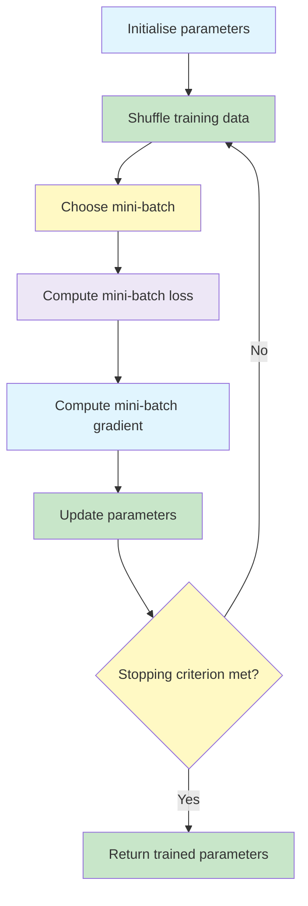
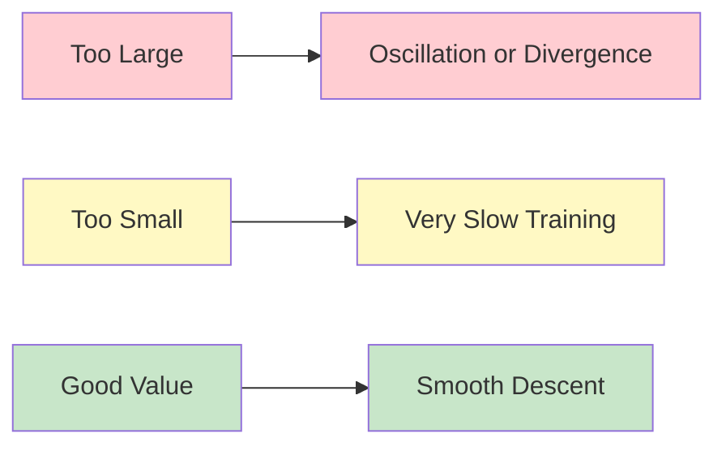

# Optimisation: Gradient Descent and Mini-Batch Gradient Descent

Gradient descent is the core optimisation idea behind neural network training.
It updates the model parameters by moving in the opposite direction of the gradient of the loss.

{}
**Key takeaway:**  
Gradient descent uses the gradient to decide how to change the parameters.
The learning rate controls how large each update step is.
{}

---


flowchart TD
    A["Gradient Descent Variants"] --> B["Batch Gradient Descent"]
    A --> C["Stochastic Gradient Descent"]
    A --> D["Mini-batch Gradient Descent"]

    B --> B1["Uses full dataset"]
    B --> B2["One update per epoch"]
    B --> B3["Smooth but slow"]

    C --> C1["Uses one example at a time"]
    C --> C2["Frequent updates"]
    C --> C3["Fast but noisy"]

    D --> D1["Uses small batches"]
    D --> D2["Efficient on hardware"]
    D --> D3["Balanced and practical"]

    style A fill:#E1F5FE,stroke:#4A90E2,stroke-width:2px
    style B fill:#EDE7F6,stroke:#7E57C2
    style C fill:#C8E6C9,stroke:#43A047
    style D fill:#FFF9C4,stroke:#FBC02D


---
	
## Gradient Descent Rule ☆

The gradient tells us the direction in which the loss increases fastest.
To reduce the loss, we move in the opposite direction.

{}

\theta_{t+1} = \theta_t - \eta \nabla \mathcal{L}(\theta_t)

{}

Where:

| Symbol | Meaning |
|---|---|
|  \theta_t  | parameters at iteration  t  |
|  \eta  | learning rate |
|  \nabla \mathcal{L}(\theta_t)  | gradient of the loss |
|  \theta_{t+1}  | updated parameters |

## One Iteration Numerical Example ☆

Consider the simple function:

{}

f(x,y) = x^2 + y^2

{}

The gradient is:

{}

\nabla f = [2x, 2y]

{}

Start at:

{}

(x_0, y_0) = (3,4), \qquad \eta = 0.1

{}

Before update:

| Quantity | Value |
|---|---|
| Position |  (3,4)  |
| Loss |  3^2 + 4^2 = 25  |
| Gradient |  [6,8]  |

Update:

{}

x_1 = 3 - 0.1(6) = 2.4

{}

{}

y_1 = 4 - 0.1(8) = 3.2

{}

New loss:

{}

f(2.4,3.2) = 2.4^2 + 3.2^2 = 16

{}

The loss decreases from  25  to  16 .
This is a  36\%  reduction in one step.

## Batch GD, SGD, and Mini-Batch GD ☆

Gradient descent can use different amounts of data per update.

| Method | Gradient Uses | Updates per Epoch | Memory | Convergence |
|---|---|---:|---|---|
| Batch Gradient Descent | all examples |  1  | high | smooth but slow |
| Stochastic Gradient Descent | one example |  N  | low | noisy but fast |
| Mini-Batch Gradient Descent | small batch |  N/B  | medium | balanced |

For a dataset with  N = 10000  samples and batch size  B = 32 :

| Method | Updates per Epoch |
|---|---:|
| Batch GD |  1  |
| SGD |  10000  |
| Mini-batch GD |  10000 / 32 \approx 313  |

{}
Mini-batch gradient descent is the common practical choice for deep learning.
It balances GPU efficiency, convergence stability, and update frequency.
{}

## Mini-Batch Gradient Descent Algorithm ☆

For a mini-batch  \mathcal{B}  of size  B , the mini-batch loss is:

{}

\mathcal{L}(\theta) = \frac{1}{B}\sum_{i \in \mathcal{B}} \mathcal{L}_i(\theta)

{}

The gradient is:

{}

g = \nabla_\theta \mathcal{L}(\theta) = \frac{1}{B}\sum_{i \in \mathcal{B}} \nabla \mathcal{L}_i(\theta)

{}

The parameter update is:

{}

\theta \leftarrow \theta - \eta g

{}

## Toy Problem for Optimisation Examples ☆

A useful toy loss function is:

{}

\mathcal{L}(w_1,w_2) = w_1^2 + 4w_2^2

{}

The gradient is:

{}

\nabla \mathcal{L} = [2w_1, 8w_2]

{}

This creates an elongated bowl.
The  w_2  direction is four times steeper than the  w_1  direction.
This causes ordinary gradient descent to move too aggressively in the steep direction and more slowly in the flatter direction.

## Mini-Batch GD Numerical Example ☆

Problem setup:

{}

\mathcal{L}(w_1,w_2) = w_1^2 + 4w_2^2, \qquad (w_1,w_2) = (4,2), \qquad \eta = 0.1

{}

| Iteration | Loss | Gradient  [\nabla_{w_1}, \nabla_{w_2}]  | New  w_1  | New  w_2  |
|---:|---:|---:|---:|---:|
| 0 | 32.00 |  [8,16]  |  3.20  |  0.40  |
| 1 | 10.88 |  [6.4,3.2]  |  2.56  |  0.08  |
| 2 | 6.58 |  [5.1,0.64]  |  2.05  |  0.016  |
| 3 | 4.21 |  [4.1,0.13]  |  1.64  |  0.003  |

Observation:

The loss decreases:

{}

32 \rightarrow 10.88 \rightarrow 6.58 \rightarrow 4.21

{}

However,  w_2  moves much more aggressively than  w_1  because its gradient is steeper.
This shows why adaptive methods and momentum can help.

## Learning Rate Effects ☆

The learning rate controls step size.

| Learning Rate | Behaviour |
|---|---|
| Too large | oscillation, unstable updates, possible divergence |
| Too small | very slow progress, may take too long to train |
| Just right | smooth and fast convergence |

{}
A high learning rate can make the loss jump around.
A very low learning rate may look stable, but training may be too slow to be useful.
{}

## Why Adaptive Techniques Are Needed ☆

A fixed learning rate applies the same step size to every parameter.
This can be inefficient because:

- different parameters may need different step sizes;
- some directions in the loss landscape are steeper than others;
- sparse features may need larger updates;
- dense features may need smaller, more careful updates;
- elongated contours can cause zigzag movement.

## Exam Notes ☆

Remember these points:

- Gradient descent moves opposite to the gradient.
- The learning rate controls the update size.
- Mini-batch GD is commonly used in deep learning.
- Batch GD is smooth but computationally heavy.
- SGD is noisy but gives many updates.
- Mini-batch GD is a practical compromise.
- A learning rate that is too large can cause divergence.
- A learning rate that is too small can make training very slow.
- Steep directions can cause unbalanced updates.

---
 | 
