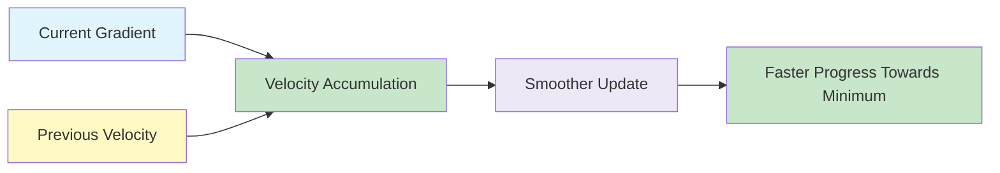
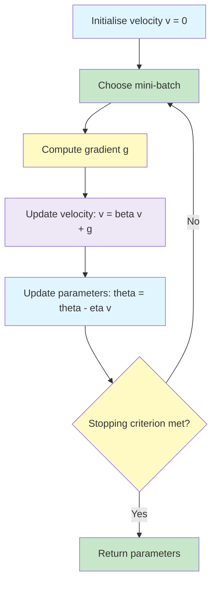

# Optimisation: Momentum Methods

Momentum improves gradient descent by adding a memory of previous update directions.
Instead of using only the current gradient, the optimiser accumulates velocity across iterations.

{}
**Key takeaway:**  
Momentum helps the optimiser move faster in consistent directions and reduces zigzag movement in directions where gradients oscillate.
{}

---


flowchart TD
    A["Momentum-based Optimiser"] --> B["SGD with Momentum"]

    B --> B1["Adds velocity term"]
    B --> B2["Accumulates past gradients"]
    B --> B3["Reduces zig-zag movement"]
    B --> B4["Speeds up movement in useful direction"]
    B --> B5["Helps through shallow regions"]

    B1 --> C1["Current update depends on previous update"]
    B2 --> C2["Builds inertia"]
    B3 --> C3["Smoother path to minimum"]

    style A fill:#C8E6C9,stroke:#43A047,stroke-width:2px
    style B fill:#E1F5FE,stroke:#4A90E2
    style B1 fill:#EDE7F6,stroke:#7E57C2
    style B2 fill:#FFF9C4,stroke:#FBC02D
    style B3 fill:#F8BBD0,stroke:#D81B60
    style B4 fill:#EDE7F6,stroke:#7E57C2
    style B5 fill:#FFF9C4,stroke:#FBC02D


---	
	
## Physical Intuition ☆

Momentum is often explained using the analogy of a ball rolling down a hill.

- The ball gains speed when it keeps moving in the same direction.
- Small bumps do not stop it immediately.
- Oscillations are dampened in directions where movement keeps changing.
- The optimiser can sometimes move through shallow local minima more effectively.

## Momentum Formula ☆

The velocity update is:

{}

v_t = \beta v_{t-1} + \nabla \mathcal{L}(\theta_t)

{}

The parameter update is:

{}

\theta_{t+1} = \theta_t - \eta v_t

{}

Where:

| Symbol | Meaning |
|---|---|
|  v_t  | velocity at iteration  t  |
|  \beta  | momentum coefficient |
|  \eta  | learning rate |
|  \nabla \mathcal{L}(\theta_t)  | current gradient |

A common value is:

{}

\beta = 0.9

{}

This means that around  90\%  of the previous velocity is retained.

## Why Momentum Helps ☆

Vanilla SGD can zigzag in narrow valleys because the gradient direction changes sharply from one step to the next.
Momentum smooths these updates.

| Problem in Vanilla SGD | How Momentum Helps |
|---|---|
| Zigzag movement | smooths oscillations |
| Slow progress in consistent direction | accumulates speed |
| Shallow local minima | may roll through small bumps |
| No memory of previous updates | stores velocity vector |

{}
Momentum is especially useful when gradients point consistently in one useful direction but oscillate in another direction.
It accelerates the useful direction and dampens the noisy direction.
{}

## SGD with Momentum Algorithm ☆

For each mini-batch  \mathcal{B} :

{}

g = \frac{1}{B}\sum_{i \in \mathcal{B}} \nabla \mathcal{L}_i(\theta)

{}

Then:

{}

v \leftarrow \beta v + g

{}

{}

\theta \leftarrow \theta - \eta v

{}

## Momentum Numerical Example ☆

Use the same toy problem:

{}

\mathcal{L}(w_1,w_2) = w_1^2 + 4w_2^2

{}

Start at:

{}

(w_1,w_2) = (4,2), \qquad \eta = 0.05, \qquad \beta = 0.9

{}

The learning rate is reduced compared with vanilla gradient descent because momentum amplifies the step direction.

| Iteration | Loss | Gradient  [\nabla_{w_1}, \nabla_{w_2}]  | Velocity  [v_1,v_2]  |  w_1  |  w_2  |
|---:|---:|---:|---:|---:|---:|
| 0 | 32.00 |  [8,16]  |  [8,16]  |  3.60  |  1.20  |
| 1 | 18.72 |  [7.2,9.6]  |  [14.4,24]  |  2.88  |  0.00  |
| 2 | 8.29 |  [5.76,0]  |  [18.7,21.6]  |  1.94  |  -1.08  |
| 3 | 8.43 |  [3.88,-8.64]  |  [20.7,10.8]  |  0.91  |  -1.62  |

The values show that the method can still oscillate, especially in the steep  w_2  direction.
However, momentum changes the behaviour of training by accumulating movement across steps.

{}
Momentum often needs a smaller learning rate than vanilla gradient descent because it amplifies steps using accumulated velocity.
{}

## Momentum vs Vanilla SGD ☆

| Feature | Vanilla SGD | SGD with Momentum |
|---|---|---|
| Uses current gradient | yes | yes |
| Uses previous update direction | no | yes |
| Extra memory required | no | velocity vector |
| Handles zigzag movement | weaker | better |
| Typical use | simple baseline | general deep learning and production systems |

## Practical Guidelines ☆

Use momentum when:

- training with SGD is too noisy;
- the loss decreases slowly;
- updates zigzag in narrow valleys;
- the model is a deep neural network;
- you want a stronger baseline than vanilla SGD.

A typical setting is:

{}

\beta = 0.9

{}

The learning rate should still be tuned carefully.
Momentum does not remove the need for learning rate selection.

## Exam Notes ☆

Remember these points:

- Momentum adds memory to SGD.
- The velocity stores accumulated gradients.
- The gradient is added to velocity, not directly to parameters.
- A common value is  \beta = 0.9 .
- Momentum can speed up convergence.
- Momentum can smooth oscillations in ravines.
- Momentum may require a smaller learning rate.
- Additional memory is needed to store a velocity vector of the same size as the parameters.

---
 | 
