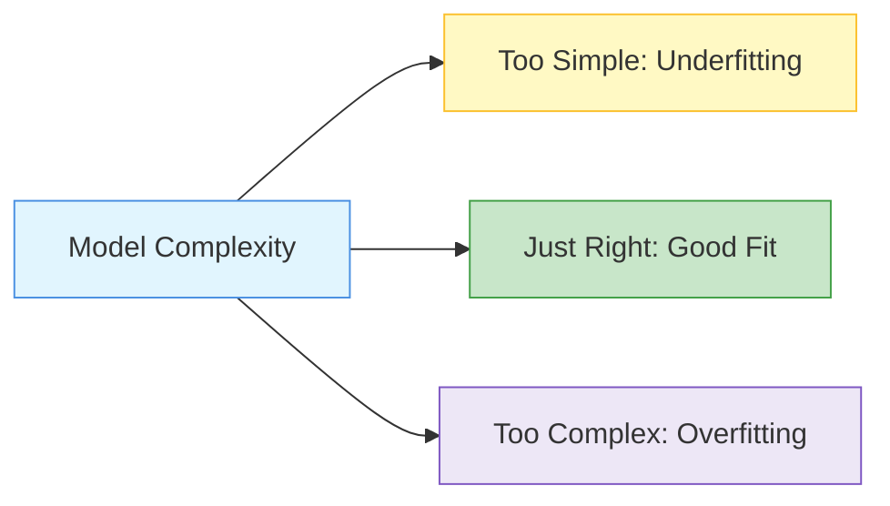
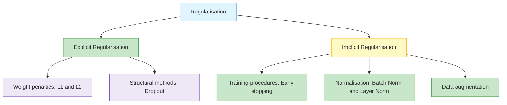
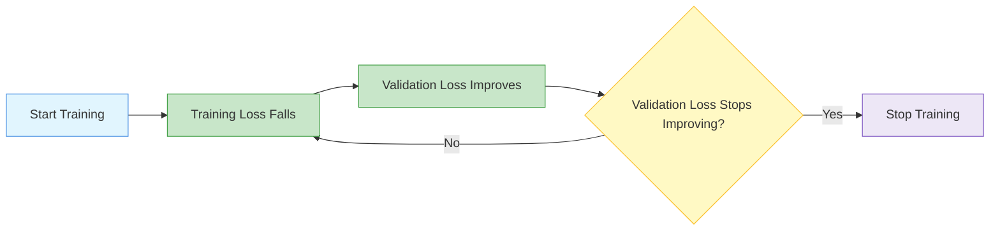

# Regularisation for Deep models

Regularisation means adding constraints or techniques that prevent a model from becoming too complex and memorising the training data.

The goal is not only low training error.

The goal is good performance on unseen data.

{}
**Key takeaway:**  
Regularisation helps the model generalise by controlling complexity, stabilising training, and reducing overfitting.
{}

- Generalization for regression  
- Training Error and Generalization Error 
- Underfitting or Overfitting 
- Model Selection 
- Weight Decay and Norms 
- Generalization in Classification 
- Environment and Distribution Shift 
- Generalization in Deep Learning 
- Dropout 
- Batch Normalization  
- Layer Normalization  

---

## Underfitting, Good Fit, and Overfitting ☆

| Case | Model behaviour | Training error | Test error |
|---|---|---|---|
| Underfitting | too simple | high | high |
| Good fit | captures useful pattern | low | low |
| Overfitting | memorises training noise | very low | high |

---

## Training Error and Generalisation Error ☆

Training error measures performance on data used for learning.

Generalisation error measures expected performance on unseen data.

A model can have excellent training performance and poor test performance.

That is overfitting.

---

## Regularisation Taxonomy

---

## L2 Regularisation / Weight Decay ☆

L2 regularisation penalises large weights.

{}

J_{regularised}(\theta)=J(\theta)+\lambda \|\theta\|_2^2

{}

This encourages smoother models with smaller weights.

Weight decay is closely related to L2 regularisation in gradient-based optimisation.

---

## L1 Regularisation

L1 regularisation encourages sparse weights.

{}

J_{regularised}(\theta)=J(\theta)+\lambda \|\theta\|_1

{}

It can push some weights towards zero.

---

## Dropout ☆

Dropout randomly disables some neurons during training.

This prevents the model from relying too heavily on any single neuron or feature.

{}
Dropout does not usually remove neurons because they are bad.

It randomly drops units during training to make the network more robust.
{}

---

## Dropout Intuition

---

## Dropout Formula

During training, a binary mask is sampled.

{}

\tilde{h}=m \odot h

{}

Where:

-  h  is the activation
-  m  is a random mask
-  \odot  means element-wise multiplication

---

## Batch Normalisation ☆

Batch normalisation normalises activations using mini-batch statistics.

It helps stabilise training and often allows faster convergence.

{}

\mu_B = \frac{1}{m}\sum_{i=1}^{m}x_i

{}

{}

\sigma_B^2 = \frac{1}{m}\sum_{i=1}^{m}(x_i-\mu_B)^2

{}

{}

\hat{x}_i = \frac{x_i-\mu_B}{\sqrt{\sigma_B^2+\epsilon}}

{}

{}

y_i=\gamma \hat{x}_i+\beta

{}

---

## Layer Normalisation ☆

Layer normalisation normalises across features within each example.

It is commonly used in transformers.

Batch normalisation depends on batch statistics.

Layer normalisation is more suitable for sequence models where batch statistics may be less stable.

---

## Early Stopping

Early stopping monitors validation performance and stops training when validation error no longer improves.

It prevents the model from continuing to memorise the training set.

---

## Data Augmentation

Data augmentation creates modified versions of training examples.

In computer vision, this may include:

- rotation
- cropping
- flipping
- brightness changes
- zooming

It helps the model learn robust patterns instead of memorising exact images.

---

## Vanishing Gradient Problem ☆

Vanishing gradient means gradients become extremely small in earlier layers.

This makes early layers learn very slowly.

{}

\frac{\partial L}{\partial W^{(1)}} = \frac{\partial L}{\partial h^{(L)}} \prod_{l=2}^{L} \frac{\partial h^{(l)}}{\partial h^{(l-1)}} \frac{\partial h^{(1)}}{\partial W^{(1)}}

{}

If many factors in the product are less than one, the gradient becomes very small.

Common in:

- deep networks with sigmoid or tanh
- long RNN sequences
- poor weight initialisation

---

## Exploding Gradient Problem ☆

Exploding gradient means gradients become extremely large.

Symptoms:

- loss becomes NaN or infinity
- huge weight updates
- unstable training curves

Solutions:

- gradient clipping
- better initialisation
- normalisation
- residual connections

---

## Weight Initialisation ☆

Good weight initialisation helps avoid vanishing or exploding gradients.

Bad initialisation can:

- break learning
- make neurons compute identical functions
- slow convergence
- cause saturation

---

## Xavier / Glorot Initialisation

Xavier initialisation keeps activation variance and gradient variance more stable across layers.

It is commonly used for sigmoid or tanh-style activations.

{}

W \sim U\left(-\sqrt{\frac{6}{n_{in}+n_{out}}}, \sqrt{\frac{6}{n_{in}+n_{out}}}\right)

{}

---

## He Initialisation

He initialisation is commonly used with ReLU and Leaky ReLU.

{}

W \sim N\left(0, \frac{2}{n_{in}}\right)

{}

---

## When to Apply Regularisation ☆

| Situation | Useful technique |
|---|---|
| Small dataset | data augmentation, L2, dropout |
| Deep network | batch norm, residual connections, dropout |
| Transformer | layer norm, dropout, weight decay |
| RNN / sequence model | recurrent dropout, gradient clipping |
| Overfitting | dropout, early stopping, L2 |
| Training instability | normalisation, better initialisation, gradient clipping |

---

## Common Mistakes ☆

- saying regularisation always improves training accuracy
- confusing training error and test error
- saying dropout permanently deletes neurons
- forgetting dropout behaves differently during training and inference
- using batch norm and layer norm interchangeably without context
- ignoring weight initialisation in deep networks

---

## Revision / Summary

{}
Regularisation is about finding the right balance:

**enough model capacity to learn patterns, but enough constraint to avoid memorisation.**
{}

| Technique | Main purpose |
|---|---|
| L1 | sparsity |
| L2 / weight decay | smaller weights |
| Dropout | reduce co-adaptation |
| Batch norm | stabilise mini-batch activations |
| Layer norm | stabilise per-example feature activations |
| Early stopping | stop before overfitting worsens |
| Data augmentation | increase effective data variety |
| Gradient clipping | prevent exploding gradients |
| Xavier / He initialisation | support stable gradient flow |

---
  
## Reference
- **Dive into deep learning. Cambridge University Press.**. ([T1 – Ch 3.6, 3.7, T1 - Ch 4.6, 4.7, T1 - Ch 5.5, 5.6, T1 - Ch 8.5, T1 - Ch 11.7](https://d2l.ai/chapter_introduction/index.html)

---
 | 
