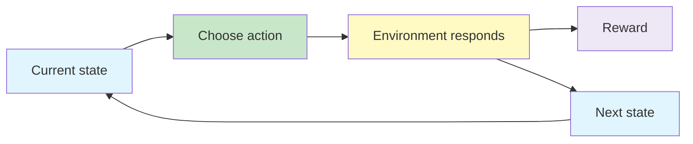

# Markov Decision Process Framework

A **Markov Decision Process (MDP)** is a mathematical framework for modelling sequential decisions. It describes the situations an agent may encounter, the actions it may take, how the environment may change, and the rewards produced by those changes.

Bandit problems ask which action is best in a single recurring situation. An MDP adds changing states: an action affects not only the immediate reward but also the situation faced next.

{}**An MDP turns agent-environment interaction into a precise model of states, actions, transitions and rewards.**{}

---

## From Bandits to Sequential Decisions ☆

### Non-Associative Bandit

A basic multi-armed bandit has one recurring decision context. Choosing an action produces a reward, but it does not move the agent through a sequence of different states.

### Sequential Decision Problem

In a sequential problem:

- the agent can occupy different states;
- the useful action depends on the current state;
- an action influences the next state;
- present choices can affect future rewards.

{}
A simple way to distinguish the two settings is this: a bandit learns **which action is best**, while an MDP learns **which action is best in each state while considering what follows**.
{}

---

## Agent-Environment Interface ☆

The **agent** is the learner and decision-maker. Everything outside the agent is considered part of the **environment**.

At discrete time step  t :

1. the agent observes state  S_t ;
2. it selects action  A_t ;
3. the environment produces reward  R_{t+1} ;
4. the environment moves to state  S_{t+1} .

The interaction repeats, producing a trajectory:

{}

S_0, A_0, R_1, S_1, A_1, R_2, S_2, \ldots

{}

The boundary between agent and environment marks the limit of the agent's direct control. It does not necessarily mark the limit of its knowledge.

---

## The Markov Property ☆

The defining idea behind an MDP is the **Markov property**:

{}**Given the present state, the future is independent of the past.**{}

The current state must contain all information needed to predict the next state and reward after an action. The agent should not need the complete history of earlier states and actions.

### Chess Intuition

Suppose a skilled chess player joins a game already in progress. If the current board position contains all relevant information, the player can choose the next move without being told the full sequence of moves that produced it.

The current board is therefore a suitable Markov state.

### Formal Statement

{}

\Pr(S_{t+1},R_{t+1}\mid S_t,A_t,S_{t-1},A_{t-1},\ldots)
=
\Pr(S_{t+1},R_{t+1}\mid S_t,A_t)

{}

{}
The physical world may be Markovian while the agent's observation is not. If important information is omitted from the state representation, the same observed state may lead to different outcomes depending on hidden history.
{}

---

## Components of a Finite MDP ☆

A finite MDP is commonly described using:

| Component | Meaning |
|---|---|
|  \mathcal{S}  | Finite set of states |
|  \mathcal{A}  | Set of actions |
|  p(s',r\mid s,a)  | Probability of the next state and reward |
| Reward mechanism | Numerical feedback defining the goal |
| Start state or distribution | Where interaction begins |
| Terminal state, when applicable | Where an episode ends |

Some problems allow different actions in different states, written as  \mathcal{A}(s) .

---

## Model Dynamics ☆

The dynamics describe how the environment responds when action  a  is taken in state  s .

### Joint Transition and Reward Probability

{}

p(s',r\mid s,a)
\doteq
\Pr\left(S_{t+1}=s',R_{t+1}=r\mid S_t=s,A_t=a\right)

{}

This distribution gives the probability of receiving reward  r  and arriving in state  s'  after taking action  a  in state  s .

### State-Transition Probability

If only the next-state probability is required, sum over all possible rewards:

{}

p(s'\mid s,a)
=
\sum_{r\in\mathcal{R}} p(s',r\mid s,a)

{}

### Expected Reward for a State-Action Pair

{}

r(s,a)
=
\mathbb{E}[R_{t+1}\mid S_t=s,A_t=a]

{}

### Expected Reward for a Transition

When the next state is also specified:

{}

r(s,a,s')
=
\mathbb{E}[R_{t+1}\mid S_t=s,A_t=a,S_{t+1}=s']

{}

This quantity distinguishes transitions that begin with the same state and action but arrive in different next states.

The transition model may be deterministic or stochastic:

- **deterministic:** a state-action pair always produces the same next state;
- **stochastic:** several next states are possible, each with a probability.

---

## Gridworld Example ☆

Consider an agent moving through a grid:

- each accessible cell is a state;
- actions are north, south, east and west;
- a wall blocks movement through a cell;
- movement is noisy rather than perfectly deterministic;
- terminal cells may produce positive or negative rewards;
- each ordinary step may carry a small cost.

For example, an intended north action may move:

- north with probability  0.8 ;
- west with probability  0.1 ;
- east with probability  0.1 .

If the sampled direction is blocked by a wall, the agent remains in the same cell.

This is a sequential decision problem because the chosen movement changes the state from which the next decision must be made.

---

## Formulating Real Problems as MDPs ☆

The first modelling task is to identify the states, actions, rewards and transition dynamics. These choices should contain enough information for useful decision-making without making the representation unnecessarily large.

### Video Game

| MDP element | Possible formulation |
|---|---|
| State | Raw image pixels or processed visual features |
| Action | Game controls |
| Reward | Change in game score |
| Dynamics | Rules and stochastic evolution of the game |

### Traffic Signal Control

| MDP element | Possible formulation |
|---|---|
| State | Current lights, approaching vehicles, waiting times, stopped vehicles and speeds |
| Action | Signal assignment or phase change |
| Reward | Reduction in traffic delay |
| Dynamics | Changing and uncertain traffic demand |

### Recycling Robot

A recycling robot searches for cans while managing a rechargeable battery.

| MDP element | Possible formulation |
|---|---|
| State | Battery level: high or low |
| Actions at high charge | Search or wait |
| Actions at low charge | Search, wait or recharge |
| Reward | Reward for collecting cans, with searching more productive than waiting |
| Dynamics | Probabilities of charge remaining high, becoming low, or requiring rescue/recharge |

The actions available can depend on the state. Recharge, for example, may only be meaningful when the battery is low.

---

## State Design Matters

A useful state representation should:

- contain the information needed to choose an action;
- preserve the Markov property as far as practical;
- distinguish situations requiring different behaviour;
- avoid irrelevant detail that makes learning unnecessarily difficult.

For a robot avoiding a pit, sensor readings describing the ground ahead may be state information. The decision to move forward, turn or stop belongs to the action space.

{}
A practical test is to ask: if two observations look identical to the agent, should the same action have the same likely consequences? If not, important state information may be missing.
{}

---

## Model-Based and Model-Free Perspective

The transition and reward rules collectively form a **model of the environment**.

| Approach | Use of environment model |
|---|---|
| Model-based | Uses known or learned dynamics to plan |
| Model-free | Learns values or policies directly from interaction |

An MDP describes the decision problem whether or not the learning algorithm is explicitly given the model.

---

## Common Mistakes ☆

{}
- Treating actions as states or sensor readings as actions.
- Assuming every action leads deterministically to one next state.
- Including too little information in the state to satisfy the Markov property.
- Confusing a contextual bandit with an MDP: in an MDP, actions influence future states and rewards.
- Assuming the agent-environment boundary must coincide with a physical boundary.
{}

---

## Practice Questions

1. Why is a basic multi-armed bandit described as non-associative?
2. Explain the Markov property using a chess or navigation example.
3. Distinguish  p(s',r\mid s,a)  from  p(s'\mid s,a) .
4. Formulate states, actions and rewards for a lift-control system.
5. Why can a poor state representation make an apparently Markov problem non-Markov from the agent's perspective?

---

## Key Takeaways ☆

{}
- An MDP models sequential interaction using states, actions, transition probabilities and rewards.
- The Markov property requires the present state to contain the information needed for predicting what follows.
- Actions affect both immediate rewards and future states.
- MDP formulation begins by carefully choosing the state, action, reward and dynamics representations.
- Gridworld, video games, traffic control and recycling robots can all be expressed using the same abstract framework.
{}

---

## Checklist

- [ ] I can distinguish a bandit problem from an MDP.
- [ ] I can explain the agent-environment interface.
- [ ] I can state and interpret the Markov property.
- [ ] I can interpret  p(s',r\mid s,a) .
- [ ] I can identify states, actions, rewards and dynamics in a new problem.
- [ ] I can explain why state representation affects whether the Markov property holds.

---

## References

1. Sutton and Barto, *Reinforcement Learning: An Introduction*, Chapter 3.
2. Supplied Deep Reinforcement Learning slides and recordings on Markov Decision Processes and associative tasks.

---
 | 
