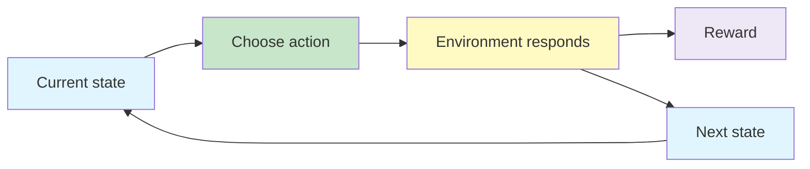

# Markov Decision Processes

A **Markov Decision Process (MDP)** is the mathematical framework used to describe sequential decision-making in reinforcement learning. It brings together the **agent**, **environment**, **states**, **actions**, **transition dynamics**, **rewards**, **returns**, **policies**, and **value functions** in one model.

A basic bandit asks which action is best in a recurring situation. An MDP goes further: the action taken now can change the **next state**, which changes the decisions and rewards that become possible later.

Once the MDP itself is defined, the next questions are: **What is the agent trying to achieve? How should rewards over time be counted? How good is a state or action? How do we evaluate a policy, and what does optimal behaviour mean?**

{}**An MDP models states, actions, transitions and rewards; returns, policies and value functions tell us how good behaviour is over time.**{}

{}
**Reward = immediate feedback. Return = accumulated future reward. Value = expected return.**
{}

- Markov Decision Processes
- Modelling Agent-Environment interaction using MDP; Examples 
- Discussion on Goals , Rewards & Returns; Policy and Value Functions 
- Bellman Equation for value functions 
- Optimal Policy and Optimal Value functions 

---

## From Bandits to Sequential Decisions ☆

### Non-Associative Bandit

A basic multi-armed bandit has one recurring decision context. Choosing an action produces a reward, but it does not move the agent through a sequence of different states.

### Sequential Decision Problem

In a sequential problem:

- the agent can occupy different states;
- the useful action depends on the current state;
- an action influences the next state;
- present choices can affect future rewards.

{}
A simple way to distinguish the two settings is this: a bandit learns **which action is best**, while an MDP learns **which action is best in each state while considering what follows**.
{}

---

---

## Agent-Environment Interface ☆

The **agent** is the learner and decision-maker. Everything outside the agent is considered part of the **environment**.

At discrete time step  t :

1. the agent observes state  S_t ;
2. it selects action  A_t ;
3. the environment produces reward  R_{t+1} ;
4. the environment moves to state  S_{t+1} .

The interaction repeats, producing a trajectory:

{}

S_0, A_0, R_1, S_1, A_1, R_2, S_2, \ldots

{}

The boundary between agent and environment marks the limit of the agent's direct control. It does not necessarily mark the limit of its knowledge.

---

---

## The Markov Property ☆

The defining idea behind an MDP is the **Markov property**:

{}**Given the present state, the future is independent of the past.**{}

The current state must contain all information needed to predict the next state and reward after an action. The agent should not need the complete history of earlier states and actions.

### Chess Intuition

Suppose a skilled chess player joins a game already in progress. If the current board position contains all relevant information, the player can choose the next move without being told the full sequence of moves that produced it.

The current board is therefore a suitable Markov state.

### Formal Statement

{}

\Pr(S_{t+1},R_{t+1}\mid S_t,A_t,S_{t-1},A_{t-1},\ldots)
=
\Pr(S_{t+1},R_{t+1}\mid S_t,A_t)

{}

{}
The physical world may be Markovian while the agent's observation is not. If important information is omitted from the state representation, the same observed state may lead to different outcomes depending on hidden history.
{}

---

---

## Components of a Finite MDP ☆

A finite MDP is commonly described using:

| Component | Meaning |
|---|---|
|  \mathcal{S}  | Finite set of states |
|  \mathcal{A}  | Set of actions |
|  p(s',r\mid s,a)  | Probability of the next state and reward |
| Reward mechanism | Numerical feedback defining the goal |
| Start state or distribution | Where interaction begins |
| Terminal state, when applicable | Where an episode ends |

Some problems allow different actions in different states, written as  \mathcal{A}(s) .

---

---

## Model Dynamics ☆

The dynamics describe how the environment responds when action  a  is taken in state  s .

### Joint Transition and Reward Probability

{}

p(s',r\mid s,a)
\doteq
\Pr\left(S_{t+1}=s',R_{t+1}=r\mid S_t=s,A_t=a\right)

{}

This distribution gives the probability of receiving reward  r  and arriving in state  s'  after taking action  a  in state  s .

### State-Transition Probability

If only the next-state probability is required, sum over all possible rewards:

{}

p(s'\mid s,a)
=
\sum_{r\in\mathcal{R}} p(s',r\mid s,a)

{}

### Expected Reward for a State-Action Pair

{}

r(s,a)
=
\mathbb{E}[R_{t+1}\mid S_t=s,A_t=a]

{}

### Expected Reward for a Transition

When the next state is also specified:

{}

r(s,a,s')
=
\mathbb{E}[R_{t+1}\mid S_t=s,A_t=a,S_{t+1}=s']

{}

This quantity distinguishes transitions that begin with the same state and action but arrive in different next states.

The transition model may be deterministic or stochastic:

- **deterministic:** a state-action pair always produces the same next state;
- **stochastic:** several next states are possible, each with a probability.

---

---

## Gridworld Example ☆

Consider an agent moving through a grid:

- each accessible cell is a state;
- actions are north, south, east and west;
- a wall blocks movement through a cell;
- movement is noisy rather than perfectly deterministic;
- terminal cells may produce positive or negative rewards;
- each ordinary step may carry a small cost.

For example, an intended north action may move:

- north with probability  0.8 ;
- west with probability  0.1 ;
- east with probability  0.1 .

If the sampled direction is blocked by a wall, the agent remains in the same cell.

This is a sequential decision problem because the chosen movement changes the state from which the next decision must be made.

---

---

## Formulating Real Problems as MDPs ☆

The first modelling task is to identify the states, actions, rewards and transition dynamics. These choices should contain enough information for useful decision-making without making the representation unnecessarily large.

### Video Game

| MDP element | Possible formulation |
|---|---|
| State | Raw image pixels or processed visual features |
| Action | Game controls |
| Reward | Change in game score |
| Dynamics | Rules and stochastic evolution of the game |

### Traffic Signal Control

| MDP element | Possible formulation |
|---|---|
| State | Current lights, approaching vehicles, waiting times, stopped vehicles and speeds |
| Action | Signal assignment or phase change |
| Reward | Reduction in traffic delay |
| Dynamics | Changing and uncertain traffic demand |

### Recycling Robot

A recycling robot searches for cans while managing a rechargeable battery.

| MDP element | Possible formulation |
|---|---|
| State | Battery level: high or low |
| Actions at high charge | Search or wait |
| Actions at low charge | Search, wait or recharge |
| Reward | Reward for collecting cans, with searching more productive than waiting |
| Dynamics | Probabilities of charge remaining high, becoming low, or requiring rescue/recharge |

The actions available can depend on the state. Recharge, for example, may only be meaningful when the battery is low.

---

---

## State Design Matters

A useful state representation should:

- contain the information needed to choose an action;
- preserve the Markov property as far as practical;
- distinguish situations requiring different behaviour;
- avoid irrelevant detail that makes learning unnecessarily difficult.

For a robot avoiding a pit, sensor readings describing the ground ahead may be state information. The decision to move forward, turn or stop belongs to the action space.

{}
A practical test is to ask: if two observations look identical to the agent, should the same action have the same likely consequences? If not, important state information may be missing.
{}

---

---

## Model-Based and Model-Free Perspective

The transition and reward rules collectively form a **model of the environment**.

| Approach | Use of environment model |
|---|---|
| Model-based | Uses known or learned dynamics to plan |
| Model-free | Learns values or policies directly from interaction |

An MDP describes the decision problem whether or not the learning algorithm is explicitly given the model.

---

---

## Goals and Rewards ☆

The **reward hypothesis** proposes that a goal can be expressed as maximising the expected cumulative value of a scalar reward signal.

The agent does not directly understand ideas such as winning a game, cleaning a room or driving safely. It learns to prefer behaviour that produces greater return.

### Specify What, Not How

A reward should represent what is to be achieved without prescribing every step of the solution. If the complete action sequence is already programmed, there is little left for the agent to learn.

{}
The reward defines the destination. Learning discovers the route.
{}

### Reward Design Failures

A poorly designed reward may be maximised in an unintended way.

| Intended goal | Poor reward | Possible unintended behaviour |
|---|---|---|
| Win at chess | Reward every captured piece | Capture pieces while falling into a losing trap |
| Clean a room | Reward every unit of dirt collected | Deposit dirt and collect it repeatedly |
| Reach a destination efficiently | Reward only arrival | Reach the goal using an unnecessarily long route |

A better design may combine positive rewards for accomplishing the goal with penalties for unsafe, wasteful or manipulative behaviour.

{}
An RL agent follows the incentives encoded in the reward, not the designer's unstated intention. Reward design is therefore part of modelling the problem, not a cosmetic implementation detail.
{}

---

---

## Reward versus Return ☆

The reward  R_{t+1}  is the immediate feedback received after action  A_t .

The **return**  G_t  combines rewards that arrive from time  t+1  onwards.

| Quantity | Meaning |
|---|---|
|  R_{t+1}  | Immediate reward after the current action |
|  G_t  | Total future reward from the current time |
|  V_\pi(s)  | Expected return from state  s  under policy  \pi  |

An agent aims to maximise expected return rather than a single immediate reward.

---

---

## Episodic Tasks ☆

An **episodic task** naturally divides interaction into episodes. Each episode ends at a terminal time  T .

Examples include:

- a game ending in a win, loss or draw;
- a trip through a maze;
- an attempt to balance a pole until it falls.

For an undiscounted episodic task:

{}

G_t
=
R_{t+1}+R_{t+2}+\cdots+R_T

{}

A new episode begins after the terminal state is reached.

---

---

## Continuing Tasks and Discounted Return ☆

A **continuing task** has no natural terminal state. If a positive reward is received forever, simply adding all future rewards may produce an infinite return.

The solution is to discount rewards that lie further in the future:

{}

G_t
=
R_{t+1}
+\gamma R_{t+2}
+\gamma^2 R_{t+3}
+\cdots
=
\sum_{k=0}^{\infty}\gamma^k R_{t+k+1}

{}

The discount rate satisfies:

{}

0 \leq \gamma \leq 1

{}

### Meaning of the Discount Rate

| Value of  \gamma  | Behaviour |
|---|---|
|  0  | Only the immediate reward matters |
| Close to  0  | Strong preference for near-term rewards |
| Close to  1  | Distant rewards remain important |
|  1  | Future rewards are not discounted; may be unsuitable for continuing tasks |

The discount rate can represent time preference and also keep infinite-horizon returns finite.

### Constant Reward Example ☆

If the agent receives reward  +1  forever and  \gamma=0.95 :

{}

G_t
=
1+0.95+0.95^2+\cdots
=
\frac{1}{1-0.95}
=
20

{}

---

---

## Recursive Form of Return ☆

The discounted return can be separated into the immediate reward and the remaining return:

{}

G_t
=
R_{t+1}+\gamma G_{t+1}

{}

This one-step recursive relationship is fundamental. It allows long-term quantities to be expressed using the immediate reward and the value of what follows.

{}
The Bellman equations are built from the same pattern: **current reward plus discounted future value**.
{}

---

---

## Cart-Pole as Episodic or Continuing

The cart-pole task applies forces to a moving cart so that a hinged pole remains upright.

### Episodic Formulation

- reward  +1  for every time step the pole remains balanced;
- the episode ends when the pole falls or a boundary is crossed;
- greater return means balancing for longer.

### Continuing Formulation

- the task does not terminate after failure;
- failure may produce a large negative reward;
- the system is reset and interaction continues;
- discounting controls the influence of the unending future.

The physical system may be identical, but the return and terminal-state design change the learning problem.

---

---

## Policy ☆

A **policy** maps states to probabilities of selecting actions.

{}

\pi(a\mid s)
=
\Pr(A_t=a\mid S_t=s)

{}

A deterministic policy selects one action in each state. A stochastic policy assigns a probability distribution over the available actions.

The purpose of learning is to improve the policy using experience.

---

---

## State-Value Function ☆

The state-value function under policy  \pi  is the expected return when the agent starts in state  s  and then follows  \pi .

{}

v_\pi(s)
\doteq
\mathbb{E}_\pi[G_t\mid S_t=s]

{}

It answers:

> How good is it to be in this state while following this policy?

---

---

## Action-Value Function ☆

The action-value function under policy  \pi  is the expected return after taking action  a  in state  s  and then following  \pi .

{}

q_\pi(s,a)
\doteq
\mathbb{E}_\pi[G_t\mid S_t=s,A_t=a]

{}

It answers:

> How good is this action in this state while following this policy afterwards?

---

---

## Relationship Between State and Action Values ☆

The value of a state is the policy-weighted average of its action values:

{}

v_\pi(s)
=
\sum_a \pi(a\mid s)q_\pi(s,a)

{}

If the transition model is known, an action value can be expressed using next-state values:

{}

q_\pi(s,a)
=
\sum_{s',r}
p(s',r\mid s,a)
\left[r+\gamma v_\pi(s')\right]

{}

| Function | Conditions on the present | Main question |
|---|---|---|
|  v_\pi(s)  | State is fixed | How good is this state? |
|  q_\pi(s,a)  | State and first action are fixed | How good is this action here? |

---

---

## Bellman Expectation Equation ☆

The Bellman equation decomposes a state's value into:

1. the expected immediate reward;
2. the discounted value of the expected next state.

{}

v_\pi(s)
=
\sum_a \pi(a\mid s)
\sum_{s',r}p(s',r\mid s,a)
\left[r+\gamma v_\pi(s')\right]

{}

The equation is an expectation over:

- actions chosen by the policy;
- next states and rewards produced by the environment.

{}
The Bellman equation does not merely add rewards. It links the value of one state to the values of possible successor states.
{}

---

---

## Gridworld Interpretation

Suppose a gridworld uses an equiprobable random policy with four actions. Each action is selected with probability  1/4 .

For any state  s , its value is the average of the four one-step outcomes:

{}

v_\pi(s)
=
\frac{1}{4}
\sum_{a\in\{\uparrow,\downarrow,\leftarrow,\rightarrow\}}
\left[r(s,a)+\gamma v_\pi(s')\right]

{}

An action that attempts to leave the grid may keep the agent in the same state and produce a negative reward. A special state may instead send the agent to another cell with a larger positive reward.

Repeated Bellman updates propagate this information through the grid.

---

---

## Comparing Policies ☆

A policy  \pi  is at least as good as policy  \pi'  if:

{}

v_\pi(s)\geq v_{\pi'}(s)
\qquad \text{for every } s\in\mathcal{S}

{}

An **optimal policy**, denoted  \pi_* , is at least as good as every other policy. More than one optimal policy may exist.

---

---

## Optimal Value Functions ☆

The optimal state-value function gives the greatest achievable expected return from each state:

{}

v_*(s)
=
\max_\pi v_\pi(s)

{}

The optimal action-value function gives the greatest achievable expected return after taking an action in a state:

{}

q_*(s,a)
=
\max_\pi q_\pi(s,a)

{}

If  q_*(s,a)  is known, an optimal policy can choose an action that maximises it.

---

---

## Bellman Optimality Equations ☆

The optimal value of a state uses the best available action rather than averaging actions according to a fixed policy:

{}

v_*(s)
=
\max_a
\sum_{s',r}p(s',r\mid s,a)
\left[r+\gamma v_*(s')\right]

{}

For action values:

{}

q_*(s,a)
=
\sum_{s',r}p(s',r\mid s,a)
\left[r+\gamma\max_{a'}q_*(s',a')\right]

{}

### Expectation versus Optimality

| Equation | Action selection |
|---|---|
| Bellman expectation equation | Averages actions using  \pi(a\mid s)  |
| Bellman optimality equation | Selects the maximum-valued action |

{}
Do not replace an expectation with a maximum unless the objective is optimal control. Policy evaluation asks how good a given policy is; optimality asks how good the best possible behaviour can be.
{}

---

---

## Common Mistakes ☆

{}

- Treating actions as states or sensor readings as actions.
- Assuming every action leads deterministically to one next state.
- Including too little information in the state to satisfy the Markov property.
- Confusing a contextual bandit with an MDP: in an MDP, actions influence future states and rewards.
- Assuming the agent-environment boundary must coincide with a physical boundary.

- Treating immediate reward as the same quantity as return or value.
- Assuming  \gamma=0  removes all rewards; it retains the immediate reward.
- Using  \gamma=1  in an infinite continuing task without checking whether the return remains finite.
- Confusing  v_\pi(s)  with  q_\pi(s,a) .
- Using a maximum in the Bellman expectation equation for a fixed stochastic policy.
- Assuming an apparently reasonable reward cannot be exploited in an unintended way.

{}

---

## Practice Questions

1. Why is a basic multi-armed bandit described as non-associative?

2. Explain the Markov property using a chess or navigation example.

3. Distinguish  p(s',r\mid s,a)  from  p(s'\mid s,a) .

4. Formulate states, actions and rewards for a lift-control system.

5. Why can a poor state representation make an apparently Markov problem non-Markov from the agent's perspective? ---

6. Explain why maximising immediate reward can produce poor long-term behaviour.

7. Calculate the infinite discounted return for reward  +2  and  \gamma=0.8 .

8. What changes when  \gamma  is set to zero?

9. Compare episodic and continuing formulations of cart-pole.

10. Explain the difference between  v_\pi(s)  and  q_\pi(s,a) .

11. Why does the Bellman expectation equation average over actions while the Bellman optimality equation uses a maximum?

12. Give an example of reward hacking and propose a better reward design. ---

---

## Key Takeaways ☆

{}

- An MDP models sequential interaction using states, actions, transition probabilities and rewards.
- The Markov property requires the present state to contain the information needed for predicting what follows.
- Actions affect both immediate rewards and future states.
- MDP formulation begins by carefully choosing the state, action, reward and dynamics representations.
- Gridworld, video games, traffic control and recycling robots can all be expressed using the same abstract framework.

- Rewards specify the agent's objective, so their design must reflect the intended behaviour.
- Return combines future rewards; discounting controls how strongly distant rewards matter.
- A policy maps states to action probabilities.
- State values and action values measure expected return under a policy.
- Bellman equations express long-term value recursively as immediate reward plus discounted future value.
- Optimality equations replace policy-weighted action averages with the best available action.

{}

---

## Checklist

- [ ] I can distinguish a bandit problem from an MDP.

- [ ] I can explain the agent-environment interface.

- [ ] I can state and interpret the Markov property.

- [ ] I can interpret  p(s',r\mid s,a) .

- [ ] I can identify states, actions, rewards and dynamics in a new problem.

- [ ] I can explain why state representation affects whether the Markov property holds.

- [ ] I can distinguish reward, return and value.

- [ ] I can calculate episodic and discounted returns.

- [ ] I can interpret the discount rate.

- [ ] I can define a policy and distinguish deterministic from stochastic policies.

- [ ] I can explain state-value and action-value functions.

- [ ] I can interpret every term in the Bellman expectation equation.

- [ ] I can distinguish Bellman expectation and Bellman optimality equations.

- [ ] I can explain why reward design can produce unintended behaviour.

---

## References

1. Sutton and Barto, *Reinforcement Learning: An Introduction*, Chapter 3.

2. Supplied Deep Reinforcement Learning slides and recordings on Markov Decision Processes, associative tasks, rewards, returns, policies, value functions and Bellman equations.

---

 | 
