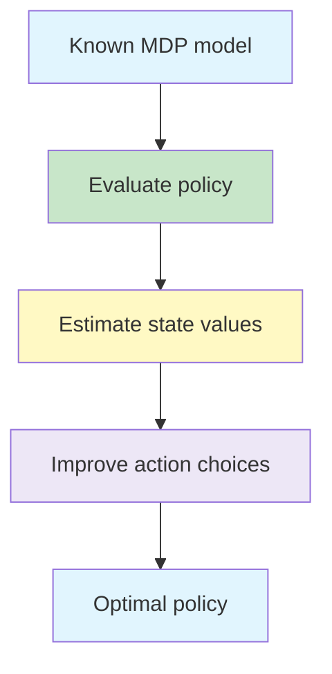
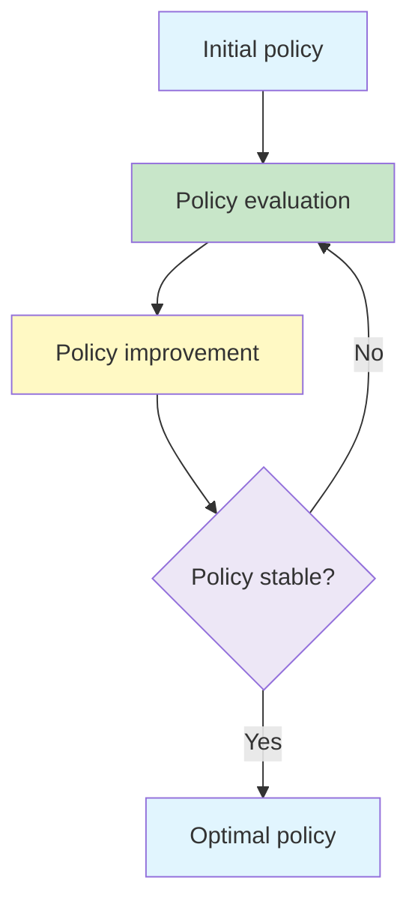

# Dynamic Programming

Dynamic Programming (DP) solves a reinforcement learning problem by repeatedly applying Bellman equations. It uses a complete model of the environment to calculate value functions and improve a policy.

{}**Dynamic Programming turns a known model of an MDP into a policy for choosing actions.**{}

- Dynamic Programming 
- Policy Iteration  
- Value Iteration  
- Generalized policy iteration 
- Efficiency of Dynamic Programming

---

## 1. When Dynamic Programming Can Be Used ☆

DP assumes that the environment dynamics are known. For every state and action, the agent needs the probabilities of possible next states and rewards:

{}

p(s',r\mid s,a)

{}

The state and action spaces must also be small enough for the required calculations to be practical.

| Requirement | Why it is needed |
|---|---|
| Known transition and reward model | DP calculates expectations over possible outcomes |
| Finite or manageable state space | Values must be stored and repeatedly updated |
| Finite action space | Candidate actions must be compared |

{}
A route planner with a complete map and known travel costs can plan before travelling. This is the basic DP setting: the model is already available, so learning through trial and error is unnecessary.
{}

---

## 2. Prediction and Control ☆

Dynamic Programming addresses two related tasks:

- **Prediction:** calculate the value function for a given policy.
- **Control:** find a policy that maximises expected return.

Prediction is performed by **policy evaluation**. Control combines evaluation with **policy improvement**.



---

## 3. Iterative Policy Evaluation ☆

Policy evaluation calculates  v_\pi(s) , the expected return from state  s  while following policy  \pi .

The Bellman expectation equation is used as an update rule:

{}

v_{k+1}(s)
=
\sum_a \pi(a\mid s)
\sum_{s',r} p(s',r\mid s,a)
\left[r+\gamma v_k(s')\right]

{}

The current estimates  v_k  are used to produce improved estimates  v_{k+1} . Repeated sweeps continue until the change becomes sufficiently small.

A common stopping test is:

{}

\Delta
=
\max_s \left|v_{k+1}(s)-v_k(s)\right|
< \theta

{}

Here,  \theta  is a small tolerance chosen by the designer.

### Intuition

Each state asks its possible successors:

> What immediate reward might I receive, and what are those next states currently worth?

The answer is averaged according to the policy and the environment probabilities.

---

## 4. Policy Improvement ☆

After evaluating a policy, the agent checks whether another action would produce a higher expected return.

For each state, calculate the one-step look-ahead value:

{}

q_\pi(s,a)
=
\sum_{s',r}p(s',r\mid s,a)
\left[r+\gamma v_\pi(s')\right]

{}

The improved policy selects an action that maximises this quantity:

{}

\pi'(s)
=
\arg\max_a
\sum_{s',r}p(s',r\mid s,a)
\left[r+\gamma v_\pi(s')\right]

{}

The **policy improvement theorem** guarantees that the greedy policy  \pi'  is at least as good as  \pi .

---

## 5. Policy Iteration ☆

Policy iteration repeatedly alternates between:

1. **Policy evaluation:** calculate the values under the current policy.
2. **Policy improvement:** make the policy greedy with respect to those values.



### Policy Iteration Algorithm

```text
Initialise a policy pi and state values V

Repeat:
    Evaluate pi until its values are sufficiently accurate

    Assume the policy is stable
    For every state s:
        remember the old action
        choose the action that maximises expected return
        if the action changes, mark the policy unstable

Until the policy is stable
```

Once no action changes, the policy is optimal for the finite MDP.

---

## 6. Value Iteration ☆

Policy evaluation does not always need to converge fully before the policy is improved. Value iteration combines a truncated evaluation step with immediate greedy improvement.

Its update is the Bellman optimality backup:

{}

v_{k+1}(s)
=
\max_a
\sum_{s',r}p(s',r\mid s,a)
\left[r+\gamma v_k(s')\right]

{}

After the values converge, extract the policy:

{}

\pi_*(s)
=
\arg\max_a
\sum_{s',r}p(s',r\mid s,a)
\left[r+\gamma v_*(s')\right]

{}

### Value Iteration Algorithm

```text
Initialise V(s) arbitrarily for all non-terminal states

Repeat:
    delta = 0
    For every state s:
        old_value = V(s)
        V(s) = maximum expected one-step return over all actions
        delta = max(delta, abs(old_value - V(s)))

Until delta is smaller than theta

Choose a greedy action in every state
```

---

## 7. Policy Iteration versus Value Iteration ☆

| Feature | Policy Iteration | Value Iteration |
|---|---|---|
| Main cycle | Evaluate policy, then improve it | Apply optimality backups directly |
| Evaluation | Usually several sweeps | One truncated sweep per improvement |
| Policy | Explicit throughout | Commonly extracted after value convergence |
| Number of iterations | Often fewer | Often more |
| Work per iteration | Usually greater | Usually smaller |
| Final result | Optimal values and policy | Optimal values and policy |

Both methods are forms of **Generalised Policy Iteration**.

---

## 8. Generalised Policy Iteration ☆

Generalised Policy Iteration (GPI) describes the interaction of two processes:

- value estimation moves the value function towards consistency with the policy;
- policy improvement moves the policy towards greediness with respect to the value function.

These processes do not have to finish one at a time. They can operate at different speeds and still reinforce one another.

{}
Evaluation makes the values agree with the policy. Improvement makes the policy agree with the values. Their interaction drives both towards optimality.
{}

---

## 9. Synchronous and Asynchronous Updates

### Synchronous Updates

A complete sweep updates every state once using values from the preceding sweep.

### Asynchronous Updates

States may instead be updated in a different order or at different frequencies. Convergence is still possible provided all relevant states continue to be updated appropriately.

Prioritising states whose values have changed significantly can reduce unnecessary work.

---

## 10. Worked One-Step Example ☆

Suppose state  s  offers two deterministic actions:

| Action | Immediate reward | Next-state value |
|---|---:|---:|
| Left | 2 | 4 |
| Right | 1 | 8 |

Let  \gamma=0.9 .

For Left:

{}

2+0.9(4)=5.6

{}

For Right:

{}

1+0.9(8)=8.2

{}

The greedy improvement selects Right. Its immediate reward is smaller, but its discounted future value is larger.

---

## 11. Limitations of Dynamic Programming ☆

Dynamic Programming provides important theoretical foundations, but it has practical limitations:

- it requires the transition and reward model;
- full sweeps become expensive in large state spaces;
- tabular storage is infeasible in continuous state spaces;
- evaluating every action is difficult when the action space is continuous;
- changes to the environment may require values to be recomputed.

These limitations motivate methods that learn from sampled experience, including Monte Carlo and Temporal-Difference learning.

---

## Common Mistakes ☆

{}
- Dynamic Programming does not normally discover an unknown transition model through interaction; it assumes the model is available.
- Policy evaluation estimates values for a fixed policy. Policy improvement changes the policy.
- The maximum in value iteration is taken over actions, while the environment outcomes are still averaged using their probabilities.
- A high immediate reward does not necessarily imply the best action when future values differ.
- Value iteration and policy iteration use different update schedules but seek the same optimal solution.
{}

---

## Practice Questions

1. Why does Dynamic Programming require a model of the environment?
2. Distinguish prediction from control.
3. Explain the two stages of policy iteration.
4. Compare policy iteration with value iteration.
5. What does the threshold  \theta  control?
6. Why is the maximum taken over actions but not over next-state outcomes?
7. Explain Generalised Policy Iteration in your own words.

---

## Key Takeaways ☆

{}
- Dynamic Programming solves a known finite MDP using Bellman backups.
- Policy evaluation calculates values for a fixed policy.
- Policy improvement makes the policy greedy with respect to those values.
- Policy iteration alternates full evaluation and improvement.
- Value iteration combines evaluation and improvement in one optimality update.
- Both methods are instances of Generalised Policy Iteration.
{}

---

## Checklist

- [ ] I can explain why Dynamic Programming needs an environment model.
- [ ] I can apply an iterative policy-evaluation update.
- [ ] I can distinguish policy iteration from value iteration.
- [ ] I can explain Generalised Policy Iteration.
- [ ] I can identify the practical limitations of tabular Dynamic Programming.

---

## References

1. Sutton and Barto, *Reinforcement Learning: An Introduction*, Chapter 4.
2. Supplied material on Dynamic Programming, policy iteration, value iteration and the race-car and gridworld examples.

---
 | 
