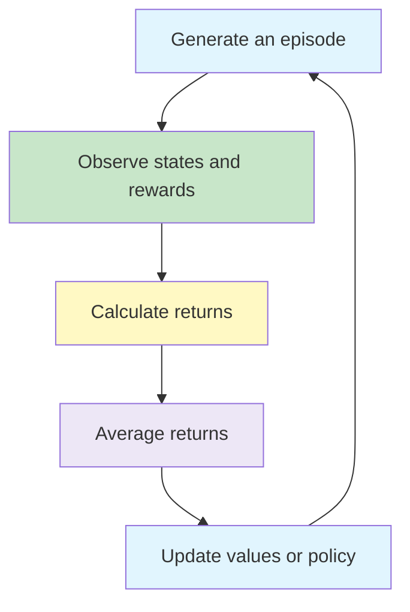
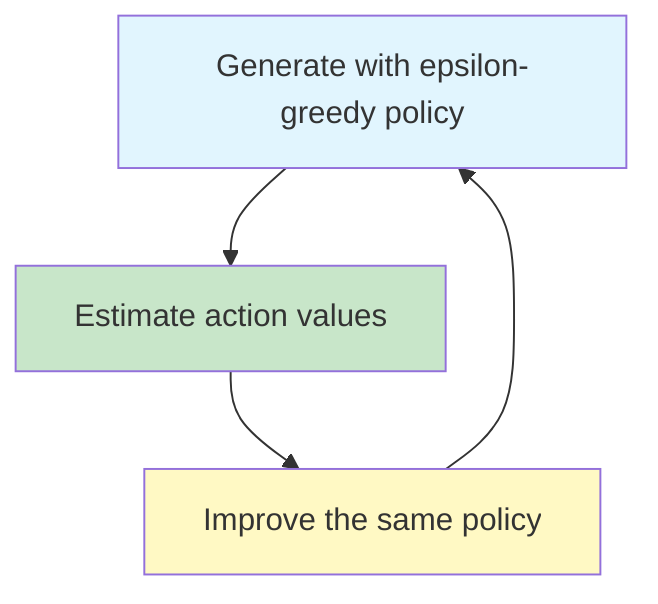

# Monte Carlo Methods

Monte Carlo (MC) methods learn value functions and policies by averaging returns observed in complete episodes. Unlike Dynamic Programming, they do not require transition probabilities or a complete model of the environment.

{}**Monte Carlo learning replaces model-based expectation with averages from sampled experience.**{}

---

## 1. The Main Idea ☆

Suppose the agent repeatedly reaches a state  s . Each time, it records the return received from that point until the episode ends. The average of these returns estimates the state's value.

{}

v_\pi(s)
=
\mathbb{E}_\pi[G_t\mid S_t=s]

{}

The expectation is not calculated from a transition model. It is estimated from experience:

{}

V(s)
\approx
\frac{1}{N(s)}
\sum_{i=1}^{N(s)}G_i(s)

{}

Here,  G_i(s)  is an observed return following a visit to state  s .



---

## 2. Why Complete Episodes Are Required ☆

The return from time  t  is:

{}

G_t
=
R_{t+1}+\gamma R_{t+2}+\gamma^2R_{t+3}+\cdots

{}

Monte Carlo learning uses the actual return rather than an estimated next-state value. The complete future reward sequence must therefore be known before the update can be performed.

This makes standard MC methods most natural for episodic tasks such as:

- completing a game;
- reaching the end of a maze;
- finishing a delivery route;
- terminating a simulation run.

{}
Monte Carlo methods normally cannot update a state value immediately after one transition. They must wait until the episode has supplied the remaining rewards.
{}

---

## 3. First-Visit Monte Carlo Prediction ☆

First-visit MC uses only the return following the **first occurrence** of a state in each episode.

Suppose an episode is:

```text
A -> B -> A -> terminal
```

For state A, first-visit MC uses the return following the first A and ignores the second A for that episode.

### Algorithm

```text
Initialise V(s) and an empty return record for every state

Repeat for each episode:
    Generate a complete episode using policy pi
    For every state s appearing in the episode:
        find its first occurrence
        calculate the return G from that occurrence
        add G to the return record for s
        set V(s) to the average recorded return
```

As the number of episodes increases, the average converges towards  v_\pi(s)  under the usual assumptions.

---

## 4. Every-Visit Monte Carlo Prediction ☆

Every-visit MC uses the return following **every occurrence** of the state.

For the episode:

```text
A -> B -> A -> terminal
```

two returns are recorded for A: one from its first occurrence and another from its second occurrence.

| Method | Samples used from one episode |
|---|---|
| First-visit MC | First occurrence of each state |
| Every-visit MC | Every occurrence of each state |

Both methods converge to the same value with sufficient experience, although their finite-sample estimates can differ.

---

## 5. Worked Prediction Example ☆

Let  \gamma=1  and consider:

```text
S1 --(+2)--> S2 --(+3)--> S1 --(+5)--> terminal
```

The returns following the two visits to S1 are:

{}

G_{\text{first }S1}=2+3+5=10

{}

{}

G_{\text{second }S1}=5

{}

Therefore:

- first-visit estimate from this episode:  10 ;
- every-visit estimate from this episode:  (10+5)/2=7.5 .

The methods differ because the state appears twice. Over many episodes, both estimate its expected return.

---

## 6. Incremental Monte Carlo Update ☆

Storing every return is unnecessary. A value can be updated incrementally:

{}

V(S_t)
\leftarrow
V(S_t)
+
\alpha\left[G_t-V(S_t)\right]

{}

Using  \alpha=1/N(S_t)  gives the ordinary sample average. A constant step size gives more influence to recent experience, which can help in a changing environment.

The term:

{}

G_t-V(S_t)

{}

is the difference between the observed return and the current prediction.

---

## 7. Monte Carlo Action Values ☆

When the environment model is unknown, improving a policy from state values alone is difficult because the agent cannot calculate the consequences of each action in advance.

Monte Carlo control therefore estimates action values:

{}

q_\pi(s,a)
=
\mathbb{E}_\pi[G_t\mid S_t=s,A_t=a]

{}

Each state-action pair is evaluated from the returns observed after that pair occurs.

---

## 8. Exploration and Exploring Starts ☆

If a policy always selects its current greedy action, some alternatives may never be tried. Their values cannot then be estimated accurately.

**Exploring starts** assumes that every state-action pair has a non-zero probability of being selected as the starting pair of an episode. This supports sufficient exploration but may be unrealistic when the starting state cannot be freely controlled.

A more practical approach is an  \varepsilon -soft policy.

---

## 9. Epsilon-Soft and Epsilon-Greedy Policies ☆

An  \varepsilon -soft policy assigns non-zero probability to every available action.

For  m  actions, an  \varepsilon -greedy policy assigns:

{}

\pi(a\mid s)
=
\begin{cases}
1-\varepsilon+\dfrac{\varepsilon}{m},
& a\in\arg\max_b Q(s,b)\\[6pt]
\dfrac{\varepsilon}{m},
& \text{otherwise}
\end{cases}

{}

This policy mainly exploits the highest estimated action value while continuing to explore.

---

## 10. On-Policy Monte Carlo Control ☆

On-policy control evaluates and improves the same policy that generates the episodes.



### Simplified Algorithm

```text
Initialise Q(s,a) and an epsilon-soft policy

Repeat:
    Generate a complete episode using the current policy
    Calculate the return for each selected state-action pair
    Update Q(s,a) from the observed return
    Make the policy epsilon-greedy with respect to Q
```

This is Generalised Policy Iteration using sampled returns instead of a known environment model.

---

## 11. On-Policy and Off-Policy Learning ☆

| Approach | Behaviour policy | Target policy |
|---|---|---|
| On-policy | Generates experience | Same policy is evaluated or improved |
| Off-policy | Generates experience | A different policy is evaluated or improved |

The **behaviour policy**  b  determines which actions generate the data. The **target policy**  \pi  is the policy whose values are being learned.

Off-policy learning is useful when:

- experience comes from an exploratory policy;
- past data is reused after the policy changes;
- demonstrations or another agent produced the data;
- the target policy is greedy while behaviour remains exploratory.

---

## 12. Importance Sampling ☆

Returns generated under  b  may not have the distribution expected under  \pi . Importance sampling corrects this mismatch using a likelihood ratio.

For a trajectory segment from  t  to  T-1 :

{}

\rho_{t:T-1}
=
\prod_{k=t}^{T-1}
\frac{\pi(A_k\mid S_k)}{b(A_k\mid S_k)}

{}

The environment transition probabilities cancel because both policies experience the same environment. Only action-selection probabilities appear in the ratio.

{}
Importance sampling requires **coverage**: whenever the target policy can select an action, the behaviour policy must also assign that action non-zero probability.
{}

---

## 13. Ordinary and Weighted Importance Sampling ☆

Suppose  n  relevant returns have ratios  \rho_i  and values  G_i .

### Ordinary Importance Sampling

{}

V_{\text{ordinary}}(s)
=
\frac{1}{n}
\sum_{i=1}^{n}\rho_iG_i

{}

It is unbiased, but its variance can be very high.

### Weighted Importance Sampling

{}

V_{\text{weighted}}(s)
=
\frac{\sum_{i=1}^{n}\rho_iG_i}
{\sum_{i=1}^{n}\rho_i}

{}

It generally has lower variance but is biased for finite samples. The bias approaches zero with sufficient data under suitable conditions.

| Property | Ordinary | Weighted |
|---|---|---|
| Normalisation | Divide by number of samples | Divide by sum of ratios |
| Bias | Unbiased | Initially biased |
| Variance | Can be very high | Usually lower |
| Sensitivity to large ratios | High | Reduced by normalisation |

---

## 14. Importance-Sampling Example ☆

Assume the behaviour and target policies assign the following probabilities to the actions in a two-step trajectory:

| Step | Target probability | Behaviour probability |
|---|---:|---:|
| 1 | 0.8 | 0.4 |
| 2 | 0.2 | 0.5 |

The importance-sampling ratio is:

{}

\rho
=
\frac{0.8}{0.4}
\times
\frac{0.2}{0.5}
=
0.8

{}

If the return is  G=10 , its ordinary weighted contribution is:

{}

\rho G=0.8(10)=8

{}

If the behaviour policy assigns zero probability to an action that the target policy may take, the ratio cannot provide a valid correction. This is why coverage is essential.

---

## 15. Monte Carlo versus Dynamic Programming ☆

| Feature | Dynamic Programming | Monte Carlo |
|---|---|---|
| Environment model | Required | Not required |
| Source of update target | Expected model outcomes | Sampled complete return |
| Complete episode required | No | Yes |
| Bootstrapping | Yes | No |
| State coverage | Sweeps across the state space | Updates visited states |
| Suitability | Small known MDP | Episodic sampled experience |

Monte Carlo can focus computation on states that actually occur, but its estimates may have high variance because complete sampled returns can vary substantially.

---

## 16. Link to Temporal-Difference Learning

Monte Carlo waits for the complete return:

{}

\text{MC target}=G_t

{}

Temporal-Difference learning instead uses the immediate reward and an estimate of the next state:

{}

\text{TD target}=R_{t+1}+\gamma V(S_{t+1})

{}

This allows TD methods to update before the episode finishes, but introduces bootstrapping.

---

## Common Mistakes ☆

{}
- Monte Carlo methods learn from sampled episodes; they are not the same as repeatedly applying a known transition model.
- First-visit means the first occurrence within each episode, not the first occurrence across the entire experiment.
- On-policy and off-policy describe the relationship between the behaviour and target policies, not whether learning happens online or offline.
- An epsilon-greedy policy gives every action some probability, including the greedy action's share of random exploration.
- Importance-sampling ratios multiply action-probability ratios across the relevant trajectory segment.
{}

---

## Practice Questions

1. Why must standard Monte Carlo methods wait until an episode ends?
2. Distinguish first-visit and every-visit prediction.
3. Why are action values useful when the transition model is unknown?
4. What problem is solved by an epsilon-soft policy?
5. Distinguish behaviour and target policies.
6. Calculate an importance-sampling ratio for a two-step trajectory.
7. Compare ordinary and weighted importance sampling.
8. Explain how Monte Carlo learning differs from Dynamic Programming.

---

## Key Takeaways ☆

{}
- Monte Carlo methods learn from complete sampled returns without requiring an environment model.
- First-visit and every-visit methods differ in which occurrences they use from an episode.
- On-policy control evaluates and improves the policy that generates experience.
- Off-policy learning separates the behaviour policy from the target policy.
- Importance sampling corrects for differences between those policies.
- Monte Carlo methods do not bootstrap, but their sampled returns can have high variance.
{}

---

## Checklist

- [ ] I can calculate a return from a complete episode.
- [ ] I can distinguish first-visit from every-visit prediction.
- [ ] I can explain how epsilon-soft policies support exploration.
- [ ] I can distinguish on-policy from off-policy learning.
- [ ] I can calculate a simple importance-sampling ratio.
- [ ] I can compare ordinary and weighted importance sampling.

---

## References

1. Sutton and Barto, *Reinforcement Learning: An Introduction*, Chapter 5.
2. Supplied material on Monte Carlo prediction, control, epsilon-soft policies and importance sampling.

---
 | 
