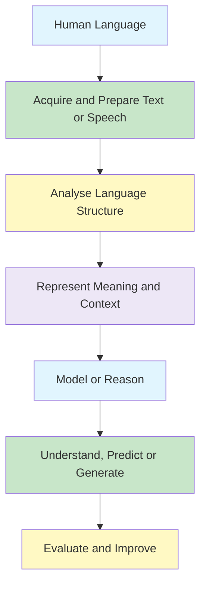
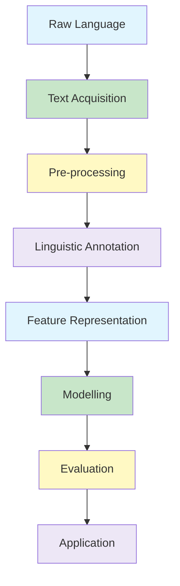
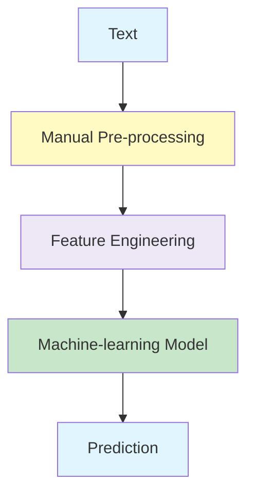
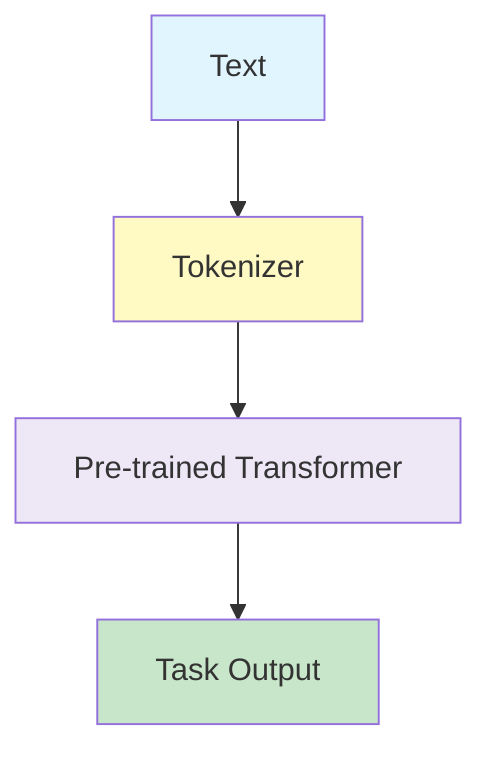

# NLP - Understanding and Generation

- The Study of Language.
- Applications of Natural Language Understanding.
- Evaluating Language Understanding Systems.
- Different Levels of Language Analysis.
- Organisation of Natural Language Understanding Systems.

## Learning Objectives

- Explain what Natural Language Processing studies and how it relates to artificial intelligence and linguistics.
- Describe why human language is difficult for computers to process.
- Recognise the main applications and stages of an NLP pipeline.
- Distinguish morphological, lexical, syntactic, semantic, pragmatic, and discourse analysis.
- Explain the relationship between natural language understanding and natural language generation.
- Identify suitable ways to evaluate different NLP systems.
<!--
## Map

| Section | Topic | Status |
|---|---|---|
| 1 | What Is Natural Language Processing?
| 2 | Why NLP Matters
| 3 | Evolution of NLP
| 4 | NLP Applications
| 5 | The NLP Pipeline
| 6 | Ambiguity and Why NLP Is Difficult
| 7 | Levels of Language Analysis
| 8 | Natural Language Understanding and Generation
| 9 | Evaluating NLP Systems
-->
## Big Picture



## 1. What Is Natural Language Processing? ☆

Natural language processing (NLP) is the discipline of building machines that can manipulate human language - or data that resembles human language - in the way that it is written, spoken, and organised. 

### Key Concepts

NLP can be divided into two overlapping subfields: 

1. **Natural Language Understanding (NLU)**, which focuses on semantic analysis or determining the intended meaning of text
2. **Natural Language Generation (NLG)**, which focuses on text generation by a machine.

### Key Points to Remember

NLP is separate from — but often used in conjunction with — speech recognition, which seeks to parse spoken language into words, turning sound into text and vice versa.

## 2. Why NLP Matters

Humans communicate using unstructured data like text and voice, while computers require structured data like binary code. NLP acts as a digital translator, allowing machines to understand, interpret, and respond to human language in a valuable way.

## 3. Evolution of NLP


## 4. NLP Applications

**Daily Communication Tools**
- Email filters
- Autocorrect
- Grammar checkers
- Predictive text
- Language translation platforms

**Conversational AI & Search**
- Smart virtual assistants
- Customer service chatbots
- Search engine autocomplete
- Semantic search engines

**Content Processing & Text Analytics**
- Sentiment analysis
- Automatic text summarisation
- Automated audio transcription
- Named entity recognition (NER)
- Resume screening systems

**Advanced & Accessibility Applications**
- Sign language translators
- Voice-based communication software
- Automated video captioning

## 5. The NLP Pipeline ☆

An **NLP pipeline** is a sequence of steps that converts raw human language into a structured form that a computer can analyse and use.

{}
NLP system does not immediately understand a sentence.

It gradually:

**collects the text → cleans it → analyses its language structure → converts it into numbers → applies a model → produces a useful result**
{}



### Running Example

Consider the following movie review:

> **The movie was not bad at all!**

The goal is to determine whether the review expresses a positive or negative sentiment.

### 1. Text Acquisition

The first step is to collect language data from a source.

Possible sources include:

- Customer reviews
- Emails
- Web pages
- Social media posts
- Documents
- Chat conversations
- Speech converted into text

For the running example, the acquired text is:

```text
The movie was not bad at all!
```

### 2. Text Pre-processing ☆

Pre-processing cleans and normalises the raw text before further analysis.

Common operations include:

- Converting text to lowercase
- Removing unnecessary punctuation
- Tokenisation
- Removing selected stop words
- Stemming
- Lemmatisation

After lowercasing and tokenisation:

```text
[the, movie, was, not, bad, at, all]
```

#### Tokenisation

**Tokenisation** divides text into smaller units called **tokens**.

For example:

```text
Natural language processing is useful.
```

becomes:

```text
[Natural, language, processing, is, useful]
```

#### Stemming and Lemmatisation

Both techniques reduce related word forms to a common base.

| Technique | Example |
|---|---|
| Stemming | `studies → studi` |
| Lemmatisation | `studies → study` |
| Stemming | `running → run` |
| Lemmatisation | `better → good` |

{}
Pre-processing must not blindly remove words.

In the sentence **“The movie was not bad”**, the word **not** is essential. Removing it would change the meaning from positive to negative.
{}

### 3. Linguistic Annotation ☆

Linguistic annotation adds grammatical and linguistic information to the text.

It may include:

- Part-of-speech tagging
- Named entity recognition
- Syntactic parsing
- Dependency parsing
- Lemma identification
- Negation detection

A possible part-of-speech representation is:

| Word | Tag | Meaning |
|---|---|---|
| The | DT | Determiner |
| movie | NN | Noun |
| was | VBD | Past-tense verb |
| not | RB | Adverb |
| bad | JJ | Adjective |
| at | IN | Preposition |
| all | DT | Determiner |

The system must also identify that **not** modifies **bad**.

```text
not → bad
```

This relationship helps the system recognise that:

```text
not bad
```

does not carry the same meaning as:

```text
bad
```

### 4. Feature Representation ☆

Machine-learning models work with numbers rather than raw words.

The text must therefore be converted into a numerical representation.

Common representation methods include:

- **Bag of Words**: Counts word frequencies per document while completely ignoring grammar and word order.
- **TF-IDF**: Weights words by how frequent they are locally versus how rare they are across all documents.
- **Word2Vec**: Learns static word vectors using a neural network to predict words based on their local neighbors.
- **GloVe**: Creates static word vectors by factoring a macro-level matrix of global word co-occurrence statistics.
- **Contextual Embeddings**: Uses sequential neural networks to dynamically change a word's vector based on its surrounding sentence.
- **Transformer Embeddings**: Uses simultaneous self-attention to calculate fluid, long-range word relationships across entire documents in parallel.

Conceptually:

```text
"The movie was not bad at all"
                ↓
[0.12, -0.45, 0.81, 0.26, ...]
```

The numerical representation should preserve useful information about:

- Word meaning
- Word relationships
- Context
- Word order
- Negation

{}

Traditional approaches such as **Bag of Words** and **TF-IDF** mainly represent word occurrence.

Modern embeddings attempt to represent the **meaning and context** of words.

{}

```
import numpy as np
from sklearn.feature_extraction.text import CountVectorizer, TfidfVectorizer
from gensim.models import Word2Vec
import gensim.downloader as api
from transformers import AutoTokenizer, AutoModel, pipeline
import torch

# 1. Sample Data
documents = [
    "The bank lowered interest rates",
    "The river bank overflowed"
]
tokenized_docs = [doc.lower().split() for doc in documents]

# ==========================================
# SCIKIT-LEARN (Lexical / Frequency Based)
# ==========================================

# 2. Bag of Words (CountVectorizer)
bow_vectorizer = CountVectorizer()
bow_matrix = bow_vectorizer.fit_transform(documents).toarray()
print("Bag of Words Shape:", bow_matrix.shape)

# 3. TF-IDF
tfidf_vectorizer = TfidfVectorizer()
tfidf_matrix = tfidf_vectorizer.fit_transform(documents).toarray()
print("TF-IDF Shape:", tfidf_matrix.shape)

# ==========================================
# GENSIM (Static Word Vectors)
# ==========================================

# 4. Word2Vec (Trained from scratch locally)
w2v_model = Word2Vec(sentences=tokenized_docs, vector_size=50, window=3, min_count=1)
w2v_vector = w2v_model.wv['bank']
print("Word2Vec 'bank' Vector Shape:", w2v_vector.shape)

# 5. GloVe (Using a pre-trained Global Co-occurrence model)
# Note: This downloads a 66MB model on first run
glove_vectors = api.load("glove-wiki-gigaword-50")
glove_vector = glove_vectors['bank']
print("GloVe 'bank' Vector Shape:", glove_vector.shape)

# ==========================================
# HUGGING FACE (Contextual / Transformers)
# ==========================================

# 6. Contextual Embeddings (BiLSTM / Feature-based via pipeline)
# DistilBERT works well here to show context shifts dynamically
nlp_pipe = pipeline("feature-extraction", model="distilbert-base-uncased")

# Notice how the vector for 'bank' shifts between doc 1 and doc 2
context_doc1 = np.array(nlp_pipe(documents[0]))  # Shape: (1, sequence_length, hidden_dim)
context_doc2 = np.array(nlp_pipe(documents[1]))
print("Contextual (DistilBERT) Sequence Shape:", context_doc1.shape)

# 7. Transformer Embeddings (Manual Hugging Face PyTorch Workflow)
model_name = "bert-base-uncased"
tokenizer = AutoTokenizer.from_pretrained(model_name)
model = AutoModel.from_pretrained(model_name)

inputs = tokenizer(documents, padding=True, truncation=True, return_tensors="pt")
with torch.no_grad():
    outputs = model(**inputs)

# The last hidden state contains the precise contextualized self-attention embeddings
transformer_embeddings = outputs.last_hidden_state
print("Transformer Last Hidden State Shape:", transformer_embeddings.shape)
```


### 5. Modelling ☆

The numerical representation is passed to a model that performs the required NLP task.

Possible models include:

- Naïve Bayes
- Logistic regression
- Support Vector Machine
- Hidden Markov Model
- Neural network
- Transformer
- Large Language Model

For sentiment analysis, the model may produce:

```text
Positive sentiment: 0.94
Negative sentiment: 0.06
```

The predicted result is therefore:

```text
Positive sentiment
```

The model has learned that the expression **not bad** usually communicates a mildly positive meaning.

### 6. Evaluation ☆

Evaluation measures how well the NLP system performs.

For classification tasks, common measures include:

- Accuracy
- Precision
- Recall
- F1-score

For language-generation tasks, measures may include:

- BLEU
- ROUGE
- Human evaluation
- Fluency
- Relevance
- Factual correctness

Evaluation is important because producing an output does not automatically mean that the output is correct, reliable or useful.

### 7. Application

The final result is delivered through an application.

Examples include:

- Sentiment-analysis dashboards
- Chatbots
- Search engines
- Recommendation systems
- Spam filters
- Translation systems
- Document classifiers
- Question-answering systems

For the running example:

```text
Input:
The movie was not bad at all!

Output:
Positive sentiment — 94% confidence
```

The result could then be displayed on a review dashboard or used to calculate an overall customer-satisfaction score.

### Complete Pipeline Example

| Pipeline Stage | What Happens |
|---|---|
| Text acquisition | The movie review is collected |
| Pre-processing | The text is lowercased and tokenised |
| Linguistic annotation | Part-of-speech tags and negation are identified |
| Feature representation | The text is converted into TF-IDF values or embeddings |
| Modelling | A classifier predicts the sentiment |
| Evaluation | The prediction is compared with the correct label |
| Application | The result is displayed on a dashboard |

### Classical and Modern NLP Pipelines

#### Classical NLP Pipeline



Classical NLP normally requires explicit steps such as:

- Tokenisation
- Stop-word handling
- Stemming or lemmatisation
- TF-IDF calculation
- Manual feature selection

#### Modern NLP Pipeline



Modern transformer models can learn many linguistic features automatically.

However, important steps still remain:

- Collecting appropriate data
- Cleaning malformed input
- Choosing the correct model
- Evaluating the output
- Monitoring bias and errors
- Integrating the result into an application

{}
The NLP pipeline can be remembered as:

**Text → Tokens → Linguistic information → Numerical representation → Model → Evaluation → Application**

{}


## 6. Ambiguity and Why NLP Is Difficult ☆

### 1. Lexical Ambiguity (Polysemy and Homonymy)~
Occurs when a single word has multiple potential meanings, such as "bank" referring to either a financial institution or a river's edge.
 
### 2. Syntactic Structure Ambiguity
Occurs when a sentence can be parsed into multiple different grammatical structures, altering who performs an action (e.g., "I saw the man with the telescope").
 
### 3. Anaphora and Coreference Resolution
The challenge of correctly mapping pronouns or references (like "it" or "they") back to the specific noun they represent across a text.
 
### 4. Semantic and Pragmatic Ambiguity (Sarcasm and Metaphor)
Occurs when the literal meaning of words conflicts with the speaker's true contextual intent, tone, or cultural figure of speech.
 
### 5. Out-of-Vocabulary (OOV) and Evolving Language
The issue where a system encounters brand-new slang, internet acronyms, or rapidly changing definitions that do not exist in its trained dataset.

## 7. Levels of Language Analysis ☆

## 8. Natural Language Understanding and Generation ☆


## 9. Evaluating NLP Systems ☆


## Practical Exploration

Explore tokenisation, sentence splitting, part-of-speech tagging, and named-entity recognition using NLTK or spaCy.

```python
# Add a minimal, well-commented Python example here.
```

## Comparison Table

| Concept | Main Question | Example |
|---|---|---|
| Morphology | How is a word formed? | `unhelpful` → `un` + `help` + `ful` |
| Syntax | How are words arranged? | Identifying noun and verb phrases |
| Semantics | What does the sentence mean? | Resolving the meaning of `bank` |
| Pragmatics | What does the speaker intend? | Interpreting an indirect request |
| Discourse | How does earlier text affect later text? | Resolving what `she` refers to |

## Common Mistakes

{}
- Treating NLP as simple keyword matching rather than modelling meaning and context.
- Confusing syntactic correctness with semantic or pragmatic plausibility.
- Assuming that one metric is suitable for every NLP task.
{}

## Practice Questions

1. Explain NLP and describe how it differs from general text processing.
2. Compare syntax, semantics, pragmatics, and discourse with one example each.
3. Trace a sentence through a typical NLP pipeline.
4. Explain why ambiguity makes language understanding difficult.
5. Compare evaluation approaches for classification and text generation.

## Key Takeaways

{}
- NLP combines ideas from artificial intelligence, computer science, linguistics, and statistics.
- Language must be analysed at several interacting levels, from word structure to wider context.
- Strong NLP systems require both useful representations and suitable evaluation methods.
{}

## Checklist

- [ ] I can explain what NLP is and why it is difficult.
- [ ] I can give examples of important NLP applications.
- [ ] I can describe the stages of an NLP pipeline.
- [ ] I can distinguish the main levels of language analysis.
- [ ] I can explain the roles of understanding, generation, and evaluation.

---
 | 
