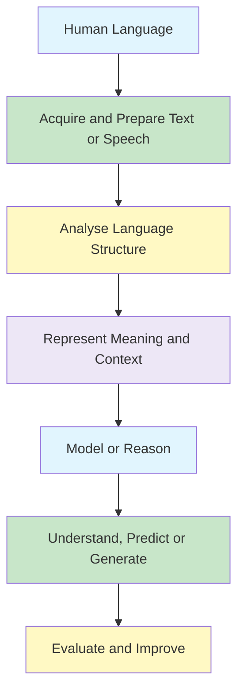

# NLP - Understanding and Generation

- The Study of Language.
- Applications of Natural Language Understanding.
- Evaluating Language Understanding Systems.
- Different Levels of Language Analysis.
- Organisation of Natural Language Understanding Systems.

## Learning Objectives

- Explain what Natural Language Processing studies and how it relates to artificial intelligence and linguistics.
- Describe why human language is difficult for computers to process.
- Recognise the main applications and stages of an NLP pipeline.
- Distinguish morphological, lexical, syntactic, semantic, pragmatic, and discourse analysis.
- Explain the relationship between natural language understanding and natural language generation.
- Identify suitable ways to evaluate different NLP systems.

## Map

| Section | Topic | Status |
|---|---|---|
| 1 | What Is Natural Language Processing?
| 2 | Why NLP Matters
| 3 | Evolution of NLP
| 4 | NLP Applications
| 5 | The NLP Pipeline
| 6 | Ambiguity and Why NLP Is Difficult
| 7 | Levels of Language Analysis
| 8 | Natural Language Understanding and Generation
| 9 | Evaluating NLP Systems

## Big Picture



## 1. What Is Natural Language Processing? ☆

### Definition

{}
<!-- Add a precise, one- or two-sentence definition here. -->
{}

### Intuition

<!-- Explain the idea in beginner-friendly language and connect it to a familiar example. -->

### Key Concepts

- <!-- Key term or component -->
- <!-- Key term or component -->
- <!-- Key relationship or assumption -->

### Formula or Model

<!-- Add mathematics only when it supports understanding. Use this exact structure:

{}

FORMULA HERE

{}

For inline mathematics use:  x 
-->

### Worked Example

<!-- Add a small step-by-step example. -->

### Why It Matters in NLP

<!-- Explain where this concept is used in real NLP systems. -->

### Key Points to Remember

- <!-- Definition or distinction to remember -->
- <!-- Important explanation, derivation, or comparison -->
- <!-- Common mistake to avoid -->

## 2. Why NLP Matters

### Definition

{}
<!-- Add a precise, one- or two-sentence definition here. -->
{}

### Intuition

<!-- Explain the idea in beginner-friendly language and connect it to a familiar example. -->

### Key Concepts

- <!-- Key term or component -->
- <!-- Key term or component -->
- <!-- Key relationship or assumption -->

### Formula or Model

<!-- Add mathematics only when it supports understanding. Use this exact structure:

{}

FORMULA HERE

{}

For inline mathematics use:  x 
-->

### Worked Example

<!-- Add a small step-by-step example. -->

### Why It Matters in NLP

<!-- Explain where this concept is used in real NLP systems. -->

### Key Points to Remember

- <!-- Definition or distinction to remember -->
- <!-- Important explanation, derivation, or comparison -->
- <!-- Common mistake to avoid -->

## 3. Evolution of NLP

### Definition

{}
<!-- Add a precise, one- or two-sentence definition here. -->
{}

### Intuition

<!-- Explain the idea in beginner-friendly language and connect it to a familiar example. -->

### Key Concepts

- <!-- Key term or component -->
- <!-- Key term or component -->
- <!-- Key relationship or assumption -->

### Formula or Model

<!-- Add mathematics only when it supports understanding. Use this exact structure:

{}

FORMULA HERE

{}

For inline mathematics use:  x 
-->

### Worked Example

<!-- Add a small step-by-step example. -->

### Why It Matters in NLP

<!-- Explain where this concept is used in real NLP systems. -->

### Key Points to Remember

- <!-- Definition or distinction to remember -->
- <!-- Important explanation, derivation, or comparison -->
- <!-- Common mistake to avoid -->

## 4. NLP Applications

### Definition

{}
<!-- Add a precise, one- or two-sentence definition here. -->
{}

### Intuition

<!-- Explain the idea in beginner-friendly language and connect it to a familiar example. -->

### Key Concepts

- <!-- Key term or component -->
- <!-- Key term or component -->
- <!-- Key relationship or assumption -->

### Formula or Model

<!-- Add mathematics only when it supports understanding. Use this exact structure:

{}

FORMULA HERE

{}

For inline mathematics use:  x 
-->

### Worked Example

<!-- Add a small step-by-step example. -->

### Why It Matters in NLP

<!-- Explain where this concept is used in real NLP systems. -->

### Key Points to Remember

- <!-- Definition or distinction to remember -->
- <!-- Important explanation, derivation, or comparison -->
- <!-- Common mistake to avoid -->

## 5. The NLP Pipeline ☆

### Definition

{}
<!-- Add a precise, one- or two-sentence definition here. -->
{}

### Intuition

<!-- Explain the idea in beginner-friendly language and connect it to a familiar example. -->

### Key Concepts

- <!-- Key term or component -->
- <!-- Key term or component -->
- <!-- Key relationship or assumption -->

### Formula or Model

<!-- Add mathematics only when it supports understanding. Use this exact structure:

{}

FORMULA HERE

{}

For inline mathematics use:  x 
-->

### Worked Example

<!-- Add a small step-by-step example. -->

### Why It Matters in NLP

<!-- Explain where this concept is used in real NLP systems. -->

### Key Points to Remember

- <!-- Definition or distinction to remember -->
- <!-- Important explanation, derivation, or comparison -->
- <!-- Common mistake to avoid -->

## 6. Ambiguity and Why NLP Is Difficult ☆

### Definition

{}
<!-- Add a precise, one- or two-sentence definition here. -->
{}

### Intuition

<!-- Explain the idea in beginner-friendly language and connect it to a familiar example. -->

### Key Concepts

- <!-- Key term or component -->
- <!-- Key term or component -->
- <!-- Key relationship or assumption -->

### Formula or Model

<!-- Add mathematics only when it supports understanding. Use this exact structure:

{}

FORMULA HERE

{}

For inline mathematics use:  x 
-->

### Worked Example

<!-- Add a small step-by-step example. -->

### Why It Matters in NLP

<!-- Explain where this concept is used in real NLP systems. -->

### Key Points to Remember

- <!-- Definition or distinction to remember -->
- <!-- Important explanation, derivation, or comparison -->
- <!-- Common mistake to avoid -->

## 7. Levels of Language Analysis ☆

### Definition

{}
<!-- Add a precise, one- or two-sentence definition here. -->
{}

### Intuition

<!-- Explain the idea in beginner-friendly language and connect it to a familiar example. -->

### Key Concepts

- <!-- Key term or component -->
- <!-- Key term or component -->
- <!-- Key relationship or assumption -->

### Formula or Model

<!-- Add mathematics only when it supports understanding. Use this exact structure:

{}

FORMULA HERE

{}

For inline mathematics use:  x 
-->

### Worked Example

<!-- Add a small step-by-step example. -->

### Why It Matters in NLP

<!-- Explain where this concept is used in real NLP systems. -->

### Key Points to Remember

- <!-- Definition or distinction to remember -->
- <!-- Important explanation, derivation, or comparison -->
- <!-- Common mistake to avoid -->

## 8. Natural Language Understanding and Generation ☆

### Definition

{}
<!-- Add a precise, one- or two-sentence definition here. -->
{}

### Intuition

<!-- Explain the idea in beginner-friendly language and connect it to a familiar example. -->

### Key Concepts

- <!-- Key term or component -->
- <!-- Key term or component -->
- <!-- Key relationship or assumption -->

### Formula or Model

<!-- Add mathematics only when it supports understanding. Use this exact structure:

{}

FORMULA HERE

{}

For inline mathematics use:  x 
-->

### Worked Example

<!-- Add a small step-by-step example. -->

### Why It Matters in NLP

<!-- Explain where this concept is used in real NLP systems. -->

### Key Points to Remember

- <!-- Definition or distinction to remember -->
- <!-- Important explanation, derivation, or comparison -->
- <!-- Common mistake to avoid -->

## 9. Evaluating NLP Systems ☆

### Definition

{}
<!-- Add a precise, one- or two-sentence definition here. -->
{}

### Intuition

<!-- Explain the idea in beginner-friendly language and connect it to a familiar example. -->

### Key Concepts

- <!-- Key term or component -->
- <!-- Key term or component -->
- <!-- Key relationship or assumption -->

### Formula or Model

<!-- Add mathematics only when it supports understanding. Use this exact structure:

{}

FORMULA HERE

{}

For inline mathematics use:  x 
-->

### Worked Example

<!-- Add a small step-by-step example. -->

### Why It Matters in NLP

<!-- Explain where this concept is used in real NLP systems. -->

### Key Points to Remember

- <!-- Definition or distinction to remember -->
- <!-- Important explanation, derivation, or comparison -->
- <!-- Common mistake to avoid -->


## Practical Exploration

Explore tokenisation, sentence splitting, part-of-speech tagging, and named-entity recognition using NLTK or spaCy.

```python
# Add a minimal, well-commented Python example here.
```

## Comparison Table

| Concept | Main Question | Example |
|---|---|---|
| Morphology | How is a word formed? | `unhelpful` → `un` + `help` + `ful` |
| Syntax | How are words arranged? | Identifying noun and verb phrases |
| Semantics | What does the sentence mean? | Resolving the meaning of `bank` |
| Pragmatics | What does the speaker intend? | Interpreting an indirect request |
| Discourse | How does earlier text affect later text? | Resolving what `she` refers to |

## Common Mistakes

{}
- Treating NLP as simple keyword matching rather than modelling meaning and context.
- Confusing syntactic correctness with semantic or pragmatic plausibility.
- Assuming that one metric is suitable for every NLP task.
{}

## Practice Questions

1. Explain NLP and describe how it differs from general text processing.
2. Compare syntax, semantics, pragmatics, and discourse with one example each.
3. Trace a sentence through a typical NLP pipeline.
4. Explain why ambiguity makes language understanding difficult.
5. Compare evaluation approaches for classification and text generation.

## Key Takeaways

{}
- NLP combines ideas from artificial intelligence, computer science, linguistics, and statistics.
- Language must be analysed at several interacting levels, from word structure to wider context.
- Strong NLP systems require both useful representations and suitable evaluation methods.
{}

## Checklist

- [ ] I can explain what NLP is and why it is difficult.
- [ ] I can give examples of important NLP applications.
- [ ] I can describe the stages of an NLP pipeline.
- [ ] I can distinguish the main levels of language analysis.
- [ ] I can explain the roles of understanding, generation, and evaluation.

---
 | 
