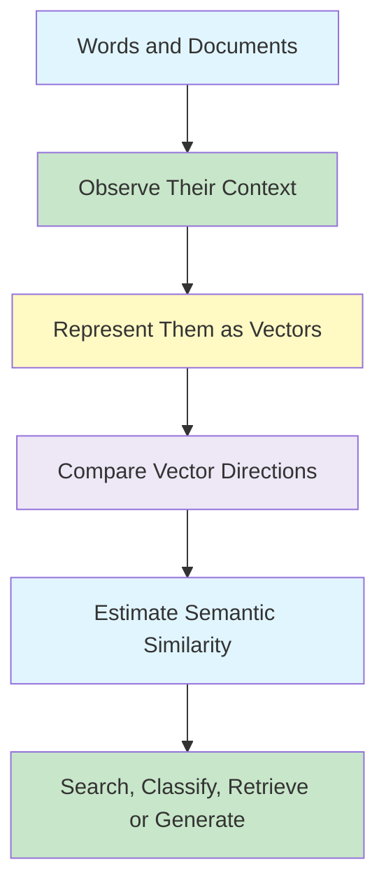
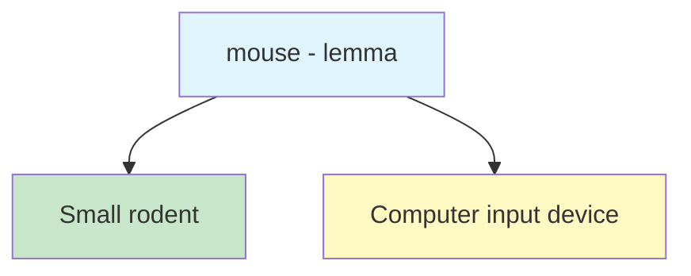
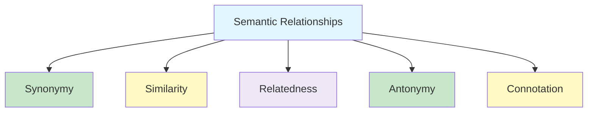
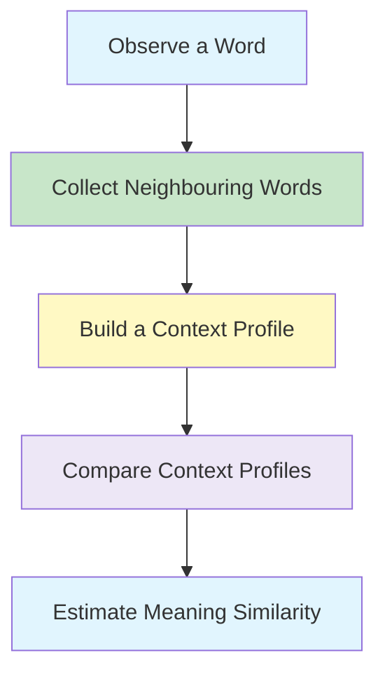
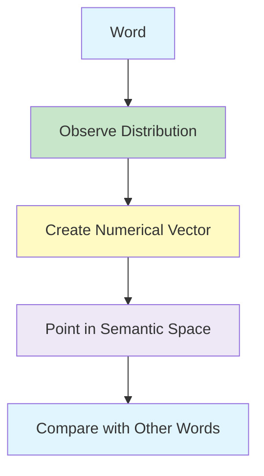
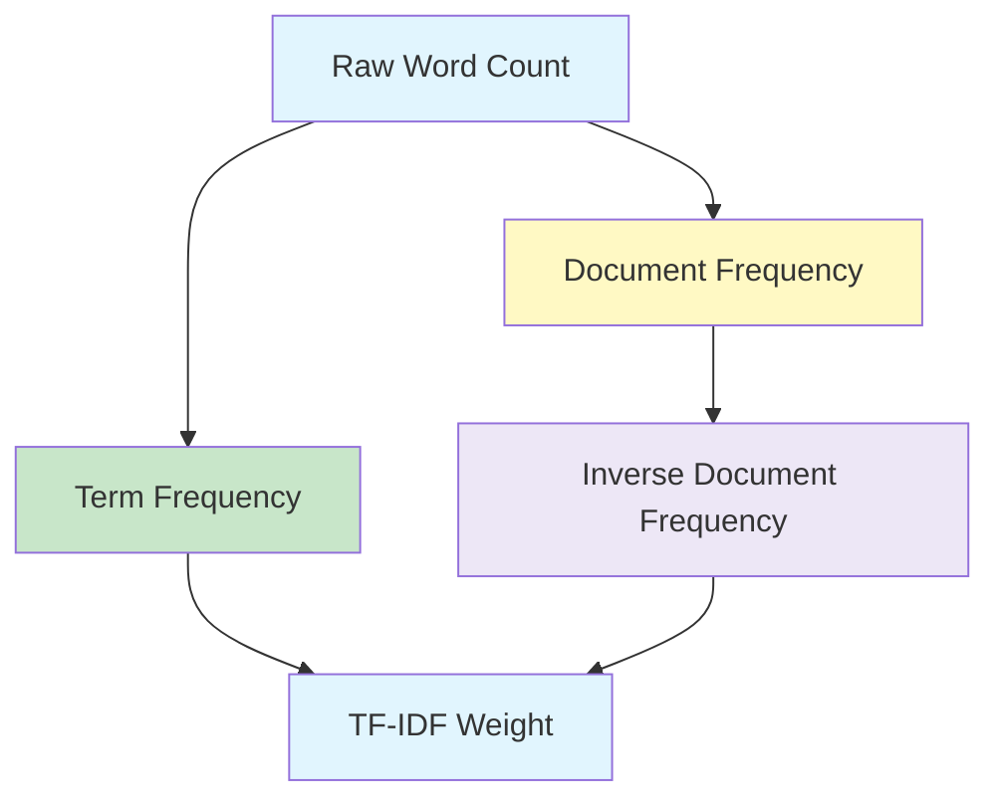
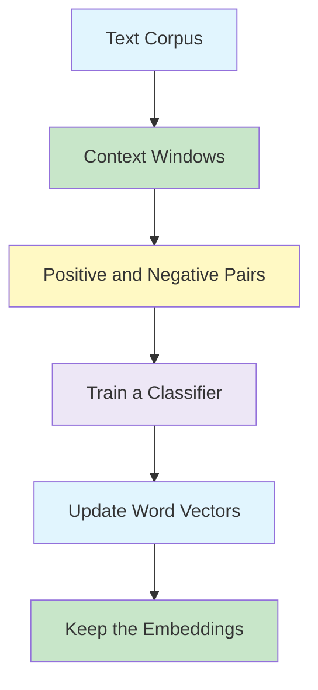
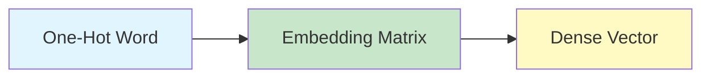
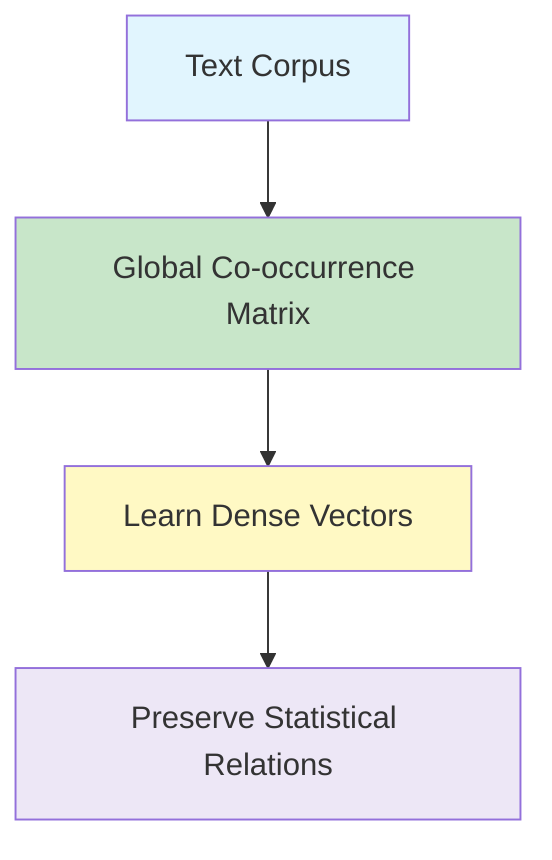

# NLP - Vector Semantics and Embedding

- Lexical semantics and word meaning.
- Lemmas, senses, and semantic relationships.
- Distributional hypothesis.
- Vector semantics and word embeddings.
- Document and word vectors.
- Dot product and cosine similarity.
- Term Frequency–Inverse Document Frequency (TF-IDF).
- Prediction-based word embeddings and self-supervision.
- Word2Vec using Skip-gram with Negative Sampling and CBOW.
- Embedding matrices, context-window choices, analogies, visualisation, and bias.
- GloVe and global word–word co-occurrence statistics.

## Learning Objectives

- Explain lexical semantics and distinguish a lemma from a word sense.
- Compare synonymy, similarity, relatedness, antonymy, and connotation.
- Explain the distributional hypothesis and its role in modelling meaning.
- Describe how words and documents can be represented as vectors.
- Construct and interpret word–document and word–context matrices.
- Calculate dot product and cosine similarity between vectors.
- Explain why raw word frequency can be misleading.
- Calculate TF, IDF, and TF-IDF weights.
- Explain how Word2Vec learns embeddings from a prediction task.
- Construct positive and negative Skip-gram training pairs.
- Explain how sigmoid, negative sampling, and gradient descent train SGNS.
- Compare Skip-gram with CBOW.
- Explain how context-window size affects the relationships captured.
- Interpret word analogies and two-dimensional embedding visualisations.
- Explain how GloVe combines global counts with learned dense vectors.
- Recognise how social biases can be encoded in word embeddings.

<!--
## Map

| Section | Topic | Status |
|---|---|---|
| 1 | Lexical Semantics |
| 2 | Lemmas and Word Senses |
| 3 | Semantic Relationships |
| 4 | Distributional Hypothesis |
| 5 | Vector Semantics and Word Embeddings |
| 6 | Documents as Vectors |
| 7 | Words as Vectors |
| 8 | Dot Product |
| 9 | Cosine Similarity |
| 10 | TF-IDF |
| 11 | Count-Based and Prediction-Based Embeddings |
-->

## Big Picture



## 1. Lexical Semantics ☆

**Lexical semantics** is the linguistic study of word meaning and the relationships between word meanings.

The word **lexical** refers to words or vocabulary, while **semantics** refers to meaning.

Lexical semantics asks questions such as:

- What does a word mean?
- Can one word have several meanings?
- Can the same concept be expressed using different words?
- How are two words similar, related, or opposite?
- How does context help determine the intended meaning?

{}
A useful model of word meaning should help an NLP system **reason about meaning**, select the intended interpretation, and support tasks such as question answering, information retrieval, summarisation, and machine translation.
{}

### Why Word Meaning Matters

Consider the question:

> **How tall is Mount Everest?**

A useful question-answering system should recognise that **tall** is semantically close to **height**, allowing it to retrieve an answer such as:

> The official **height** of Mount Everest is 29,029 feet.

The words are not identical, but their meanings are sufficiently similar in this context.

---

## 2. Lemmas and Word Senses ☆

A **lemma** is the dictionary or base form used to represent a word.

A **word sense** is one particular meaning associated with that lemma.

For example, the lemma **mouse** can express different senses:

1. A small rodent.
2. A hand-operated device used to control a computer cursor.



A lemma can therefore be **polysemous**, meaning that it has more than one related sense.

### Many-to-Many Relationship

The relationship between words and meanings is often many-to-many:

- One word can express several meanings.
- One meaning can be expressed by several words.

For example:

- The word **bank** can refer to a financial institution or the side of a river.
- The concept of a medical practitioner can be expressed using **doctor** or **physician**.

{}
A word and its meaning are not the same thing.

The written form is a **symbol**, while a sense is the meaning selected from the available possibilities.
{}

---

## 3. Semantic Relationships Between Words ☆

Words can be connected through different types of semantic relationships.



### 3.1 Synonymy

**Synonyms** have the same or nearly the same meaning in some contexts.

Examples:

- `couch` and `sofa`
- `car` and `automobile`
- `vomit` and `throw up`

Perfect synonymy is uncommon because two words are rarely interchangeable in every possible context.

For example:

- `water` and `H₂O` refer to the same substance, but **H₂O** would sound unusual in a surfing guide.
- `big` and `large` are similar, but **my big sister** does not normally mean the same as **my large sister**.

Therefore, synonymy is usually understood as **approximate** or **rough synonymy**.

### 3.2 Word Similarity

Two words are **similar** when they share important elements of meaning, even if they are not synonyms.

Examples:

- `cat` and `dog`
- `car` and `bicycle`
- `cow` and `horse`

Word similarity is useful when comparing:

- Words
- Phrases
- Sentences
- Documents

Applications include question answering, paraphrasing, summarisation, search, and clustering.

### 3.3 Word Relatedness

**Relatedness**, also called **word association**, is broader than similarity.

Words may be related because they belong to the same semantic field, even though they do not have similar meanings.

| Pair | Relationship |
|---|---|
| `coffee` and `tea` | Similar |
| `coffee` and `cup` | Related, but not similar |
| `doctor` and `hospital` | Related |
| `waiter` and `menu` | Related |

A **semantic field** is a group of words connected to the same domain.

Examples:

| Semantic Field | Related Words |
|---|---|
| Hospital | doctor, nurse, surgeon, ward, scalpel |
| Restaurant | waiter, menu, plate, food, chef |
| House | door, roof, kitchen, family, bed |

{}
Do not treat **similarity** and **relatedness** as identical.

A cup is related to coffee because coffee may be served in it, but a cup is not a type of coffee and does not have a similar meaning.
{}

### 3.4 Antonymy

**Antonyms** have senses that are opposite with respect to a particular feature of meaning.

Examples:

- `dark` and `light`
- `short` and `long`
- `fast` and `slow`
- `hot` and `cold`
- `up` and `down`

Antonyms are often similar in most respects but differ along one important dimension.

They may represent:

- Opposite ends of a scale: `long` and `short`
- A binary opposition: `in` and `out`
- A reversible relationship: `rise` and `fall`

### 3.5 Connotation

**Connotation** is the affective or emotional meaning associated with a word.

Words can carry:

- Positive or negative emotion
- Positive or negative evaluation
- Different levels of intensity
- Different impressions of control or power

Examples:

| Positive | Negative |
|---|---|
| happy | sad |
| great | terrible |
| love | hate |

### Valence, Arousal, and Dominance ☆

The **VAD model** represents affective meaning using three dimensions:

| Dimension | Meaning |
|---|---|
| Valence | How pleasant or unpleasant something feels |
| Arousal | The intensity of emotion it provokes |
| Dominance | The degree of control or power it communicates |

For example:

| Word | Valence | Arousal | Dominance |
|---|---:|---:|---:|
| Joy | 8.8 | 6.0 | 7.0 |
| Excitement | 8.1 | 8.5 | 7.2 |
| Afraid | 2.1 | 8.4 | 2.0 |
| Depressed | 1.7 | 2.0 | 1.1 |

The VAD representation demonstrates an important idea: some aspects of meaning can be represented as coordinates in a multidimensional space.

---

## 4. Distributional Hypothesis ☆

The **distributional hypothesis** connects a word's meaning with the contexts in which it occurs.

{}
> Words that occur in similar contexts tend to have similar meanings.
{}

For example, the words **oculist** and **eye doctor** are likely to occur near words such as:

- eyes
- examined
- eye drops
- vision
- myopia

Because their neighbouring words are similar, their meanings are also likely to be similar.

The difference in meaning between two words can therefore be estimated from the difference between their linguistic environments.



### Inferring the Meaning of an Unknown Word

Suppose an unfamiliar word, **ongchoi**, appears in sentences such as:

- Ongchoi is delicious sautéed with garlic.
- Ongchoi is excellent over rice.
- Ongchoi leaves go well with salty sauces.

Suppose familiar words such as **spinach**, **chard**, and **collard greens** occur in similar contexts.

From these shared environments, we can infer that **ongchoi** is probably a leafy green vegetable.

{}
The central intuition is:

**Context → Usage Pattern → Vector Representation → Approximate Meaning**
{}

---

## 5. Vector Semantics and Word Embeddings ☆

**Vector semantics** represents meaning using numerical vectors.

Each word is represented as a point in a high-dimensional semantic space. The coordinates are learned or calculated from the word's distribution across contexts.

The vectors used to represent words are called **word embeddings**.



Words with similar meanings should appear close together or point in similar directions in this space.

### Why Use Vectors?

Consider a sentiment-analysis system.

#### Using Word Identity

A feature may record the exact word:

```text
The sentence contains the word "terrible".
```

This representation recognises only the same word. If a new sentence contains **awful** or **horrible**, the feature is not activated.

#### Using Word Embeddings

A feature contains the word's vector:

```text
terrible → [35, 22, 17, ...]
```

A semantically similar word may have a nearby vector:

```text
awful → [34, 21, 14, ...]
```

The model can therefore generalise to words that were not seen during training but have similar meanings.

---

## 6. Types of Word Embeddings

Word representations can be divided broadly into two groups.

| Type | Representation | Main Idea | Examples |
|---|---|---|---|
| Frequency-based | Sparse, high-dimensional | Use counts or weighted counts | Count vector, co-occurrence vector, TF-IDF |
| Prediction-based | Dense, low-dimensional | Learn by predicting surrounding context | Word2Vec, Skip-gram, CBOW, GloVe |

### Frequency-Based Embeddings

Frequency-based methods:

- Count how often words occur.
- Use vocabulary words or documents as vector dimensions.
- Usually produce sparse and high-dimensional vectors.
- Provide a useful baseline for understanding vector semantics.

### Prediction-Based Embeddings

Prediction-based methods:

- Learn vector representations through a prediction objective.
- Use surrounding context to train the representation.
- Usually produce dense, lower-dimensional vectors.
- Give similar words similar vector representations.

This page develops the foundations using **count-based representations** and **TF-IDF**. Prediction-based approaches are introduced separately.

The prediction-based approaches are developed in Sections 15–23 after the count-based foundations and their applications.

---

## 7. Representing Documents as Vectors ☆

A **document** can be any unit of text, such as:

- A book
- An article
- An email
- A web page
- A report

A document consists of many words or **terms**.

### Word–Document Matrix

In a word–document matrix:

- Each row represents a word.
- Each column represents a document.
- Each cell contains the number of times the word occurs in the document.

Consider four Shakespeare plays:

| Word | As You Like It | Twelfth Night | Julius Caesar | Henry V |
|---|---:|---:|---:|---:|
| battle | 1 | 0 | 7 | 13 |
| good | 114 | 80 | 62 | 89 |
| fool | 36 | 58 | 1 | 4 |
| wit | 20 | 15 | 2 | 3 |

Each column is a document vector.

```text
As You Like It → [1, 114, 36, 20]
Twelfth Night → [0, 80, 58, 15]
Julius Caesar → [7, 62, 1, 2]
Henry V → [13, 89, 4, 3]
```

Documents with similar word distributions have similar vectors.

In this example:

- **As You Like It** and **Twelfth Night** contain relatively high counts of `fool` and `wit`.
- **Julius Caesar** and **Henry V** contain relatively high counts of `battle`.

The vector representation therefore begins to reflect differences between comedies and historical or tragic works.

---

## 8. Representing Words as Vectors ☆

The same matrix can also be read row by row.

Each word is represented using the documents in which it appears:

```text
battle → [1, 0, 7, 13]
good   → [114, 80, 62, 89]
fool   → [36, 58, 1, 4]
wit    → [20, 15, 2, 3]
```

This representation captures information about how each word is distributed across the document collection.

For example:

- `battle` occurs particularly often in **Julius Caesar** and **Henry V**.
- `fool` occurs particularly often in the comedies.
- `good` occurs frequently in all four documents and may therefore be less useful for distinguishing them.

### Word–Word or Term–Context Matrix

Instead of using documents as dimensions, we can use neighbouring words as dimensions.

In a word–word matrix:

- Each row represents a target word.
- Each column represents a context word.
- Each cell contains the number of times the target and context words occur within a selected context window.

Example:

| Target Word | computer | data | fruit |
|---|---:|---:|---:|
| digital | 4 | 5 | 0 |
| information | 8 | 10 | 0 |
| cherry | 0 | 1 | 8 |

Therefore:

```text
digital     → [4, 5, 0]
information → [8, 10, 0]
cherry      → [0, 1, 8]
```

The vectors for **digital** and **information** have similar patterns, while **cherry** points towards a different context.

{}
The dimensions of a vector do not need to be physical properties.

A dimension can represent a document, a neighbouring word, or another measurable feature of usage.
{}

---

## 9. Computing Similarity with the Dot Product ☆

The **dot product** multiplies corresponding vector components and adds the results.

{}

\mathbf{v} \cdot \mathbf{w}
=
\sum_{i=1}^{N} v_i w_i
=
v_1w_1 + v_2w_2 + \cdots + v_Nw_N

{}

Using the vectors:

```text
digital     → [4, 5, 0]
information → [8, 10, 0]
cherry      → [0, 1, 8]
```

### Digital and Information

{}

[4,5,0] \cdot [8,10,0]
=
(4 \times 8) + (5 \times 10) + (0 \times 0)
=
82

{}

### Digital and Cherry

{}

[4,5,0] \cdot [0,1,8]
=
(4 \times 0) + (5 \times 1) + (0 \times 8)
=
5

{}

The first pair has a larger dot product because the vectors have large values in the same dimensions.

### Problem with Raw Dot Product ☆

The dot product is biased towards longer vectors.

The length or magnitude of a vector is:

{}

\lVert \mathbf{v} \rVert
=
\sqrt{\sum_{i=1}^{N} v_i^2}

{}

Longer vectors can produce larger dot products even when their meanings are not especially similar.

Consider the frequent word:

```text
the → [40, 25, 30]
```

Its dot product with `digital` is:

{}

[4,5,0] \cdot [40,25,30]
=
(4 \times 40) + (5 \times 25) + (0 \times 30)
=
285

{}

This is larger than the dot product between `digital` and `information`, even though `digital` is semantically closer to `information`.

{}
A large dot product may result from **vector magnitude or word frequency**, not only from semantic similarity.
{}

---

## 10. Cosine Similarity ☆

**Cosine similarity** normalises the dot product using the lengths of the two vectors.

It measures the angle between vectors rather than their raw magnitudes.

{}

\cos(\mathbf{v},\mathbf{w})
=
\frac{\mathbf{v}\cdot\mathbf{w}}
{\lVert\mathbf{v}\rVert\lVert\mathbf{w}\rVert}
=
\frac{\sum_{i=1}^{N}v_iw_i}
{\sqrt{\sum_{i=1}^{N}v_i^2}\sqrt{\sum_{i=1}^{N}w_i^2}}

{}

### Interpretation

| Cosine Value | Interpretation |
|---:|---|
| `+1` | Same direction; maximum similarity |
| `0` | Orthogonal directions; no directional similarity |
| `-1` | Opposite directions |

Frequency-based vectors normally contain only non-negative values. Their cosine similarity therefore commonly ranges from `0` to `1`.

### Worked Examples

#### Digital and Information

The vector for `information` is exactly twice the vector for `digital`.

{}

\cos(\text{digital},\text{information})
=
\frac{82}{\sqrt{41}\sqrt{164}}
=
1

{}

They point in the same direction and have maximum cosine similarity.

#### Digital and Cherry

{}

\cos(\text{digital},\text{cherry})
=
\frac{5}{\sqrt{41}\sqrt{65}}
\approx
0.097

{}

The vectors point in substantially different directions.

#### Digital and The

{}

\cos(\text{digital},\text{the})
=
\frac{285}{\sqrt{41}\sqrt{3125}}
\approx
0.796

{}

Normalisation reduces the advantage gained purely from the large magnitude of the frequent word.

### Dot Product and Cosine Similarity

| Measure | What It Uses | Main Limitation or Strength |
|---|---|---|
| Dot product | Shared component values and magnitude | Favours long or frequent vectors |
| Cosine similarity | Direction after length normalisation | Better for comparing usage patterns |

{}
**Dot product asks:** How much do the vectors overlap?

**Cosine similarity asks:** How similarly are the vectors pointing?
{}

---

## 11. TF-IDF ☆

Raw frequency is often a poor representation.

A word may occur frequently because it is important to a document, or simply because it is common in almost every document.

TF-IDF balances two requirements:

1. Reward words that occur frequently within a particular document.
2. Down-weight words that occur across many documents in the collection.



### 11.1 Term Frequency ☆

**Term frequency**, written as `tf`, measures how often term `t` occurs in document `d`.

A simple definition uses the raw count:

{}

\operatorname{tf}_{t,d}
=
\operatorname{count}(t,d)

{}

A logarithm is often used to reduce the influence of very large counts:

{}

\operatorname{tf}_{t,d}
=
\log_{10}\left(\operatorname{count}(t,d)+1\right)

{}

Adding `1` ensures that a term with a count of zero has a valid term-frequency value of zero.

### 11.2 Document Frequency ☆

**Document frequency**, written as `df`, is the number of documents in which a term appears.

{}

\operatorname{df}_t
=
\text{number of documents containing term } t

{}

Document frequency is different from **collection frequency**:

- **Collection frequency** counts every occurrence of a word in the collection.
- **Document frequency** counts the number of documents containing the word.

Consider Shakespeare's 37 plays:

| Word | Collection Frequency | Document Frequency |
|---|---:|---:|
| Romeo | 113 | 1 |
| action | 113 | 31 |

Both words occur 113 times, but their distributions are very different:

- `Romeo` strongly identifies a small number of documents.
- `action` appears across many plays and has less discriminative power.

### 11.3 Inverse Document Frequency ☆

**Inverse document frequency**, written as `idf`, measures how informative or discriminative a term is.

{}

\operatorname{idf}_t
=
\log_{10}\left(\frac{N}{\operatorname{df}_t}\right)

{}

where:

- `N` is the total number of documents.
- `dfₜ` is the number of documents containing term `t`.

Interpretation:

- A word appearing in few documents receives a high IDF.
- A word appearing in many documents receives a low IDF.
- A word appearing in every document receives an IDF of zero.

### 11.4 Combining TF and IDF ☆

The final TF-IDF weight is:

{}

w_{t,d}
=
\operatorname{tf}_{t,d}
\times
\operatorname{idf}_t

{}

A word receives a high TF-IDF score when it:

- Appears frequently in a particular document.
- Appears in relatively few documents across the collection.

---

## 12. TF-IDF Worked Example ☆

Consider the word `wit` in **As You Like It**.

From the word–document matrix:

- Count of `wit` in the document = `20`
- Total number of plays = `37`
- Number of plays containing `wit` = `34`

### Step 1: Term Frequency

{}

\operatorname{tf}_{wit,d}
=
\log_{10}(20+1)
\approx
1.322

{}

### Step 2: Inverse Document Frequency

{}

\operatorname{idf}_{wit}
=
\log_{10}\left(\frac{37}{34}\right)
\approx
0.037

{}

### Step 3: TF-IDF

{}

\operatorname{tfidf}_{wit,d}
=
1.322 \times 0.037
\approx
0.049

{}

Now consider `good`:

- Count in **As You Like It** = `114`
- It appears in all `37` documents.

{}

\operatorname{idf}_{good}
=
\log_{10}\left(\frac{37}{37}\right)
=
0

{}

Therefore:

{}

\operatorname{tfidf}_{good,d}
=
\operatorname{tf}_{good,d} \times 0
=
0

{}

Although `good` occurs frequently, it does not distinguish one document from another.

{}
TF-IDF does not simply ask:

**How frequent is this word?**

It asks:

**How frequent is this word here, compared with how widely it appears everywhere?**
{}

---

## 13. Why TF-IDF Is Better Than Raw Counts

| Raw Counts | TF-IDF |
|---|---|
| Rewards every frequent word | Rewards locally frequent words |
| Favours common function words | Down-weights widely occurring words |
| Can add noise to document vectors | Improves discriminative power |
| Uses frequency only | Combines local and collection-level evidence |

TF-IDF is still a count-based representation. It does not directly capture every aspect of meaning, word order, or context, but it provides a stronger representation than unweighted raw counts.

---

## 14. Applications of Vector Semantics

Vector representations allow mathematical operations to be applied to language.

Applications include:

- Semantic search
- Information retrieval
- Question answering
- Document similarity
- Plagiarism detection
- Text classification
- Paraphrase detection
- Summarisation
- Clustering
- Machine translation

Once words and documents are represented as vectors, an NLP system can:

- Compare them.
- Find nearby meanings.
- Group similar documents.
- Retrieve relevant information.
- Generalise from known words to semantically similar words.

---

## 15. From Counting to Predicting ☆

Frequency-based methods construct vectors from explicit co-occurrence counts. Prediction-based methods learn vectors by solving a prediction problem.

Word2Vec asks whether two words genuinely occur in one another's context. The prediction task is a means to an end: after training, the valuable output is the set of learned word embeddings.



### Self-Supervision

Word2Vec does not require people to label examples manually. The corpus supplies its own training signal:

- Words that really occur together form **positive examples**.
- Randomly sampled words form **negative examples**.

{}
The text supervises the model itself. Nearby words supply the positive labels, while sampled unrelated words supply contrasting examples.
{}

The two principal Word2Vec architectures reverse the prediction direction:

| Architecture | Input | Prediction |
|---|---|---|
| Skip-gram | Centre word | Surrounding context words |
| CBOW | Surrounding context words | Centre word |

---

## 16. One-Hot Vectors and Embedding Matrices

### One-Hot Representation

A one-hot vector has one dimension for every word in the vocabulary. The position corresponding to the selected word contains `1`; all other positions contain `0`.

For a vocabulary of six words:

```text
man    → [1, 0, 0, 0, 0, 0]
woman  → [0, 1, 0, 0, 0, 0]
king   → [0, 0, 1, 0, 0, 0]
queen  → [0, 0, 0, 1, 0, 0]
apple  → [0, 0, 0, 0, 1, 0]
orange → [0, 0, 0, 0, 0, 1]
```

One-hot vectors identify words but do not encode similarity. The vector for `king` is no closer to `queen` than it is to `apple`.

### Hand-Designed Features

Words could instead be described using manually chosen features such as gender, royalty, age, or food. This would make the dimensions meaningful, but defining suitable features for every word in a large vocabulary is impractical.

### Learned Embeddings

An embedding matrix learns compact features automatically.

For a vocabulary of size  |V|  and embedding dimension  d , the embedding matrix has shape:

{}

|V|\times d

{}

Multiplying a one-hot word vector by the matrix selects the corresponding row. This operation is an **embedding lookup**.



Dense vectors commonly use a few hundred dimensions rather than one dimension for every vocabulary word.

---

## 17. Word2Vec Skip-gram with Negative Sampling ☆

**Skip-gram with Negative Sampling**, abbreviated **SGNS**, trains a binary classifier to distinguish genuine centre–context pairs from sampled false pairs.

### Creating Positive Pairs

Consider a context half-window of 2:

```text
... a tablespoon of apricot jam, a pinch ...
                       ↑
                    centre
```

If `apricot` is the centre word, nearby words such as `tablespoon`, `of`, `jam`, and `a` form positive pairs:

```text
(apricot, tablespoon) → 1
(apricot, of)         → 1
(apricot, jam)        → 1
(apricot, a)          → 1
```

### Creating Negative Pairs

Other vocabulary words are sampled to create pairs that did not occur in the window:

```text
(apricot, aardvark) → 0
(apricot, Tolstoy)  → 0
(apricot, matrix)   → 0
```

For each positive example, several negative examples are normally sampled. The original Word2Vec guidance uses roughly 2–5 negative examples for large datasets and 5–20 for smaller datasets.

Negative words are sampled according to word frequency rather than uniformly. Frequent words are therefore more likely to be sampled, but the distribution is softened so that extremely frequent words do not dominate completely.

{}

P_{\mathrm{neg}}(w)=\frac{C(w)^{0.75}}{\sum_{u\in V}C(u)^{0.75}}

{}

---

## 18. The Skip-gram Classifier ☆

The classifier receives a centre word  w  and a candidate context word  c .

Their compatibility is measured using the dot product of their embeddings:

{}

\operatorname{score}(w,c)=\mathbf{w}^{\mathsf T}\mathbf{c}

{}

A large positive dot product suggests that the words form a likely pair. The dot product is not itself a probability, so SGNS passes it through the sigmoid function:

{}

\sigma(x)=\frac{1}{1+e^{-x}}

{}

The probability of a positive pair is:

{}

P(+\mid w,c)=\sigma(\mathbf{w}^{\mathsf T}\mathbf{c})

{}

The probability of a negative pair is:

{}

P(-\mid w,c)=1-P(+\mid w,c)=\sigma(-\mathbf{w}^{\mathsf T}\mathbf{c})

{}

{}
Cosine similarity and dot product measure vector relationships, but neither is automatically a probability. The sigmoid converts the Skip-gram dot product into a value between 0 and 1.
{}

### SGNS Loss

For one positive context word and  k  negative context words, the loss is:

{}

L=-\log\sigma(\mathbf{w}^{\mathsf T}\mathbf{c}_{pos})
-\sum_{j=1}^{k}\log\sigma(-\mathbf{w}^{\mathsf T}\mathbf{c}_{neg,j})

{}

Minimising this loss:

- increases the similarity of genuine centre–context pairs
- decreases the similarity of sampled negative pairs

---

## 19. Learning the Skip-gram Embeddings

The embedding vectors begin with small random values. Stochastic Gradient Descent updates the vectors one training example at a time or in small batches.

{}

\theta_{new}=\theta_{old}-\eta\nabla_{\theta}L

{}

where  \eta  is the learning rate.

Each update moves:

- the centre-word vector closer to a genuine context vector
- the centre-word vector farther from negative context vectors

### Worked Training Illustration

Consider:

```text
Corpus: Ned Stark is the most honourable man
Positive pair: (Ned, Stark)
Negative words: pimples, zebra, idiot
```

An initial forward pass produces:

| Candidate context | Dot product | Sigmoid probability | Target |
|---|---:|---:|---:|
| Stark | 0.508 | 0.624 | 1 |
| pimples | 0.213 | 0.553 | 0 |
| zebra | 0.136 | 0.534 | 0 |
| idiot | -0.132 | 0.467 | 0 |

The model is not yet confident: the positive probability is only `0.624`, while several negative probabilities exceed `0.5`.

Backpropagation calculates the prediction errors. Gradient descent then adjusts the vectors so that `Ned` and `Stark` become more compatible and the negative pairs become less compatible.

Repeated updates across the corpus gradually organise the embedding space.

### Two Embedding Matrices

SGNS learns two vectors for every word:

- a vector in the **target embedding matrix**  W 
- a vector in the **context embedding matrix**  C 

Both matrices contain one  d -dimensional vector for every word in the vocabulary. A common final representation for word  i  is:

{}

\mathbf{e}_i=\mathbf{w}_i+\mathbf{c}_i

{}

After training, the classifier objective can be discarded and the learned embeddings retained for other NLP tasks.

---

## 20. Choosing the Context-Window Size

Window size influences the type of relationship captured by the embeddings.

| Window | Tends to capture | Example neighbours for `Hogwarts` |
|---|---|---|
| Small, such as ±2 | Syntactic or functional similarity | Other fictional schools |
| Larger, such as ±5 | Broader semantic relatedness | Dumbledore, half-blood |

A small window focuses on words that occupy similar local grammatical positions. A larger window includes more of the surrounding topic or semantic field.

The appropriate size depends on the task and can be tuned experimentally.

---

## 21. Continuous Bag of Words ☆

**Continuous Bag of Words**, abbreviated **CBOW**, reverses the Skip-gram direction. It uses surrounding context words to predict the centre word.

```text
Sentence: I am [happy] because I am learning
Context:  I, am, because, I
Target:   happy
```

### Generating Training Examples

A fixed window slides across the corpus. At each position:

1. The centre word becomes the target.
2. The surrounding words become the input context.
3. The window moves to the next position.

### CBOW Architecture

The context-word embeddings are combined, commonly by averaging:

{}

\mathbf{h}=\frac{1}{2C}\sum_{-C\leq j\leq C,\;j\neq 0}\mathbf{e}_{t+j}

{}

The combined vector is passed to an output layer. Softmax produces a probability distribution across the vocabulary:

{}

P(w_t=i\mid\mathrm{context})=
\frac{\exp(\mathbf{u}_i^{\mathsf T}\mathbf{h})}
{\sum_{j\in V}\exp(\mathbf{u}_j^{\mathsf T}\mathbf{h})}

{}

The predicted target is the vocabulary word receiving the highest probability.

### Skip-gram and CBOW Compared

| Feature | Skip-gram | CBOW |
|---|---|---|
| Direction | Centre → context | Context → centre |
| Typical training method shown | Negative sampling | Softmax |
| Training speed | Generally slower | Generally faster |
| Smaller training data | Often works well | May be less effective |
| Rare words and phrases | Often represented better | Less emphasis on rare words |
| Frequent words | Strong | Often slightly better |

{}
**Skip-gram predicts the surroundings from the word. CBOW predicts the word from its surroundings.**
{}

---

## 22. Interpreting and Inspecting Embeddings

### Analogical Relationships ☆

Some relationships appear as consistent directions in an embedding space.

```text
king − man + woman ≈ queen
Paris − France + Italy ≈ Rome
```

For an analogy  a:a^*::b:b^* , the estimated answer vector is:

{}

\mathbf{b}^*\approx\mathbf{b}-\mathbf{a}+\mathbf{a}^*

{}

The nearest embedding to the resulting vector is selected as the answer.

### Visualising Embeddings

Learned vectors may contain 100 or more dimensions. Dimensionality-reduction methods such as **t-SNE** and **PCA** can project them into two dimensions for visual inspection.

Related words may form visible clusters, such as:

- `king`, `queen`, `man`, and `woman`
- `cat`, `dog`, and `fish`
- `apple`, `grape`, and `orange`
- number words such as `one`, `two`, `three`, and `four`

{}
A two-dimensional projection is an approximation. It helps reveal patterns, but cannot preserve every distance and relationship from the original high-dimensional space.
{}

### Semantic Change over Time

Embeddings trained on text from different historical periods can reveal changes in word usage. Comparing the nearest neighbours of the same word across decades provides evidence of semantic change.

### Bias in Word Embeddings ☆

Embeddings learn relationships from the statistics of their training text. They can therefore encode and sometimes amplify social stereotypes present in the corpus.

For example, useful gender relationships may coexist with undesirable associations:

```text
king − man + woman ≈ queen
computer programmer − man + woman ≈ homemaker
father : doctor :: mother : nurse
```

If biased embeddings are used in applications such as candidate search or ranking, their associations can affect real decisions.

Bias-reduction techniques can lessen unwanted associations, but generally cannot guarantee that all bias has been removed.

---

## 23. Count-Based Methods, Word2Vec, and GloVe

### Count-Based and Prediction-Based Methods

| Count-based methods | Prediction-based methods |
|---|---|
| Fast to construct | Training scales with corpus size |
| Use observed statistics efficiently | Repeatedly process examples during training |
| Often produce sparse vectors | Produce dense vectors |
| Large counts can dominate | Can capture richer learned patterns |
| Strong baseline for similarity | Often useful for downstream NLP tasks |

### GloVe ☆

**GloVe** stands for **Global Vectors for Word Representation**.

Like Word2Vec, it learns dense word embeddings. Unlike Word2Vec's local prediction windows, GloVe begins with global word–word co-occurrence statistics collected across the corpus.



Let  X_{ij}  be the number of times context word  j  occurs near target word  i .

The total number of context occurrences for word  i  is:

{}

X_i=\sum_k X_{ik}

{}

The probability of observing context word  j  near word  i  is:

{}

P_{ij}=P(j\mid i)=\frac{X_{ij}}{X_i}

{}

### Probability-Ratio Intuition

Suppose the target words are `ice` and `steam`, and  k  is a possible context word. Consider:

{}

\frac{P(k\mid\mathrm{ice})}{P(k\mid\mathrm{steam})}

{}

Interpretation:

- A ratio much greater than 1 means  k  is strongly associated with `ice`.
- A ratio much less than 1 means  k  is strongly associated with `steam`.
- A ratio close to 1 means  k  is similarly associated with both.

{}
GloVe combines global co-occurrence evidence with learned dense representations that preserve relationships found in those statistics.
{}

---

## Practical Exploration

The following example creates TF-IDF document vectors and compares them using cosine similarity.

```python
from sklearn.feature_extraction.text import TfidfVectorizer
from sklearn.metrics.pairwise import cosine_similarity

documents = [
    "The doctor examined the patient's eyes",
    "The oculist performed an eye examination",
    "The chef prepared food in the restaurant",
]

# Convert each document into a TF-IDF vector.
vectoriser = TfidfVectorizer()
document_vectors = vectoriser.fit_transform(documents)

# Compare every document with every other document.
similarities = cosine_similarity(document_vectors)

print(vectoriser.get_feature_names_out())
print(similarities)
```

The first two documents should receive a higher similarity score because they share related vocabulary and context.

---

## Comparison Table

| Concept | Meaning | Example |
|---|---|---|
| Lemma | Base word form | `mouse` |
| Sense | One meaning of a lemma | rodent or computer device |
| Synonymy | Approximately the same meaning | `car` and `automobile` |
| Similarity | Shared elements of meaning | `cat` and `dog` |
| Relatedness | Connection through a semantic field | `coffee` and `cup` |
| Antonymy | Opposition along a meaning dimension | `hot` and `cold` |
| Connotation | Emotional or evaluative meaning | `love` and `hate` |
| Word vector | Numerical representation of a word | `[4, 5, 0]` |
| Document vector | Numerical representation of a document | `[1, 114, 36, 20]` |
| Dot product | Unnormalised vector overlap | `v · w` |
| Cosine similarity | Normalised directional similarity | `cos(v, w)` |
| TF-IDF | Weighted term importance | `tf × idf` |
| One-hot vector | Vocabulary-sized identity representation | `[0, 0, 1, 0]` |
| Embedding matrix | Stores a dense vector for every vocabulary word |  \lvert V\rvert\times d  |
| SGNS | Learns from genuine and sampled centre–context pairs | `(apricot, jam)` |
| CBOW | Predicts a centre word from its context | context → `happy` |
| GloVe | Learns dense vectors from global co-occurrence statistics |  X_{ij}  |

## Common Mistakes

{}
- Treating a lemma and a word sense as the same concept.
- Assuming that similar, related, and synonymous words are identical.
- Interpreting a large dot product as proof of semantic similarity.
- Forgetting to normalise vector magnitude when using cosine similarity.
- Confusing document frequency with total collection frequency.
- Assuming that a high term frequency always makes a word informative.
- Treating TF-IDF as a deep contextual representation rather than a weighted count-based representation.
- Confusing Skip-gram's centre-to-context direction with CBOW's context-to-centre direction.
- Treating the SGNS dot product or cosine similarity as a probability without applying sigmoid.
- Assuming negative samples are manually labelled rather than sampled from the vocabulary.
- Forgetting that SGNS learns separate target and context embedding matrices.
- Treating a two-dimensional t-SNE plot as a perfect copy of the original embedding space.
- Assuming that embeddings are neutral simply because they are numerical representations.
{}

## Practice Questions

1. Define lexical semantics and explain why it is important for NLP.
2. Distinguish a lemma from a word sense using the word `bank` or `mouse`.
3. Compare synonymy, similarity, relatedness, antonymy, and connotation.
4. Explain the distributional hypothesis using an original example.
5. Construct document vectors from a small word–document matrix.
6. Explain why the dot product can favour frequent words.
7. Calculate cosine similarity between two three-dimensional vectors.
8. Distinguish collection frequency from document frequency.
9. Calculate TF, IDF, and TF-IDF for a term in a small document collection.
10. Explain why `good` can receive a TF-IDF value of zero even when it occurs many times.
11. Explain how a corpus provides supervision for Word2Vec without manual labels.
12. Generate positive and negative Skip-gram pairs for a short sentence.
13. Explain how sigmoid converts a centre–context dot product into a probability.
14. What changes occur to positive and negative word pairs during SGNS training?
15. Compare the input, output, speed, and typical strengths of Skip-gram and CBOW.
16. Explain how context-window size affects the type of relationship captured.
17. Interpret the analogy `king − man + woman ≈ queen` geometrically.
18. Explain why embeddings can reproduce social bias from their training corpus.
19. How does GloVe differ from Word2Vec in its use of co-occurrence evidence?

## Key Takeaways

{}
- Lexical semantics studies word meaning and semantic relationships.
- A lemma can have multiple senses, and a concept can be expressed by multiple words.
- Words occurring in similar contexts tend to have similar meanings.
- Vector semantics converts usage patterns into numerical representations.
- Dot product measures overlap but is affected by vector magnitude.
- Cosine similarity compares vector direction after normalisation.
- TF-IDF rewards words that are frequent locally but uncommon across the collection.
- Word2Vec learns dense embeddings through a self-supervised prediction task.
- SGNS uses sigmoid and negative sampling to distinguish genuine context pairs from sampled pairs.
- CBOW predicts a centre word from its surrounding context and commonly trains faster than Skip-gram.
- Window size influences whether embeddings emphasise local syntactic similarity or broader semantic relatedness.
- Embeddings can support analogies and visual clustering, but can also encode social bias.
- GloVe learns dense vectors from global word–word co-occurrence statistics.
{}

## Checklist

- [ ] I can explain lexical semantics, lemmas, and word senses.
- [ ] I can distinguish synonymy, similarity, relatedness, antonymy, and connotation.
- [ ] I can explain the distributional hypothesis.
- [ ] I can interpret word–document and word–context matrices.
- [ ] I can calculate a dot product and explain its limitation.
- [ ] I can calculate and interpret cosine similarity.
- [ ] I can distinguish TF, document frequency, IDF, and TF-IDF.
- [ ] I can explain why TF-IDF is more informative than raw counts.
- [ ] I can explain how an embedding matrix maps a one-hot word to a dense vector.
- [ ] I can construct Skip-gram positive and negative training pairs.
- [ ] I can explain the SGNS classifier, loss, and gradient update.
- [ ] I can distinguish the target and context embedding matrices.
- [ ] I can compare Skip-gram and CBOW.
- [ ] I can explain the effect of changing the context-window size.
- [ ] I can interpret word analogies and embedding visualisations carefully.
- [ ] I can explain how bias enters learned embeddings.
- [ ] I can describe the global co-occurrence intuition behind GloVe.

---
 | 
