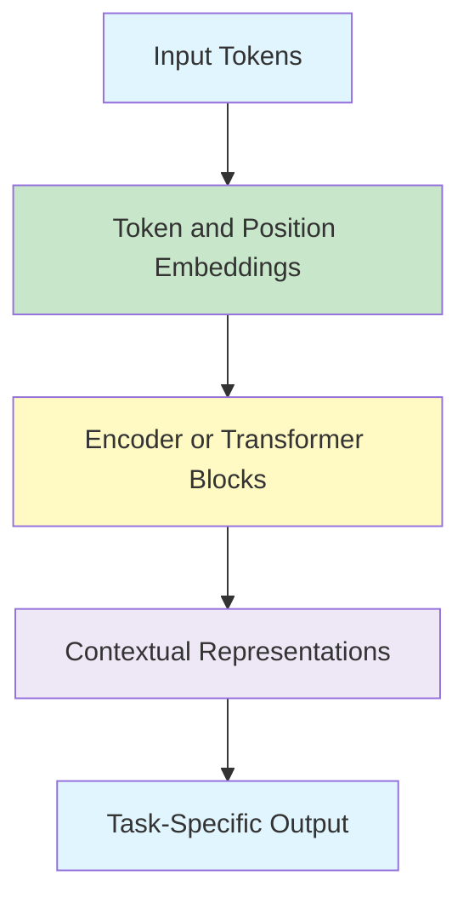

# Encoder-Decoder Models, Attention and Contextual Embeddings


{}
This page is a structured learning template. Replace the comments with clear explanations, examples, formulas, diagrams, and practical insights while keeping the Hugo shortcodes intact.
{}

## Learning Objectives

- Explain encoder-decoder architectures for sequence-to-sequence tasks.
- Describe the intuition and purpose of attention and self-attention.
- Outline the main components of Transformer networks.
- Explain how BERT produces contextual word representations.

## Chapter Map

| Section | Topic | Status |
|---|---|---|
| 1 | Neural Language Models and Generation | ☐ |
| 2 | Encoder-Decoder Networks and Attention | ☐ |
| 3 | Applications of Encoder-Decoder Networks | ☐ |
| 4 | Self-Attention and Transformer Networks | ☐ |
| 5 | BERT: Pre-training of Deep Bidirectional Transformers for Language Understanding | ☐ |
| 6 | Contextual Word Representations | ☐ |

## Big Picture

<!-- Explain how the chapter connects to earlier topics and what problem it solves. -->



## 1. Neural Language Models and Generation ☆

### Definition

{}
<!-- Add a precise, one- or two-sentence definition here. -->
{}

### Intuition

<!-- Explain the idea in beginner-friendly language and connect it to a familiar example. -->

### Key Concepts

- <!-- Key term or component -->
- <!-- Key term or component -->
- <!-- Key relationship or assumption -->

### Formula or Model

<!-- Add mathematics only when it supports understanding. Use this exact structure:

{}

FORMULA HERE

{}

For inline mathematics use:  x 
-->

### Worked Example

<!-- Add a small step-by-step example. -->

### Why It Matters in NLP

<!-- Explain where this concept is used in real NLP systems. -->

### Key Points to Remember

- <!-- Definition or distinction to remember -->
- <!-- Important explanation, derivation, or comparison -->
- <!-- Common mistake to avoid -->

## 2. Encoder-Decoder Networks and Attention ☆

### Definition

{}
<!-- Add a precise, one- or two-sentence definition here. -->
{}

### Intuition

<!-- Explain the idea in beginner-friendly language and connect it to a familiar example. -->

### Key Concepts

- <!-- Key term or component -->
- <!-- Key term or component -->
- <!-- Key relationship or assumption -->

### Formula or Model

<!-- Add mathematics only when it supports understanding. Use this exact structure:

{}

FORMULA HERE

{}

For inline mathematics use:  x 
-->

### Worked Example

<!-- Add a small step-by-step example. -->

### Why It Matters in NLP

<!-- Explain where this concept is used in real NLP systems. -->

### Key Points to Remember

- <!-- Definition or distinction to remember -->
- <!-- Important explanation, derivation, or comparison -->
- <!-- Common mistake to avoid -->

## 3. Applications of Encoder-Decoder Networks ☆

### Definition

{}
<!-- Add a precise, one- or two-sentence definition here. -->
{}

### Intuition

<!-- Explain the idea in beginner-friendly language and connect it to a familiar example. -->

### Key Concepts

- <!-- Key term or component -->
- <!-- Key term or component -->
- <!-- Key relationship or assumption -->

### Formula or Model

<!-- Add mathematics only when it supports understanding. Use this exact structure:

{}

FORMULA HERE

{}

For inline mathematics use:  x 
-->

### Worked Example

<!-- Add a small step-by-step example. -->

### Why It Matters in NLP

<!-- Explain where this concept is used in real NLP systems. -->

### Key Points to Remember

- <!-- Definition or distinction to remember -->
- <!-- Important explanation, derivation, or comparison -->
- <!-- Common mistake to avoid -->

## 4. Self-Attention and Transformer Networks ☆

### Definition

{}
<!-- Add a precise, one- or two-sentence definition here. -->
{}

### Intuition

<!-- Explain the idea in beginner-friendly language and connect it to a familiar example. -->

### Key Concepts

- <!-- Key term or component -->
- <!-- Key term or component -->
- <!-- Key relationship or assumption -->

### Formula or Model

<!-- Add mathematics only when it supports understanding. Use this exact structure:

{}

FORMULA HERE

{}

For inline mathematics use:  x 
-->

### Worked Example

<!-- Add a small step-by-step example. -->

### Why It Matters in NLP

<!-- Explain where this concept is used in real NLP systems. -->

### Key Points to Remember

- <!-- Definition or distinction to remember -->
- <!-- Important explanation, derivation, or comparison -->
- <!-- Common mistake to avoid -->

## 5. BERT: Pre-training of Deep Bidirectional Transformers for Language Understanding ☆

### Definition

{}
<!-- Add a precise, one- or two-sentence definition here. -->
{}

### Intuition

<!-- Explain the idea in beginner-friendly language and connect it to a familiar example. -->

### Key Concepts

- <!-- Key term or component -->
- <!-- Key term or component -->
- <!-- Key relationship or assumption -->

### Formula or Model

<!-- Add mathematics only when it supports understanding. Use this exact structure:

{}

FORMULA HERE

{}

For inline mathematics use:  x 
-->

### Worked Example

<!-- Add a small step-by-step example. -->

### Why It Matters in NLP

<!-- Explain where this concept is used in real NLP systems. -->

### Key Points to Remember

- <!-- Definition or distinction to remember -->
- <!-- Important explanation, derivation, or comparison -->
- <!-- Common mistake to avoid -->

## 6. Contextual Word Representations ☆

### Definition

{}
<!-- Add a precise, one- or two-sentence definition here. -->
{}

### Intuition

<!-- Explain the idea in beginner-friendly language and connect it to a familiar example. -->

### Key Concepts

- <!-- Key term or component -->
- <!-- Key term or component -->
- <!-- Key relationship or assumption -->

### Formula or Model

<!-- Add mathematics only when it supports understanding. Use this exact structure:

{}

FORMULA HERE

{}

For inline mathematics use:  x 
-->

### Worked Example

<!-- Add a small step-by-step example. -->

### Why It Matters in NLP

<!-- Explain where this concept is used in real NLP systems. -->

### Key Points to Remember

- <!-- Definition or distinction to remember -->
- <!-- Important explanation, derivation, or comparison -->
- <!-- Common mistake to avoid -->

## Practical Exploration

Use a pre-trained Transformer or BERT model for a simple NLP task and inspect token representations.

```python
# Add a minimal, well-commented Python example here.
```

## Comparison Table

| Concept or Model | Main Idea | Strength | Limitation | Typical Use |
|---|---|---|---|---|
| <!-- Item 1 --> | <!-- Idea --> | <!-- Strength --> | <!-- Limitation --> | <!-- Use --> |
| <!-- Item 2 --> | <!-- Idea --> | <!-- Strength --> | <!-- Limitation --> | <!-- Use --> |

## Common Mistakes

{}
- <!-- Add a common conceptual mistake. -->
- <!-- Add a common mathematical or algorithmic mistake. -->
- <!-- Add a terminology or interpretation mistake. -->
{}

## Practice Questions

1. <!-- Definition or explanation question -->
2. <!-- Comparison question -->
3. <!-- Calculation, trace, or worked-example question -->
4. <!-- Application or design question -->

## Key Takeaways

{}
- <!-- Most important takeaway -->
- <!-- Second takeaway -->
- <!-- Practical interpretation -->
{}

## Understanding Checklist

- [ ] I can explain **Neural Language Models and Generation** without referring to notes.
- [ ] I can explain **Encoder-Decoder Networks and Attention** without referring to notes.
- [ ] I can explain **Applications of Encoder-Decoder Networks** without referring to notes.
- [ ] I can explain **Self-Attention and Transformer Networks** without referring to notes.
- [ ] I can explain **BERT: Pre-training of Deep Bidirectional Transformers for Language Understanding** without referring to notes.
- [ ] I can explain **Contextual Word Representations** without referring to notes.

---
 | 
