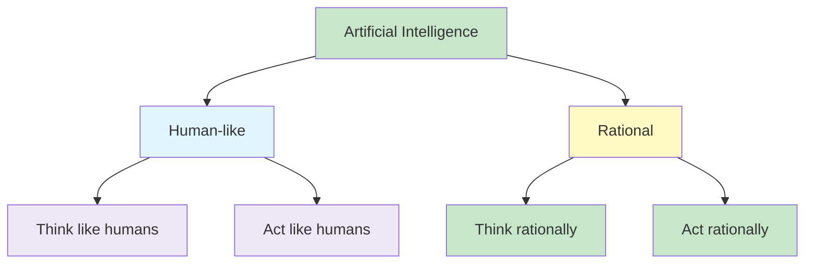
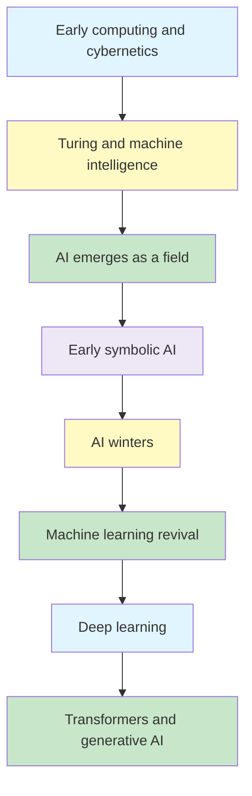

# Artificial Intelligence

Artificial Intelligence (AI) is concerned with building systems that can **perceive, reason, learn, decide and act** in ways that achieve useful goals.

The foundations of AI, its major application areas, four classic ways of thinking about intelligence, important milestones in its development, and some of the risks that accompany increasingly capable AI systems.

## Learning Objectives

- explain what intelligence and artificial intelligence mean in practical terms
- identify the major disciplines that contributed to AI
- distinguish **thinking humanly**, **acting humanly**, **thinking rationally** and **acting rationally**
- explain the idea behind the **Turing Test**
- describe why the rational-agent view is central to modern AI
- recognise important application areas and risks of AI

## Big Picture



---

1. Agent
2. Explore (all possible solutions)
3. Environment
4. Sensor → i/p → Percept
5. Actuator
6. Action
7. Initial State: Source
8. Transition Model
9. Random-isation
10. Learned Info → FACT → Knowledge Base
11. Backtracking

- State Space Transition Diagram / Search Tree
- Performance Measure → Numerical Measure (Minimise or Maximise)

M2 → Search
M4 → Game
M5 → Knowledge → Fact → KB → Inference

---

## 1. What Is Intelligence?

Intelligence is not a single ability. It involves several capabilities working together, including:

- **perception** - observing what is happening in the world
- **reasoning** - drawing conclusions from available information
- **planning** - deciding what to do and in what order
- **learning and adaptation** - improving behaviour through experience
- **understanding** - interpreting language, speech, images or situations
- **action** - doing something useful in response to what has been perceived

For example:

| Capability | Example |
|---|---|
| Reasoning | Producing a medical diagnosis from symptoms |
| Planning | Choosing a sequence of actions to reach a destination |
| Learning | Learning traffic patterns from historical data |
| Understanding | Interpreting speech or a visual scene |
| Adaptation | Improving recommendations from user behaviour |

{}
A useful mental model is: **intelligence connects perception to purposeful action**. A system observes something, processes what it observes, and uses that information to decide what to do.
{}

## 2. What Is Artificial Intelligence? ☆

There is no single definition that captures every view of AI. A useful way to organise the field is along two questions:

1. Are we interested in **thought** or **behaviour**?
2. Are we comparing the system with **humans** or with an ideal of **rationality**?

This produces four classic perspectives:

| | Human-like | Rational |
|---|---|---|
| **Thought / reasoning** | Thinking humanly | Thinking rationally |
| **Behaviour / action** | Acting humanly | Acting rationally |

These perspectives are related, but they ask different questions. A machine could produce an excellent result without reasoning as a human would, while a system designed to model human cognition may deliberately try to reproduce human reasoning patterns.

## 3. Thinking Humanly - Cognitive Modelling

The **thinking humanly** approach asks:

> How can a machine reproduce the way humans actually think?

This connects AI with **cognitive science** and psychology. Understanding human thought is difficult because people cannot always accurately explain their own internal reasoning.

Ways of studying human thought include:

- introspection
- psychological experiments
- observing human problem-solving behaviour
- brain imaging and neuroscience

A historically important example is the **General Problem Solver** developed by Newell and Simon. A major interest was not merely whether it could solve a problem, but whether its sequence of reasoning steps resembled the steps taken by humans.

Thinking humanly is particularly relevant when the objective is to understand or model human cognition, for example in intelligent tutoring or human-computer interaction.

{}
If a chess program defeats a human, that does not automatically mean it **thinks like a human**. Performance and cognitive similarity are different questions.
{}

## 4. Acting Humanly - The Turing Test ☆

The **acting humanly** approach focuses on behaviour rather than the internal reasoning process.

Alan Turing proposed a practical way of asking whether a machine could demonstrate human-like intelligent behaviour. In the **Turing Test**, a human interrogator communicates without directly seeing whether the other participant is a human or a computer.

If the interrogator cannot reliably distinguish the machine from a human based on the interaction, the machine has demonstrated human-like behaviour for the purpose of the test.

Passing such a test requires several AI capabilities, including:

- natural language processing
- knowledge representation
- automated reasoning
- machine learning

A more complete physical version would additionally require perception and action capabilities such as computer vision and robotics.

### What the Turing Test does not tell us

The Turing Test evaluates **observable behaviour**. It does not prove that the system reasons internally in the same way as a human.

It is therefore useful to distinguish:

**behaving like a human** from **thinking like a human**.

## 5. Thinking Rationally - Laws of Thought ☆

The **thinking rationally** approach focuses on reaching correct conclusions through formal reasoning.

Its roots go back to classical logic and the study of valid arguments. The aim is to represent knowledge in a formal form and apply rules of inference to derive conclusions.

A simple syllogistic pattern is:

```text
All members of group A have property B.
X is a member of group A.
Therefore, X has property B.
```

This approach is important because formal logic provides a precise framework for reasoning. However, purely logical reasoning has limitations:

- not every intelligent action requires deliberate logical inference
- real environments may contain uncertainty or incomplete information
- reasoning over a very large knowledge base may be computationally expensive

For example, quickly recoiling from a hot object can be an appropriate action without first carrying out an explicit chain of logical reasoning.

## 6. Acting Rationally - The Rational Agent Approach ☆

The **acting rationally** perspective asks a practical question:

> Given what the system knows and can observe, which action should it take to achieve the best outcome?

An **agent** is an entity that perceives its environment and acts upon it. A rational agent attempts to select an action that leads to the best outcome, or the best **expected** outcome when there is uncertainty.

{}A rational agent tries to do the right thing given the information and resources available to it.{}

Rational behaviour may involve:

- logical inference
- decision-making under uncertainty
- prediction
- learning from experience
- immediate action without lengthy deliberation

Perfect rationality is usually impossible because real systems have limited information, time and computational resources. The practical objective is therefore to design the best behaviour possible within those constraints.

This rational-agent perspective leads directly to the study of **intelligent agents and environments**.

## 7. Comparing the Four Perspectives

| Perspective | Main question | Main emphasis |
|---|---|---|
| Thinking humanly | Does it think as humans think? | Cognitive processes |
| Acting humanly | Does it behave like a human? | Observable behaviour |
| Thinking rationally | Does it reason correctly? | Logic and valid inference |
| Acting rationally | Does it choose an effective action? | Goal-directed behaviour |

{}
The four views can be remembered using two axes: **thinking vs acting**, and **human-like vs rational**.
{}

## 8. Foundations of AI

AI developed from ideas across several disciplines rather than from one field alone.

| Discipline | Contribution to AI |
|---|---|
| Philosophy | Logic, reasoning, knowledge, rationality and the nature of mind |
| Mathematics | Formal logic, probability, computation and algorithms |
| Economics | Rational decisions, utility, game theory and decision-making under uncertainty |
| Neuroscience | Understanding how biological brains process information |
| Psychology | Human cognition, learning, perception and behaviour |
| Computer science and engineering | Algorithms, software and computational hardware |
| Control theory and cybernetics | Feedback, control and goal-directed behaviour |
| Linguistics | Language structure, meaning and communication |

These foundations explain why AI includes such a wide range of techniques: search, logic, probability, optimisation, learning, game playing and intelligent agents all address different parts of intelligent behaviour.

## 9. AI Application Areas

AI techniques are used across many domains, including:

- healthcare
- finance
- education
- automotive systems
- retail
- manufacturing
- customer service
- natural language processing
- computer vision
- robotics
- smart cities
- agriculture
- entertainment
- cybersecurity
- environmental conservation
- transportation

The same underlying AI capability can appear in very different applications. For example, perception can support medical image analysis, autonomous driving or robotic inspection, while reasoning can support diagnosis, planning or decision support.

## 10. A Short History of AI

The development of AI has not been a steady upward progression. It has alternated between periods of strong optimism, rapid progress and periods of reduced expectations and investment.



Important milestones include:

- early work in computation, logic and cybernetics
- Alan Turing's work on machine intelligence and the Turing Test
- the emergence of AI as a recognised research field in the 1950s
- early symbolic reasoning programs and perceptrons
- periods of reduced funding and expectations commonly called **AI winters**
- renewed progress through machine learning and neural networks
- major achievements such as Deep Blue, AlexNet and AlphaGo
- the Transformer architecture and rapid development of large language and generative models

### Why progress accelerated

Modern AI has benefited from the combination of:

- much greater computing power
- large volumes of digital data
- improved algorithms
- advances in neural networks and deep learning
- specialised hardware and scalable computing infrastructure

These factors allowed ideas that had existed for many years to become practical at much larger scales.

## 11. Risks and Limitations of AI

Increasing capability also creates new technical and societal risks.

### Autonomous weapons

AI can increase the autonomy and scale of weapon systems, creating difficult questions about human control, accountability and safety.

### Surveillance and persuasion

AI can analyse large volumes of behavioural data and personalise information at scale. This can be used constructively, but it can also enable intrusive surveillance or manipulation.

### Biased decision-making

Models trained on biased data can reproduce or amplify unfair patterns. This is particularly important in areas such as lending, recruitment or criminal justice.

### Employment and inequality

AI can automate some tasks while making other workers more productive. The benefits and economic costs may not be distributed evenly.

### Safety-critical systems

When AI is used in transport, healthcare or critical infrastructure, errors can have serious consequences. Such applications require strong engineering, testing and ethical standards.

### Cybersecurity and misuse

AI can help detect attacks but can also be used to automate or personalise malicious activity. Other concerns include deepfakes, misinformation and sustainability costs.

{}
AI capability and AI safety are not separate concerns. The more influence a system has over real-world decisions, the more important its reliability, fairness, security and accountability become.
{}

## Common Mistakes

{}
- **AI does not mean only machine learning.** Search, logic, planning, reasoning and intelligent agents are also central areas of AI.
- **Human-like and rational are not the same thing.** Humans can make irrational decisions, while a rational system need not imitate human behaviour.
- **Passing a behavioural test does not prove human-like internal reasoning.**
- **Rational does not mean omniscient or perfect.** A system must act using the information and computational resources available to it.
{}

## Practice Questions

1. Explain the difference between intelligence and artificial intelligence.
2. Compare thinking humanly with acting humanly.
3. What does the Turing Test attempt to measure?
4. Why is thinking rationally not sufficient for every intelligent behaviour?
5. Explain the difference between acting humanly and acting rationally.
6. Why are philosophy, mathematics, economics and psychology relevant to AI?
7. Give three application areas of AI and identify the intelligent capability used in each.
8. Why has AI development experienced periods of rapid progress and periods of reduced expectations?
9. Describe three risks associated with widespread use of AI.

## Key Takeaways

{}
- AI can be viewed through four perspectives: **thinking humanly, acting humanly, thinking rationally and acting rationally**.
- The Turing Test focuses on **human-like behaviour**, while cognitive modelling focuses on **human-like thought**.
- The rational-agent approach focuses on selecting actions that achieve the best expected outcome with available information.
- AI draws on many disciplines and includes much more than machine learning.
- AI systems must be considered not only for capability, but also for their safety, fairness and wider impact.
{}

## Checklist

- [ ] I can explain the four classic perspectives on AI.
- [ ] I can describe the purpose of the Turing Test.
- [ ] I can distinguish human-like behaviour from rational behaviour.
- [ ] I can explain why several disciplines contribute to AI.
- [ ] I can identify major application areas and risks of AI.
- [ ] I understand why rational agents are an important framework for studying AI.

---
 | 
