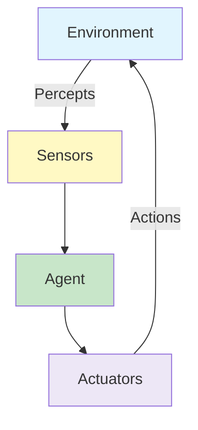
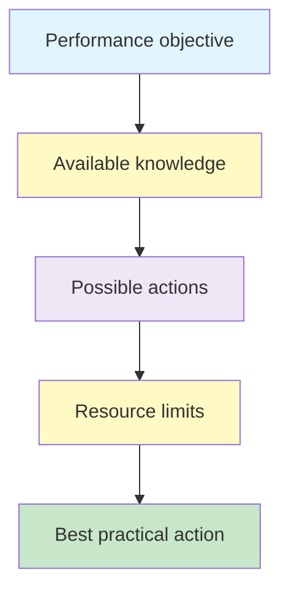
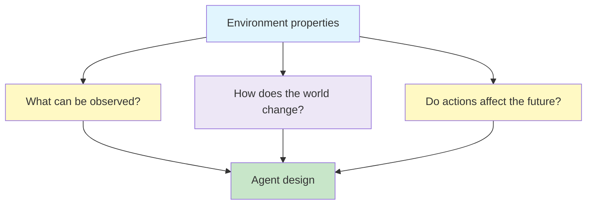

# Intelligent Agents and Environments

An intelligent agent connects **perception** with **action**. It observes an environment through sensors, uses the information it receives to decide what to do, and affects the environment through actuators.

Develop the core vocabulary for reasoning about intelligent agents: percepts, actions, rationality, performance measures, PEAS and the different properties an environment can have.

## Learning Objectives

- explain the relationship between an agent and its environment
- distinguish sensors, percepts, actions and actuators
- explain percept sequences and the agent function
- describe what makes an agent rational
- distinguish rationality from omniscience
- specify a task environment using **PEAS**
- classify environments using standard AI properties
- explain why environment properties affect agent design

## Big Picture



{}
Think of an agent as a continuous loop: **observe → decide → act → observe again**. An action may change the environment, so the next observation may be different.
{}

## 1. What Is an Agent? ☆

{}An agent is anything that can be viewed as perceiving its environment through sensors and acting upon that environment through actuators.{}

The definition is deliberately broad.

| Agent | Sensors | Actuators |
|---|---|---|
| Human | Eyes, ears and other sensory organs | Hands, legs, mouth and other body parts |
| Robot | Cameras, range finders, joint sensors | Motors, wheels, robotic arms |
| Software agent | Digital inputs, messages, data sources | Commands, messages, API or software actions |

An agent does not exist in isolation. Its sensors and actuators only make sense relative to the **environment** in which it operates.

### Agent and environment

The environment is the part of the world relevant to the problem the agent is trying to solve.

For a navigation agent, the environment might contain roads, possible locations, obstacles and a destination. For a medical diagnosis system, it might include the patient, available clinical information and the healthcare setting.

The exact environment therefore depends on the problem being modelled.

## 2. Sensors, Percepts, Actions and Actuators ☆

These terms describe different parts of the agent-environment interaction.

| Term | Meaning |
|---|---|
| **Sensor** | Mechanism used to obtain information from the environment |
| **Percept** | Information received by the agent from the environment at a particular time |
| **Action** | What the agent decides to do |
| **Actuator** | Mechanism used to carry out an action in the environment |

For a self-driving vehicle:

- a **camera** is a sensor
- the observed lane, pedestrian or traffic signal contributes to the percept
- deciding to slow down is an action
- the **braking system** is an actuator that carries out the action

{}
Do not confuse a **sensor** with a **percept**. A sensor is the mechanism that observes; a percept is the information obtained through observation.
{}

## 3. Percepts and Percept Sequences ☆

A **percept** represents what an agent observes at a particular moment.

A **percept sequence** is the complete history of percepts the agent has received so far.

This distinction matters because some decisions depend only on the current observation, while others require information from earlier observations.

For example, an agent navigating through a changing environment may need to remember where it has already been rather than deciding solely from the current view.

### Vacuum-cleaner example

Consider a simple vacuum-cleaner world with two locations, **A** and **B**.

A percept might contain:

```text
[A, Dirty]
```

This tells the agent:

- its current location is A
- location A is dirty

Possible actions include:

```text
Left, Right, Suck, NoOp
```

The agent uses the percept to select an appropriate action. If it perceives `[A, Dirty]`, for example, `Suck` may be an appropriate choice.

## 4. Agent Function ☆

The **agent function** describes the mapping from percept history to an action.

{}

f : P^{*} \rightarrow A

{}

where:

-  P^{*}  represents possible percept sequences
-  A  represents the set of possible actions

In simple words:

```text
percept history → agent function → action
```

The **agent program** is the implementation that runs on a physical or software architecture to realise this behaviour.

{}Agent = Architecture + Program{}

The conceptual function describes **what action should be selected**; the program and architecture determine **how that behaviour is implemented**.

## 5. Rational Agents ☆

A rational agent should try to do the right thing based on:

- what it has perceived
- what it already knows
- the actions available to it
- how success is measured

{}A rational action is one expected to maximise the agent's performance measure given the evidence available so far.{}

The word **expected** is important. An agent may have to act under uncertainty, where no action guarantees the best outcome.

### Performance measure

A **performance measure** is an objective criterion used to judge how successfully an agent behaves.

For a vacuum-cleaner agent, performance might consider:

- amount of dirt cleaned
- time taken
- electricity consumed
- noise generated

There may therefore be more than one measure of success. A system that cleans everything but uses excessive energy may not be considered optimal when energy efficiency is also important.

### Rationality is not omniscience

A rational agent is not required to know the future.

**Omniscience** would mean knowing the actual outcome of every possible action in advance. Real agents do not have this ability.

Rationality instead asks whether the agent made the best decision it could using the evidence available at the time.

{}
A rational decision can still lead to a poor outcome. If the future is uncertain, the quality of the decision should be judged using the information available **when the decision was made**, not information revealed afterwards.
{}

### Exploration and information gathering

A rational agent may deliberately take an action that improves its future knowledge. It can explore the environment, gather information and use new percepts to make better decisions later.

### Autonomy

An agent is more autonomous when its behaviour is determined by its own experience rather than being completely fixed by built-in knowledge.

Learning and adaptation therefore support autonomy.

## 6. Bounded Rationality

Perfect rationality is usually unrealistic because an agent has limited:

- computational power
- memory
- time
- knowledge of the environment

**Bounded rationality** recognises these limits. The aim is to choose the best practical action given the agent's knowledge and available computational resources.



## 7. PEAS - Specifying a Task Environment ☆

Before designing an intelligent agent, we need to describe the task it is expected to perform and the world in which it operates.

**PEAS** provides a systematic way to do this:

| Letter | Meaning | Key question |
|---|---|---|
| **P** | Performance measure | What counts as success? |
| **E** | Environment | What world does the agent operate in? |
| **A** | Actuators | How can the agent act? |
| **S** | Sensors | How can the agent observe? |

{}
Remember PEAS as: **How is success measured? Where does the agent operate? How can it act? How can it sense?**
{}

### Worked example: automated taxi

| PEAS component | Automated taxi |
|---|---|
| Performance | Safe, fast, legal and comfortable journeys; profitability |
| Environment | Roads, traffic, signals, pedestrians and passengers |
| Actuators | Steering, accelerator, brake, signals and horn |
| Sensors | Cameras, range sensors, speedometer, GPS, odometer and vehicle sensors |

The performance measure is deliberately broader than simply "reach the destination". A taxi that arrives quickly but drives dangerously is not behaving successfully.

### Medical diagnosis system

| PEAS component | Medical diagnosis system |
|---|---|
| Performance | Patient health, appropriate care, reduced cost and risk |
| Environment | Patient, hospital and clinical staff |
| Actuators | Display questions, recommend tests, diagnoses, treatments or referrals |
| Sensors | Entered symptoms, findings and patient responses |

### Part-picking robot

| PEAS component | Part-picking robot |
|---|---|
| Performance | Percentage of parts placed in the correct bins |
| Environment | Conveyor belt, parts and bins |
| Actuators | Robotic arm and gripper |
| Sensors | Camera and joint-angle sensors |

The PEAS description changes with the task. It should therefore be defined from the **problem statement**, not copied from another agent.

## 8. Properties of Environments ☆

The nature of the environment strongly influences how an intelligent agent should be designed.

Important dimensions include:

- fully observable vs partially observable
- deterministic vs stochastic
- episodic vs sequential
- static vs semi-dynamic vs dynamic
- discrete vs continuous
- single-agent vs multi-agent

### Fully observable vs partially observable

A **fully observable** environment gives the agent access through its sensors to all information relevant to choosing an action at a particular time.

A **partially observable** environment hides some relevant information or provides incomplete/noisy observations.

Examples:

- chess is typically treated as fully observable because the complete board state is visible
- poker is partially observable because an agent cannot see every player's cards

### Deterministic vs stochastic

In a **deterministic** environment, the next state is completely determined by the current state and the action taken.

In a **stochastic** environment, there is uncertainty about the next state.

Examples of stochastic settings include autonomous driving, a robot playing football, and agricultural tasks affected by changing weather.

If uncertainty arises specifically from the actions of other agents, the environment can also be described as **strategic**.

### Episodic vs sequential

In an **episodic** environment, each decision can be treated largely independently. The current action does not depend on a long history of earlier decisions.

Example: classifying whether an individual image contains a cat.

In a **sequential** environment, current actions affect future states and decisions. Long-term consequences therefore matter.

Examples include navigation, games and investment portfolio management.

### Static, dynamic and semi-dynamic

A **static** environment does not change while the agent is deciding what to do.

Examples include many puzzles and a Rubik's cube while no external actor changes it.

A **dynamic** environment can change while the agent is deliberating.

Examples include road traffic and changing weather.

A **semi-dynamic** environment does not change while the agent thinks, but the agent's performance changes with time. Chess played with a clock is a common example.

### Discrete vs continuous

A **discrete** environment has distinct states, percepts or actions that can be represented as separate choices. Chess is a standard example.

A **continuous** environment contains quantities that vary over a range, such as position, speed, steering angle or time. Taxi driving therefore contains many continuous elements.

### Single-agent vs multi-agent

A **single-agent** environment contains one decision-making agent of interest.

A **multi-agent** environment contains other agents whose actions can influence what happens.

Multi-agent relationships may be:

- cooperative
- competitive
- self-interested

Game playing is an obvious example, but many real-world environments are also multi-agent because people, vehicles or software systems interact with one another.

## 9. Environment Classification Examples

| Property | Chess-like game | Mobile robot in the real world |
|---|---|---|
| Observability | Fully observable | Partially observable |
| Outcome | Deterministic / strategic | Stochastic |
| Dependency | Sequential | Sequential |
| Change over time | Static or semi-dynamic with a clock | Dynamic |
| State/action space | Discrete | Often continuous |
| Agents | Multi-agent | Often multi-agent |

The real world is commonly **partially observable, stochastic, sequential, dynamic, continuous and multi-agent**. This combination makes real-world agent design substantially harder than simple toy environments.

## 10. Why Environment Properties Matter

Environment classification is not just terminology. It guides the design of the agent.

For example:

- partial observability may require memory or belief about hidden state
- stochastic environments require reasoning under uncertainty
- sequential tasks require consideration of future consequences
- dynamic environments reward timely decisions
- continuous environments need methods that can handle continuous quantities
- multi-agent environments require reasoning about the actions of others



## 11. AI Agent and Agentic AI - A Useful Distinction

The broad AI definition of an **agent** is older and more general than the recent use of the phrase **agentic AI**.

In the classical sense used here, an agent is defined by perception and action in an environment. It could be a robot, a software program or another decision-making system.

The term **agentic AI** is often used for systems with a higher degree of autonomy, where one or more AI components can reason about goals, break work into tasks, use tools, coordinate actions and adapt their behaviour.

The important point for this topic is that the theory of intelligent agents does **not** depend on large language models or modern tool-calling systems.

## Common Mistakes

{}
- A **sensor** is not a **percept**: the sensor obtains information; the percept is the information received.
- An **actuator** is not the same as an **action**: the action is the decision; the actuator carries it out.
- **Rational** does not mean all-knowing. Rationality is judged using the information available to the agent.
- A task may have several performance criteria; success is rarely captured by a single number in realistic systems.
- Environment properties are not universal labels for an agent. They depend on the particular task and modelling assumptions.
{}

## Practice Questions

1. Define an agent, sensor, percept, action and actuator using one continuous example.
2. What is the difference between a percept and a percept sequence?
3. Explain what the agent function  f : P^{*} \rightarrow A  represents.
4. Why is rationality different from omniscience?
5. Give four possible performance measures for a vacuum-cleaner agent.
6. Construct a PEAS description for an autonomous delivery robot.
7. Distinguish deterministic and stochastic environments with examples.
8. Why is image classification usually treated as episodic while navigation is sequential?
9. What is the difference between static, dynamic and semi-dynamic environments?
10. Classify an autonomous taxi environment across the major environment properties and justify each choice.

## Key Takeaways

{}
- An agent **perceives** an environment through sensors and **acts** through actuators.
- A percept is one observation; a percept sequence is the history of observations.
- The agent function maps percept sequences to actions.
- A rational agent selects actions expected to maximise its performance measure using the information available.
- **PEAS = Performance measure, Environment, Actuators, Sensors.**
- Environment properties determine what information and decision-making capabilities an agent needs.
{}

## Checklist

- [ ] I can explain the agent-environment interaction.
- [ ] I can distinguish sensors, percepts, actions and actuators.
- [ ] I can explain the agent function and percept sequence.
- [ ] I can distinguish rationality from omniscience.
- [ ] I can construct a PEAS description for a new problem.
- [ ] I can classify an environment by observability, determinism, dependency, dynamics, continuity and number of agents.
- [ ] I can explain why environment properties influence agent design.

---
 | 
