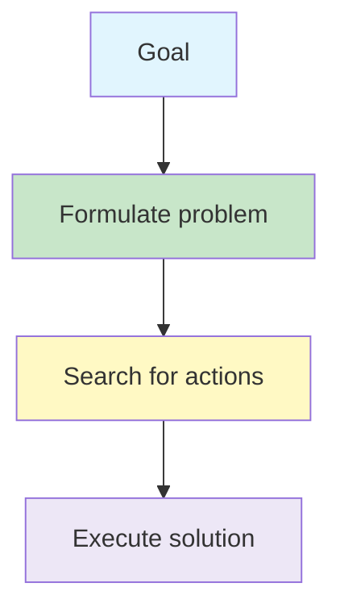
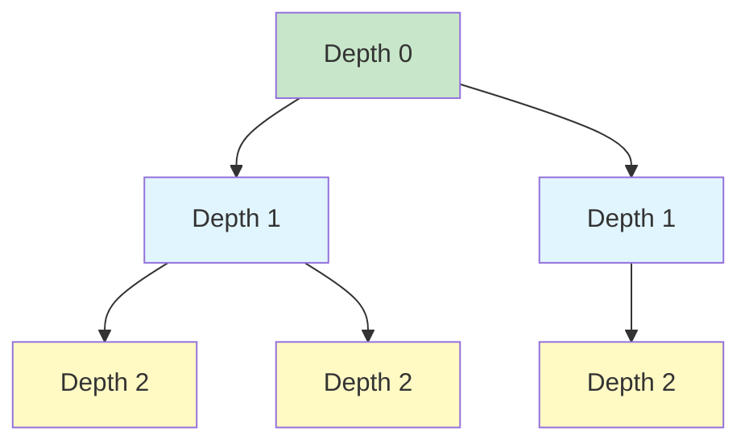

# Problem Solving and Uninformed Search

A problem-solving agent converts a goal into a precisely defined search problem. An uninformed search algorithm then explores the state space using only the information in that problem definition.

## Learning Objectives

- formulate a search problem using five components
- distinguish a state-space graph from a search tree
- explain nodes, frontiers and node expansion
- compare BFS, DFS, UCS, DLS and IDS
- select an appropriate uninformed strategy for a problem
- distinguish offline and online search

## Big Picture



## 1. Problem-Solving Agents ☆

A problem-solving agent normally follows three stages:

1. **Formulate** the goal and search problem.
2. **Search** for a sequence of actions that reaches the goal.
3. **Execute** the selected action sequence.

This approach is most natural when the environment is observable, discrete, known and deterministic. Under these assumptions, the agent can predict the result of each action and form a fixed plan before acting.

## 2. The Five Components of a Search Problem ☆

| Component | Meaning | Route-finding example |
|---|---|---|
| Initial state | Where the agent starts | In Arad |
| Actions | Legal choices in a state | Drive to Sibiu |
| Transition model | Result of applying an action | Arad + drive to Sibiu → Sibiu |
| Goal test | Checks whether the goal has been reached | Is the agent in Bucharest? |
| Path cost | Numerical cost of the action sequence | Total distance travelled |

{}A solution is a path from the initial state to a state that passes the goal test. An optimal solution has the lowest path cost.{}

### Abstraction

A useful formulation ignores details that do not affect the solution. In route planning, the agent may represent a state simply as a city rather than including the vehicle's exact position, radio setting and every nearby building.

{}
Abstraction makes search manageable: retain enough information to choose correctly, but omit irrelevant real-world detail.
{}

## 3. State, State Space and Path

- A **state** contains the information needed to make a decision.
- The **state space** is the set of states reachable from the initial state.
- An **action** creates a transition between states.
- A **path** is a sequence of actions or connected states.

The state space forms a graph: states are vertices and actions are edges.

## 4. States and Search Nodes ☆

A state describes the world. A node is a bookkeeping record used by the search algorithm.

A node commonly stores:

- `STATE` — the represented world state
- `PARENT` — the node that generated it
- `ACTION` — the action applied to the parent
- `PATH-COST` — the cost from the initial state, written as  g(n) 

Two different nodes can represent the same state if different paths reach it.

### Frontier and expansion

The **frontier** contains generated nodes waiting to be explored. **Expanding** a node means generating its successors.

| Frontier organisation | Behaviour | Used by |
|---|---|---|
| FIFO queue | Oldest node first | BFS |
| LIFO stack | Newest node first | DFS |
| Priority queue by  g(n)  | Cheapest path first | UCS |

## 5. Evaluating Search Strategies

Search algorithms are compared using:

- **Completeness:** will it find a solution if one exists?
- **Optimality:** will it find the least-cost solution?
- **Time complexity:** how many nodes are generated or expanded?
- **Space complexity:** how many nodes must be stored?

Common symbols are:

-  b  — maximum branching factor
-  d  — depth of the shallowest solution
-  m  — maximum depth of the state space

## 6. Breadth-First Search ☆

**Breadth-First Search (BFS)** expands all nodes at one depth before moving to the next depth. It uses a FIFO queue.



BFS is complete for finite branching and optimal when every step has the same cost. Its main weakness is high memory use because it stores a wide frontier.

## 7. Depth-First Search ☆

**Depth-First Search (DFS)** follows one path as deeply as possible before backtracking. It uses a LIFO stack or recursion.

DFS uses much less memory than BFS, but it can follow an unproductive or infinite branch. It does not generally guarantee the shortest or least-cost solution.

{}
Use DFS when memory is the main concern and finding an optimal path is not essential.
{}

## 8. Uniform-Cost Search ☆

**Uniform-Cost Search (UCS)** expands the frontier node with the smallest accumulated path cost.

{}

f(n) = g(n)

{}

The frontier is a priority queue ordered by  g(n) . The goal test is applied when a node is removed for expansion, not merely when a goal is first generated. A cheaper route to that goal may still be waiting on the frontier.

### Short example

Suppose:

-  S \rightarrow A = 2 
-  S \rightarrow B = 1 
-  B \rightarrow G = 8 
- another route to  G  costs 11

UCS chooses  S \rightarrow B \rightarrow G  because its total cost is 9.

## 9. Depth-Limited Search

**Depth-Limited Search (DLS)** is DFS with a fixed depth limit. It prevents the search from descending indefinitely, but it cannot find a solution located beyond the chosen limit.

## 10. Iterative Deepening Search ☆

**Iterative Deepening Search (IDS)** repeatedly runs DLS with increasing limits:

```text
0, 1, 2, 3, ...
```

It combines BFS's ability to find a shallow goal with DFS's low memory use.

{}

\text{Time} = O(b^d), \qquad \text{Space} = O(bd)

{}

IDS is complete and is optimal when all step costs are equal. Re-expanding upper-level nodes is usually inexpensive because most nodes lie near the deepest explored level.

{}
At depth limit 0, the root is visited and goal-tested, but its children are not generated. Under the standard definition, it is therefore not expanded in that iteration.
{}

## 11. Comparing Uninformed Search Algorithms

| Strategy | Chooses | Main advantage | Main limitation |
|---|---|---|---|
| BFS | Shallowest node | Complete; shortest path for equal costs | High memory use |
| DFS | Deepest node | Low memory use | Not generally complete or optimal |
| UCS | Lowest path cost | Optimal with positive costs | Can consume substantial time and memory |
| DLS | Deepest node within limit | Avoids infinite descent | Misses deeper solutions |
| IDS | Increasing depth limits | Complete with low memory | Repeats some work |

## 12. Offline and Online Search

In **offline search**, the agent has a model of the problem, plans first and then executes the plan. BFS, DFS, UCS and A* are normally described this way.

An **online search agent** does not initially know the complete environment. It repeatedly:

1. acts
2. observes the result
3. updates its knowledge
4. chooses the next action

Online search is useful when an environment is unknown, dynamic or too large to model completely, such as a robot exploring an unfamiliar building.

## Common Mistakes

{}
- BFS finds the shallowest solution, not automatically the cheapest one when edge costs differ.
- UCS tests a goal when it is selected for expansion; the first generated goal may not be cheapest.
- A search node and a world state are not the same thing.
- DFS saves memory but does not normally guarantee an optimal path.
- IDS revisits the root at every depth limit, but visiting is not always the same as expanding.
{}

## Practice Questions

1. Formulate the 8-puzzle using the five problem components.
2. Explain why abstraction is necessary in route planning.
3. Distinguish a search node from a state.
4. When does BFS guarantee an optimal solution?
5. Why is the first goal generated by UCS not necessarily optimal?
6. Why can DFS require less memory than BFS?
7. Explain how IDS combines properties of BFS and DFS.
8. When would an online search agent be more suitable than an offline agent?

## Key Takeaways

{}
- A search problem requires an initial state, actions, transition model, goal test and path cost.
- BFS explores by depth, DFS explores one branch deeply, and UCS explores by accumulated cost.
- IDS provides completeness and low memory use by repeating depth-limited searches.
- Uninformed search uses only the problem definition; it has no estimate of which non-goal state is closer to the goal.
- Online search interleaves planning, acting and learning about the environment.
{}

## Checklist

- [ ] I can formulate a search problem using five components.
- [ ] I can distinguish states, nodes, paths and the frontier.
- [ ] I can compare BFS, DFS, UCS, DLS and IDS.
- [ ] I can explain when each strategy is complete or optimal.
- [ ] I can distinguish online and offline search.

---
 | 
