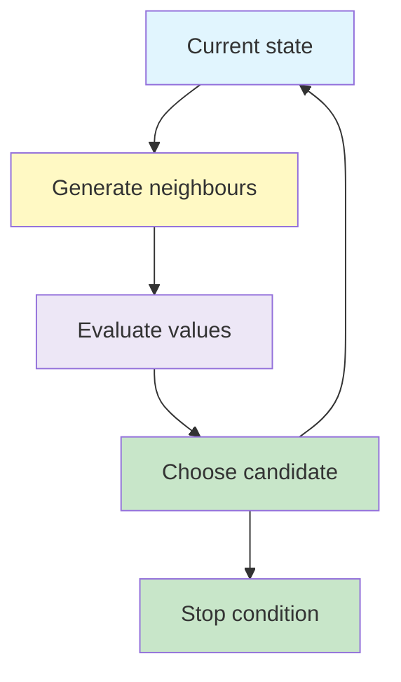

# Local Search and Optimisation

Local search improves one or a few complete candidate solutions by moving through their neighbourhoods. It is especially useful when the final configuration matters but the path used to reach it does not.

## Learning Objectives

- distinguish path optimisation from state optimisation
- explain states, neighbours and objective functions
- apply hill climbing and its variants
- recognise local maxima, plateaus and ridges
- explain random-restart and stochastic hill climbing
- describe local and stochastic beam search

## Big Picture



## 1. Path Optimisation vs State Optimisation ☆

In classical route search, the **path** is the solution. The agent must remember how it travelled from the start to the goal.

In many optimisation problems, only the final **state** matters. Examples include:

- arranging queens on a chessboard
- constructing a timetable
- selecting model hyperparameters
- finding an efficient component layout

| Type | What matters? | Example |
|---|---|---|
| Path optimisation | Sequence of actions and its cost | Shortest route |
| State optimisation | Quality of the final configuration | Non-attacking queens |

Local search is mainly used for state optimisation.

## 2. Local Search

A local search algorithm:

- keeps one current state or a small set of states
- generates neighbouring states through small changes
- uses an objective or fitness function to measure quality
- moves towards more promising states
- usually ignores the path taken

Its low memory requirement makes it useful for very large or continuous state spaces.

## 3. Core Terminology ☆

| Term | Meaning |
|---|---|
| Candidate state | One complete possible solution |
| Feasible state | A solution satisfying required constraints |
| Neighbour | A state obtained through a small permitted change |
| Neighbourhood | Set of neighbours of the current state |
| Objective function | Numerical measure to minimise or maximise |
| Fitness value | Score representing the quality of a candidate |
| Local optimum | Best state within a neighbourhood |
| Global optimum | Best state in the entire search space |

## 4. N-Queens as Local Search ☆

The N-Queens problem asks us to place  N  queens on an  N \times N  chessboard so that no two queens attack each other.

A compact representation stores one row number for each column. For example:

```text
[2, 4, 2, 2]
```

means that the queen in each column is placed in the listed row.

A neighbour can be created by moving one queen to another row. Possible objective functions include:

- minimise the number of conflicting queen pairs
- maximise the number of non-conflicting pairs
- maximise the number of safe queens

For a minimisation form:

{}

h(s) = \text{number of conflicting queen pairs}

{}

The goal has  h(s)=0 .

## 5. Hill Climbing ☆

Hill climbing repeatedly moves to a neighbouring state with a better value.

```text
1. Choose an initial state.
2. Evaluate its neighbours.
3. Move to a better neighbour.
4. Repeat until no better neighbour exists or the goal is reached.
```

In a maximisation problem, this resembles climbing towards a peak. In a minimisation problem such as conflicting queens, it resembles moving downhill towards zero.

### Steepest-ascent hill climbing

Steepest-ascent hill climbing evaluates the available successors and selects the one with the greatest improvement.

### First-choice hill climbing

First-choice hill climbing generates neighbours until it finds one that improves the current state, then moves immediately. It can be useful when a state has too many neighbours to evaluate them all.

## 6. Why Hill Climbing Gets Stuck ☆

### Local optimum

A local optimum is better than every neighbouring state but is not the best state in the whole search space.

### Plateau

A plateau is a flat region in which several neighbouring states have the same value. The algorithm receives no clear direction.

### Ridge

A ridge is a region where progress requires a sequence of sideways or indirect moves. Available single-step moves may fail to point towards the better region.

{}
Stopping because no neighbouring state is better does not prove that the current state is globally optimal.
{}

## 7. Random-Restart Hill Climbing ☆

Random-restart hill climbing runs hill climbing repeatedly from different random initial states.

```text
repeat:
    choose a random initial state
    run hill climbing
    retain the best result
```

Different restarts explore different parts of the landscape, reducing dependence on one unlucky starting point.

Possible stopping conditions include:

- reaching the desired objective value
- reaching a fixed number of restarts
- observing no further improvement

## 8. Stochastic Hill Climbing

**Stochastic hill climbing** chooses probabilistically among improving neighbours rather than always selecting the single best neighbour.

Better neighbours can receive higher selection probabilities. Randomness gives the search different possible trajectories, although it can still become stuck.

| Variant | How the next state is chosen |
|---|---|
| Steepest-ascent | Best available neighbour |
| First-choice | First improving neighbour found |
| Stochastic | Random improving neighbour, often weighted by improvement |
| Random-restart | Repeats hill climbing from new initial states |

## 9. Local Beam Search ☆

Local beam search keeps  k  current states rather than one.

1. Start with  k  states.
2. Generate successors of all  k  states.
3. Select the best  k  successors overall.
4. Repeat until a satisfactory state is found.

The states share information indirectly because all their successors compete for the same  k  positions.

### Limitation: loss of diversity

The beam can become concentrated in one region because similar high-scoring successors replace diverse alternatives. The search then behaves like several copies of the same local search.

## 10. Stochastic Beam Search

Stochastic beam search selects the next  k  states probabilistically according to fitness. Better states are more likely to survive, but weaker states still have some chance.

This preserves more diversity and resembles natural selection.

## 11. Local Search Applications

Local search can be used for:

- scheduling and timetabling
- feature selection
- machine-learning hyperparameter tuning
- VLSI component placement
- robot planning
- resource allocation
- constraint-satisfaction problems

In each case, a neighbour represents a small modification: swap two timetable entries, change one model parameter, move one component or reassign one resource.

## Common Mistakes

{}
- Local search normally optimises a complete state; it does not construct a remembered route from the start.
- A local optimum is not necessarily the global optimum.
- Standard hill climbing does not always choose randomly; stochastic hill climbing introduces probabilistic choice.
- Random restart changes the initial state, whereas a sideways move changes the current state without improving its value.
- Local beam search selects the best states from the combined successor pool, not necessarily one successor from each parent.
{}

## Practice Questions

1. Distinguish path optimisation from state optimisation.
2. Define a state, neighbour and objective function for N-Queens.
3. Trace one hill-climbing step using conflicting queen pairs.
4. Explain how a local optimum differs from a plateau.
5. Why does random restart improve the chance of finding a global optimum?
6. Compare stochastic hill climbing with steepest-ascent hill climbing.
7. How does local beam search differ from running  k  independent hill-climbing searches?
8. Why might stochastic beam search retain more diversity?

## Key Takeaways

{}
- Local search keeps one or a few candidate states and ignores the path used to reach them.
- Hill climbing repeatedly selects an improving neighbour but can stop at local optima, plateaus or ridges.
- Random restarts explore new regions; stochastic choice introduces alternative search trajectories.
- Local beam search keeps  k  promising states and selects from their combined successors.
- The state representation, neighbourhood and objective function largely determine the quality of local search.
{}

## Checklist

- [ ] I can distinguish path and state optimisation.
- [ ] I can formulate N-Queens as a local search problem.
- [ ] I can explain standard, stochastic and random-restart hill climbing.
- [ ] I can identify local optima, plateaus and ridges.
- [ ] I can explain local and stochastic beam search.

---
 | 
