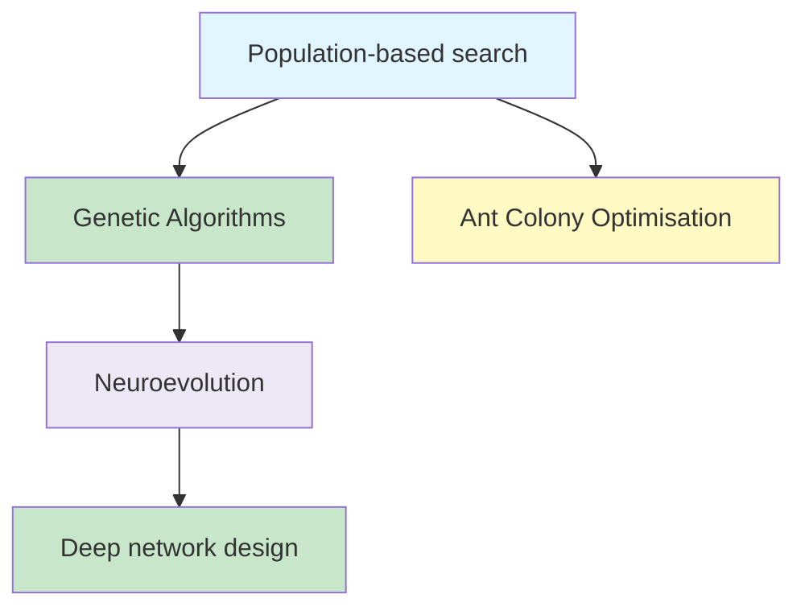
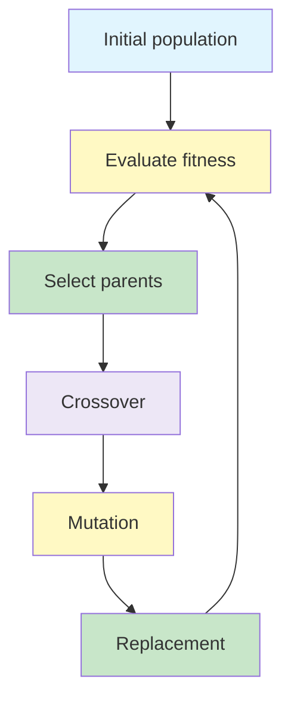

# Evolutionary and Population-Based Search

Population-based search explores with many candidate solutions at once. Genetic Algorithms evolve encoded solutions, Ant Colony Optimisation builds paths using collective pheromone signals, and neuroevolution applies evolutionary ideas to neural-network design.

## Learning Objectives

- explain the purpose of population-based search
- describe representation, fitness, selection, crossover and mutation
- trace the core Genetic Algorithm loop
- explain exploration and exploitation in Ant Colony Optimisation
- interpret the main ACO transition and pheromone-update equations
- distinguish NAS, NEAT, DeepNEAT and CoDeepNEAT

## Big Picture



## 1. Why Use a Population? ☆

A single-state method follows one candidate through the search space. A population-based method maintains several candidates in parallel.

This can:

- explore several regions simultaneously
- preserve alternative solutions
- combine useful parts of different candidates
- reduce dependence on one starting state

The additional exploration requires more computation than maintaining one state.

## 2. Genetic Algorithms ☆

A **Genetic Algorithm (GA)** is an evolutionary search method inspired by biological inheritance and natural selection.

The search begins with a population of candidate solutions. Candidates with better fitness are more likely to reproduce, and variation is introduced through crossover and mutation.

### Vocabulary

| Term | Meaning in a GA |
|---|---|
| Individual | One candidate solution |
| Population | Collection of candidate solutions |
| Chromosome | Encoded representation of a solution |
| Gene | One component of the representation |
| Fitness | Measure of solution quality |
| Generation | One cycle of evaluation and reproduction |

## 3. The Genetic Algorithm Cycle ☆



The process stops when a satisfactory fitness is reached, a generation limit is reached or improvement has stalled. A GA does not normally guarantee convergence to the global optimum.

## 4. Representation and Fitness

The representation must allow valid candidates to be created and modified.

For 8-Queens, a chromosome such as:

```text
[1, 4, 2, 2, 4, 2, 4, 2]
```

can record the row occupied by the queen in each column.

There are  \binom{8}{2}=28  pairs of queens, so one possible fitness function is the number of non-attacking pairs. A perfect arrangement has fitness 28.

## 5. Selection ☆

Selection chooses parents for reproduction. Fitter candidates should have more influence, but always selecting only the current best candidates can destroy diversity.

In **roulette-wheel selection**, the probability of selecting individual  i  is proportional to its fitness:

{}

P(i)=\frac{F(i)}{\sum_j F(j)}

{}

Higher fitness increases selection probability without guaranteeing selection.

## 6. Crossover and Mutation ☆

**Crossover** combines genetic material from two parents.

Common forms include:

- one-point crossover
- two-point crossover
- uniform crossover

**Mutation** randomly changes part of a chromosome. It introduces new variation and can restore values not currently present in the population.

{}
Selection exploits known good candidates. Mutation supports exploration. Crossover attempts to combine useful structures already discovered.
{}

## 7. Genetic Algorithm Strengths and Limitations

| Strength | Limitation |
|---|---|
| Explores multiple regions | Evaluating a population can be expensive |
| Works without gradients | Quality depends on representation and fitness |
| Handles complex, irregular spaces | Can converge prematurely |
| Produces approximate solutions | Does not guarantee the global optimum |

## 8. Ant Colony Optimisation ☆

**Ant Colony Optimisation (ACO)** is inspired by how ants collectively discover short routes using pheromone trails.

Artificial ants construct candidate routes. A route becomes more attractive when:

- it has stronger pheromone
- its edges have lower cost

Good routes receive reinforcement, while pheromone evaporation prevents early choices from dominating forever.

## 9. Constructing Routes in ACO ☆

Let:

-  \tau_{ij}  be pheromone on edge  (i,j) 
-  \eta_{ij}  be the desirability of that edge, commonly  1/d_{ij} 
-  \alpha  control the influence of pheromone
-  \beta  control the influence of edge desirability

For an unvisited candidate node  j , the transition probability is:

{}

p_{ij}^{k}=\frac{(\tau_{ij})^{\alpha}(\eta_{ij})^{\beta}}
{\sum_{h \notin visited_k}(\tau_{ih})^{\alpha}(\eta_{ih})^{\beta}}

{}

This probability balances collective experience with the immediate cost of an edge.

## 10. Updating Pheromone ☆

After routes are constructed, pheromone is updated through evaporation and reinforcement:

{}

\tau_{ij}^{new}=(1-\rho)\tau_{ij}^{old}+\sum_k \Delta\tau_{ij}^{k}

{}

where  0<\rho<1  is the evaporation coefficient.

A simple deposit rule is:

{}

\Delta\tau_{ij}^{k}=
\begin{cases}
Q/f_k, & \text{if ant } k \text{ used edge } (i,j)\\
0, & \text{otherwise}
\end{cases}

{}

Here,  f_k  is the route cost. A shorter route deposits more pheromone because  Q/f_k  is larger.

### Exploration and exploitation

- **Reinforcement** favours successful routes and supports exploitation.
- **Evaporation** weakens old trails and supports exploration.

## 11. Travelling Salesperson Problem with ACO

In the Travelling Salesperson Problem, each ant builds a tour that visits every city once and returns to the origin.

1. Place ants at starting cities.
2. Select unvisited cities using transition probabilities.
3. Complete each tour.
4. Evaluate tour costs.
5. Evaporate and deposit pheromone.
6. Repeat for further iterations.

Over time, short routes tend to receive stronger pheromone and become more likely.

## 12. Neural Architecture Search ☆

**Neural Architecture Search (NAS)** automates the design of neural-network architectures. The search may choose:

- layer types
- numbers of layers
- connections between layers
- filter sizes or units
- activation functions

The objective is to find an architecture that performs well without relying entirely on manual trial and error.

NAS can be viewed as a search problem with:

- a **search space** of possible architectures
- a **search strategy** that proposes architectures
- a **performance estimate** used as fitness

## 13. Neuroevolution

{}Neuroevolution uses evolutionary algorithms to evolve neural networks.{}

Its core loop is:

1. create a population of networks
2. train or evaluate each network
3. measure fitness
4. select better networks
5. apply crossover and mutation
6. repeat

This creates a bilevel process: evolution searches over architecture, while gradient-based learning may optimise each network's weights.

## 14. NEAT, DeepNEAT and CoDeepNEAT ☆

### NEAT

**NEAT** stands for NeuroEvolution of Augmenting Topologies. It begins with simple networks and gradually adds nodes and connections.

Key ideas include:

- innovation numbers to align related genes during crossover
- speciation to protect structurally different networks
- incremental growth from simple topologies

NEAT is effective for smaller networks but does not directly represent modern deep architectures well.

### DeepNEAT

**DeepNEAT** evolves deep networks at the layer level. A node in the evolutionary graph represents an entire layer, such as a convolutional, dense or LSTM layer, along with its hyperparameters.

### CoDeepNEAT

**CoDeepNEAT** co-evolves two populations:

- **modules** — reusable small network components
- **blueprints** — high-level patterns describing how modules are assembled

Selected modules are inserted into blueprint positions to construct complete networks. Their training performance supplies fitness feedback to the participating modules and blueprints.

| Method | Main unit evolved | Suitable scope |
|---|---|---|
| NEAT | Neurons and connections | Small evolving networks |
| DeepNEAT | Layers and layer connections | Deep architectures |
| CoDeepNEAT | Modules and blueprints | Modular deep architectures |

## Common Mistakes

{}
- A population contains candidate solutions, not several steps of one path.
- Selection is often probabilistic; the fittest individual is not necessarily the only parent.
- Crossover recombines existing material, while mutation introduces random changes.
- Strong pheromone makes a route more likely, not certain.
- NAS searches for architecture; ordinary gradient descent learns weights within a chosen architecture.
- A GA or ACO can find excellent approximate solutions without guaranteeing the global optimum.
{}

## Practice Questions

1. Why can a population explore more broadly than single-state hill climbing?
2. Represent an N-Queens candidate as a chromosome and define its fitness.
3. Explain selection, crossover and mutation using one continuous example.
4. Why is mutation important for maintaining diversity?
5. Explain the roles of  \tau ,  \eta ,  \alpha ,  \beta  and  \rho  in ACO.
6. How do evaporation and reinforcement balance exploration and exploitation?
7. What is the difference between architecture search and weight learning?
8. Compare NEAT, DeepNEAT and CoDeepNEAT.

## Key Takeaways

{}
- Population-based algorithms explore with multiple candidate solutions.
- Genetic Algorithms evolve candidates through fitness-based selection, crossover and mutation.
- ACO constructs routes using pheromone and edge desirability, then reinforces good routes while evaporating old trails.
- NAS automates neural architecture design, while neuroevolution uses evolutionary search to evolve networks.
- NEAT evolves connections, DeepNEAT evolves layers, and CoDeepNEAT co-evolves modules and blueprints.
{}

## Checklist

- [ ] I can explain the GA cycle and its vocabulary.
- [ ] I can distinguish selection, crossover and mutation.
- [ ] I can interpret ACO transition and pheromone-update formulas.
- [ ] I can explain exploration and exploitation in ACO.
- [ ] I can distinguish NAS from weight learning.
- [ ] I can compare NEAT, DeepNEAT and CoDeepNEAT.

---
 | 
