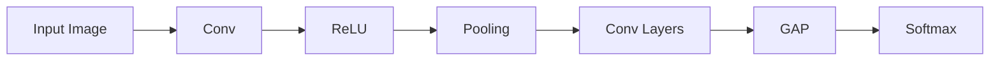
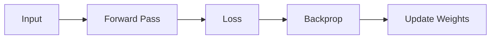

# Convolutional Neural Networks (CNN)

Convolutional Neural Networks are specialised neural networks designed for **grid-like data such as images**.

They exploit:
- Spatial structure
- Local connectivity
- Parameter sharing

---

# Image Representation

An image is represented as a tensor:

{}

X \in \mathbb{R}^{H \times W \times C}

{}

Where:
- H = height
- W = width
- C = channels

---

# Convolution Operation

A filter (kernel) slides over the image:

{}

Z(i,j) = \sum_{m}\sum_{n} X(i+m, j+n)K(m,n)

{}

- Produces a **feature map**
- Detects patterns like edges

---

# Stride and Padding

## Stride
Controls movement of filter

## Padding
Adds zeros to preserve size

{}

Output = \frac{N - F + 2P}{S} + 1

{}

---

# Activation Functions

## ReLU

{}

ReLU(x) = max(0, x)

{}

---

# Pooling

## Max Pooling
- Takes maximum value

## Average Pooling
- Takes mean

Reduces:
- Computation
- Overfitting

---

# Global Average Pooling (GAP)

Replaces flatten layer:

{}

y_k = \frac{1}{HW} \sum_{i,j} x_{i,j,k}

{}

Advantages:
- Fewer parameters
- Better generalisation

---

# CNN Architecture

---

# Loss Function (Classification)

## Cross Entropy

{}

L = - \sum y \log(\hat{y})

{}

---

# Backpropagation in CNN

Gradients computed via chain rule:

{}

\frac{\partial L}{\partial W}

{}

---

# Why CNN Works

- Local feature detection
- Translation invariance
- Hierarchical learning

---

# Deep CNN Architectures

## VGG
- Stacked 3x3 convolutions

## ResNet
- Skip connections

{}

y = F(x) + x

{}

## Inception
- Parallel convolutions

---

# Training Pipeline

---

# Summary

- CNNs process images using convolution
- Use pooling for reduction
- GAP replaces dense layers
- Deep architectures improve performance

---

 | 
