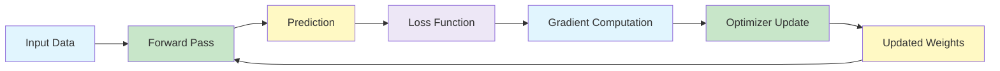
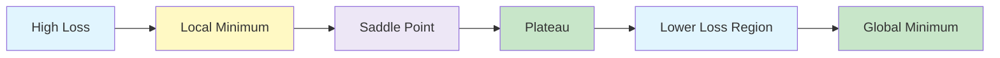

# Optimisation of Deep models

Optimisation is the process of finding the best values of the parameters of a deep neural network.

In a neural network, the parameters include weights and biases.
Training means repeatedly adjusting these parameters so that the loss becomes smaller.

{}
**Key takeaway:**  
A deep neural network does not usually learn by solving one closed-form equation.
It learns by using an iterative optimisation algorithm that repeatedly moves the parameters in a direction that reduces the loss.
{}

---

- Goal of Optimization 
- Optimization Challenges in Deep Learning 
- Gradient Descent 
- Stochastic Gradient Descent 
- Minibatch Stochastic Gradient Descent 
- Momentum 
- Adagrad and Algorithm 
- RMSProp and  Algorithm 
- Adadelta and  Algorithm 
- Adam and Algorithm 
- Code Implementation and comparison of algorithms  (webinar) 

---


flowchart TD
    A["Optimisers in DNN"] --> B["Gradient Descent Variants"]
    A --> C["Momentum-based Optimiser"]
    A --> D["Adaptive Methods"]
    A --> E["Learning Rate Schedules"]

    B --> B1["Batch Gradient Descent"]
    B --> B2["Stochastic Gradient Descent"]
    B --> B3["Mini-batch Gradient Descent"]

    C --> C1["SGD with Momentum"]

    D --> D1["Parameter-specific learning rates"]

    E --> E1["Learning rate changes during training"]

    style A fill:#E1F5FE,stroke:#4A90E2,stroke-width:2px
    style B fill:#EDE7F6,stroke:#7E57C2
    style C fill:#C8E6C9,stroke:#43A047
    style D fill:#FFF9C4,stroke:#FBC02D
    style E fill:#F8BBD0,stroke:#D81B60
	

---	

## Why Optimisation Matters ☆

The machine learning goal is to find the parameters that minimise the loss function.

{}

\theta^* = \arg\min_{\theta} \mathcal{L}(\theta)

{}

Here:

| Symbol | Meaning |
|---|---|
|  \theta  | all model parameters |
|  \mathcal{L}(\theta)  | loss function for the current parameters |
|  \theta^*  | best parameters found by optimisation |

Deep neural networks may contain millions or billions of parameters.
Because of this, it is usually not possible to compute the best parameters directly.
Instead, we use iterative algorithms such as gradient descent, mini-batch gradient descent, momentum, RMSProp, Adam, and learning rate schedules.

Without optimisation, the network keeps random weights, produces random predictions, and does not learn useful patterns.

## DNN Training Pipeline

The process repeats for many iterations.
Each iteration tries to reduce the loss by changing the parameters slightly.

## Loss Functions Review ☆

The loss function measures how wrong the model prediction is.
Different tasks use different loss functions.

| Loss Function | Formula | Gradient Form | Common Use |
|---|---|---|---|
| Mean Squared Error |  \frac{1}{2}(\hat{y} - y)^2  |  \hat{y} - y  | Regression |
| Mean Absolute Error |  \lvert \hat{y} - y \rvert  |  \operatorname{sign}(\hat{y} - y)  | Regression with outliers |
| Binary Cross-Entropy |  -[y\log(\hat{y}) + (1-y)\log(1-\hat{y})]  | similar to prediction minus target | Binary classification |
| Categorical Cross-Entropy |  -\sum_k y_k \log(\hat{y}_k)  | similar to prediction minus target | Multi-class classification |

{}
Many useful gradients have the intuitive form:

**prediction minus target**

This is one reason why backpropagation can efficiently compute updates across many layers.
{}

## Optimisation Challenges ☆

Training deep networks is difficult because the loss surface can be complicated.
The optimiser may face several problems.

### Saddle Points

A saddle point is a point where the gradient is close to zero, but the point is not a true minimum.
In some directions, the loss may increase.
In other directions, the loss may decrease.

{}

\nabla \mathcal{L}(\theta) \approx 0

{}

This can make the optimiser slow down even though a better solution exists nearby.

### Plateaus

A plateau is a flat region of the loss surface.
Gradients become very small, so parameter updates become tiny.
Learning then becomes very slow.

### Non-Convex Landscapes

Deep learning loss surfaces are usually non-convex.
This means there can be many local minima and saddle points.
There is usually no guarantee that training will find the global minimum.

## How to Identify Optimisation Problems ☆

During training, optimisation issues can be detected by looking at the loss curve, validation error, and gradient norms.

Common signs include:

- The loss curve flattens but validation error is still high.
- Gradient norms approach zero.
- Training progress stagnates for many epochs.
- Loss jumps around instead of decreasing smoothly.
- Training loss decreases, but validation loss becomes worse.

{}
A flat loss curve does not always mean the model has learned well.
It may also mean that the optimiser is stuck on a plateau, near a saddle point, or using an unsuitable learning rate.
{}

## Practical Interpretation

Optimisers decide how the model moves through the loss landscape.
A poor optimiser or a poor learning rate can make training slow, unstable, or completely unsuccessful.
A good optimiser can speed up training and make deep networks easier to train.

## Exam Notes ☆

Remember these points:

- The aim of optimisation is to minimise the loss function.
- Deep networks usually need iterative optimisation because closed-form solutions are not available.
- Gradients tell the optimiser which direction increases the loss most quickly.
- Gradient descent moves in the opposite direction of the gradient.
- Saddle points, plateaus, and non-convexity make optimisation difficult.
- The choice of loss function depends on the task type.
- The choice of optimiser affects convergence speed and stability.

---
  
## Reference
- **Dive into deep learning. Cambridge University Press.**. (Ch12)

---

 | 
