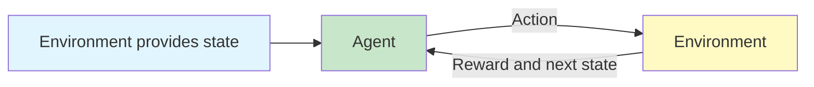

# Introducing Reinforcement Learning

Reinforcement Learning (RL) is a learning approach in which an **agent** improves its behaviour by interacting with an **environment** and observing the rewards produced by its actions.

Unlike supervised learning, the agent is not given a correct action label for every situation. It must discover useful behaviour through trial, feedback, and repeated interaction.

{}**Reinforcement learning is goal-oriented learning through interaction.**{}

---

## Why Reinforcement Learning?

RL is useful when decisions affect what happens next and the quality of an action may only become clear later.

Typical examples include:

- game playing;
- autonomous driving;
- robotics and control;
- resource allocation;
- healthcare decision support;
- recommendation or adaptive systems.

The supplied slides highlight three broad situations in which RL is useful:

1. a model of the environment is known, but an analytical solution is unavailable;
2. only a simulation of the environment is available;
3. the only practical way to learn about the environment is to interact with it.

{}

### Intuition

A supervised learner is shown the correct answer. An RL agent is shown the **consequence** of its decision and must work out which behaviour is best over time.
{}

---

## Reinforcement Learning Compared with Other Learning Paradigms ☆

| Feature | Supervised Learning | Unsupervised Learning | Reinforcement Learning |
|---|---|---|---|
| Main input | Labelled examples | Unlabelled examples | Interaction experience |
| Feedback | Correct target or label | No external target | Reward signal |
| Typical goal | Predict an output | Discover structure | Learn a sequence of actions |
| Decision effect | Usually independent predictions | Usually descriptive | Actions change future situations |
| Examples | Classification, regression | Clustering, association | Control, games, robotics |

{}
RL is **not a type of neural network**. It is a learning and decision-making framework. Neural networks can be used inside RL, producing Deep Reinforcement Learning.
{}

---

## Characteristics of Reinforcement Learning ☆

The course slides emphasise four characteristics:

- there is no direct supervision; the main feedback is a reward signal;
- decision-making is sequential;
- time plays an important role;
- feedback may be delayed rather than immediate.

These characteristics create the **credit assignment problem**: when a final result is good or bad, which earlier actions deserve credit or blame?

---

## The Agent-Environment Interaction ☆

At each time step:

1. the agent observes the current state;
2. the agent selects an action;
3. the environment changes;
4. the agent receives a reward and a new state;
5. the process repeats.

---

## Core Elements of Reinforcement Learning ☆

### Agent

The **agent** is the decision-maker that is trying to learn how to perform a task.

Example: a child learning to ride a bicycle, a robot learning to walk, or a game-playing program.

### Environment

The **environment** is the outside world with which the agent interacts.

It determines what happens after an action is taken.

### State

The **state** describes the agent's current situation.

For a board game, the state may be the current board arrangement. For a robot, it may include position, velocity, and sensor readings.

### Action

An **action** is a choice available to the agent at a particular time.

For a game-playing agent, actions might include moving left, moving right, jumping, or remaining still.

### Reward

A **reward** is the numerical feedback produced after an action.

A positive reward encourages behaviour associated with a useful outcome. A negative reward discourages behaviour associated with an undesirable outcome.

### Policy

A **policy** describes how the agent selects actions in different situations.

{}

\pi(a \mid s) = \Pr(A_t = a \mid S_t = s)

{}

The expression says that the policy assigns a probability to choosing action  a  when the agent is in state  s .

### Value Function

A **value function** estimates how good it is to be in a state, or to take an action in a state, considering future rewards.

Reward is immediate feedback. Value is a longer-term judgement.

### Model of the Environment

A **model** predicts how the environment will respond to an action.

A model may predict:

- the next state;
- the reward;
- or a probability distribution over possible outcomes.

A model is optional: some RL methods learn directly from experience without one.

---

## Reward versus Value ☆

| Concept | Main question | Time perspective |
|---|---|---|
| Reward | "What feedback did I receive now?" | Immediate |
| Value | "How promising is this situation for the future?" | Long term |

{}
A state may produce a small immediate reward but still have high value if it leads to much better future outcomes.
{}

---

## Example: Learning Tic-Tac-Toe

The lecture uses Tic-Tac-Toe to show how an agent can learn state values through repeated games.

A simple initialisation is:

- unknown non-terminal states: value  0.5 ;
- winning terminal state: value  1 ;
- losing terminal state: value  0 .

The agent plays many games and gradually updates the estimated values of visited states.

### Value Update Rule ☆

{}

V(S_t) \leftarrow V(S_t) + \alpha \left[V(S_{t+1}) - V(S_t)\right]

{}

Where:

-  V(S_t)  is the current estimate;
-  V(S_{t+1})  is the estimate of the next state;
-  \alpha  is the step-size or learning-rate parameter.

The update moves the old estimate towards the value of the next state.

{}
### Intuition

If the next state looks better than expected, increase the value of the current state. If it looks worse, decrease it.
{}

---

## Exploitation and Exploration in Tic-Tac-Toe

A learning agent normally needs both:

- **exploitation** - choose moves leading to states with the highest current values;
- **exploration** - occasionally try another move to discover whether the current estimates are wrong.

A purely greedy player may stop improving because it repeatedly chooses the first strategy that appears successful.

---

## Understanding the Step Size ☆

The slides ask what happens under different choices of  \alpha .

| Step-size behaviour | Practical effect |
|---|---|
| Gradually approaches zero | Estimates become stable; later experience has little influence |
| Decreases but remains positive | Learning slows but continues |
| Remains constant | The agent continues adapting to new experience |

{}
A very large step size can make learning unstable. A very small step size can make learning extremely slow.
{}

---

## Policy, Value, Reward, and Model - Do Not Confuse Them ☆

| Element | Role |
|---|---|
| Reward | Immediate feedback |
| Value | Expected longer-term usefulness |
| Policy | Rule or probability distribution for choosing actions |
| Model | Prediction of the environment's response |

---

## Practical Interpretation

Consider an autonomous-driving agent:

- **state:** vehicle speed, lane position, nearby vehicles, traffic lights;
- **action:** accelerate, brake, steer, or maintain speed;
- **reward:** progress, safety, comfort, and rule compliance;
- **policy:** mapping from road situations to driving actions;
- **value:** expected long-term quality of being in a particular traffic situation;
- **model:** prediction of how the road scene may change after an action.

This example shows why RL is a sequential problem: one steering or braking decision changes the situations that follow.

---

## Common Mistakes ☆

{}
- Treating reward and value as the same concept.
- Assuming the agent is given the correct action after every decision.
- Thinking RL always requires a neural network.
- Optimising only the immediate reward rather than future consequences.
- Using a purely greedy policy and assuming exploration is unnecessary.
{}

---

## Summary ☆

Be able to explain:

1. what reinforcement learning is;
2. how RL differs from supervised and unsupervised learning;
3. the agent-environment interaction loop;
4. the meaning of state, action, reward, policy, value, and model;
5. why delayed feedback makes RL difficult;
6. how the Tic-Tac-Toe state-value update works;
7. why exploration is required.

{}
**Key takeaway:** RL learns behaviour from consequences. The agent repeatedly acts, observes rewards and new states, updates its knowledge, and improves its policy.
{}

---

## References

1. Sutton and Barto, *Reinforcement Learning: An Introduction*, Chapter 1.
2. BITS Pilani Deep Reinforcement Learning course handout, Contact Session 1.
3. Supplied lecture slides, Session 1: Introduction to the Course and Introducing Reinforcement Learning.

---
 | 
