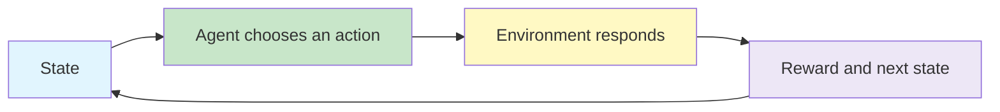

# Deep Reinforcement Learning

Deep Reinforcement Learning (DRL) studies how an **agent** can learn to make a sequence of decisions by interacting with an **environment** and receiving feedback in the form of rewards.

Reinforcement learning provides the decision-making framework. Deep learning later provides powerful function approximators for problems where states, actions, or observations are too large to represent in tables.

{}

> Deep Reinforcement Learning = Reinforcement Learning + Deep Neural Networks

Establish the classical reinforcement learning foundations needed before introducing deep value-based and policy-based methods.
{}

---

Move from the simplest decision problem - choosing one action repeatedly - towards full sequential decision-making with states, returns, policies, value functions, and learning from experience.

---

## Conceptual View

A reinforcement learning system repeatedly follows this cycle:

The agent's goal is not merely to obtain the largest immediate reward. It must learn behaviour that produces a strong **cumulative reward over time**.

---

## Learning Outcomes

- explain the agent-environment interaction used in reinforcement learning;
- distinguish rewards, returns, policies, value functions, and environment models;
- formulate finite sequential decision problems as Markov Decision Processes;
- compare Dynamic Programming, Monte Carlo, and Temporal-Difference learning;
- distinguish on-policy from off-policy learning;
- distinguish model-based from model-free approaches;
- implement classical tabular reinforcement learning algorithms;
- build the conceptual foundation required for Deep Q-Networks and policy-gradient methods.

---

## Sections

| Session | Topic | Main focus | File |
|---:|---|---|---|
| 1 | Introducing Reinforcement Learning | Agent, environment, state, action, reward, policy, value, model, Tic-Tac-Toe | `010-intro-to-reinforcement-learning.md` |
| 2 | Multi-Armed Bandit Problem | Action values, exploration versus exploitation, incremental updates, gradient bandits | `020-multi-armed-bandit-problem.md` |
| 3 | Markov Decision Processes | Goals, rewards, returns, policies, value functions, Bellman equations | `030-markov-decision-processes.md` |
| 4 | Dynamic Programming | Policy evaluation, policy iteration, value iteration, generalised policy iteration | `040-dynamic-programming.md` |
| 5 | Monte Carlo Methods I | On-policy prediction and control, first-visit and every-visit methods | `050-monte-carlo-methods-i.md` |
| 6 | Monte Carlo Methods II | Off-policy learning, importance sampling, prediction and control | `060-monte-carlo-methods-ii.md` |
| 7 | Temporal-Difference Learning I | TD(0), SARSA, Q-Learning, Expected SARSA | `070-temporal-difference-learning-i.md` |
| 8 | Temporal-Difference Learning II and DRL Taxonomy | n-step returns, TD(lambda), model/value/policy and on/off-policy classifications | `080-temporal-difference-learning-ii-drl-taxonomy.md` |

---

## How the Classical Methods Fit Together

| Method | Needs an environment model? | Learns from complete episodes? | Bootstraps from estimates? |
|---|---:|---:|---:|
| Dynamic Programming | Yes | No | Yes |
| Monte Carlo | No | Yes | No |
| Temporal-Difference | No | No | Yes |

---

## Course References

1. Richard S. Sutton and Andrew G. Barto, *Reinforcement Learning: An Introduction*, Second Edition, MIT Press.
2. Laura Graesser and Wah Loon Keng, *Foundations of Deep Reinforcement Learning: Theory and Practice in Python*.
3. BITS Pilani Deep Reinforcement Learning course handout and supplied lecture slides.

---
 | 