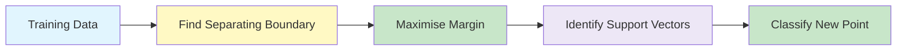
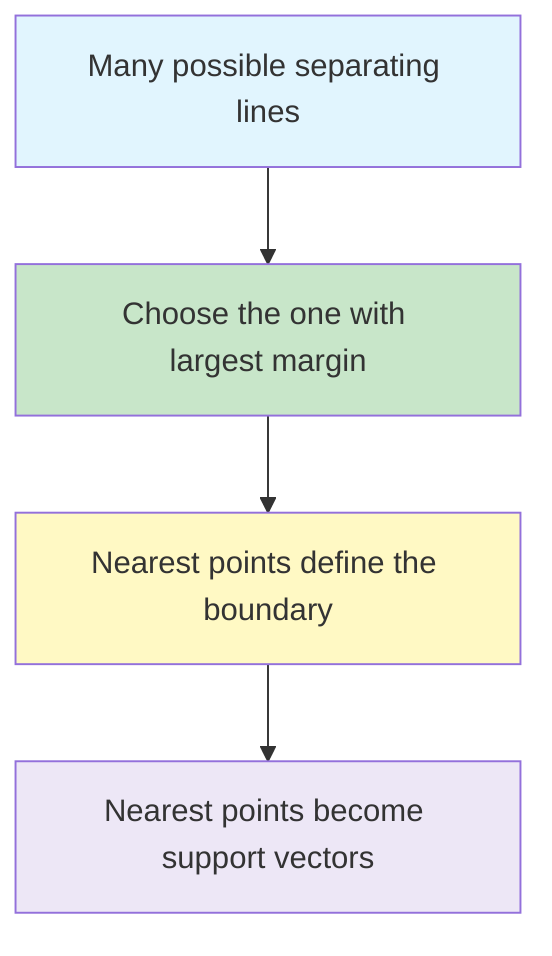
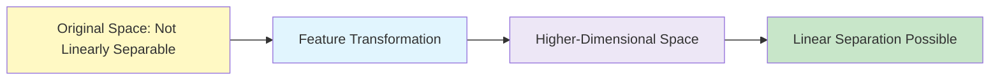

# Support Vector Machine (SVM)

**Support Vector Machine (SVM)** is a **supervised machine learning algorithm** used for:

- **Classification** (most common)
- **Regression** (SVR – Support Vector Regression)

It connects many earlier ideas:

- classification and decision boundaries
- linear classifiers
- margins
- optimisation
- constrained optimisation
- kernels for non-linear data

SVM is a **discriminative classifier**.

That means it does not try to model how each class is generated.

Instead, it tries to find the **best separating boundary** between classes.

{}
**Key takeaway:**  
SVM tries to find a decision boundary that separates the classes with the **largest possible margin**.

The training points that decide this margin are called **support vectors**.
{}

---

## Where SVM Fits in Machine Learning ☆

In supervised learning, we normally work with input-output pairs.

For classification, the output is categorical.

For example:

| Input features | Target |
|---|---|
| CGPA, entrance score | admission: yes / no |
| tumour size, cell shape | benign / malignant |
| email words | spam / not spam |

SVM is commonly introduced for **binary classification**, where the target has two classes.

The two classes are often represented as:

{}

y \in \{-1, +1\}

{}

For multiclass classification, SVM can be extended using strategies such as:

- one-vs-rest
- one-vs-one



The central question in SVM is:

> If many boundaries can separate the classes, which one should we choose?

SVM answers:

> Choose the boundary with the **maximum margin**.

---

## Decision Boundary ☆

A linear classifier separates classes using a line in 2D, a plane in 3D, or a hyperplane in higher dimensions.

The decision boundary is written as:

{}

w^T x + b = 0

{}

Where:

| Symbol | Meaning |
|---|---|
| x | input feature vector |
| w | weight vector, perpendicular to the boundary |
| b | bias or intercept |
| w^T x + b | score used for classification |

The class is predicted using the sign of the score:

{}

f(x) = \operatorname{sign}(w^T x + b)

{}

If the score is positive, classify the point as +1.

If the score is negative, classify the point as −1.

---

## Why Not Just Any Separating Line?

For linearly separable data, there may be many possible decision boundaries.

Some boundaries separate the classes but pass very close to the training points.

That is risky because a small change in the input may cause misclassification.

SVM prefers the boundary that is **furthest away from the nearest points of both classes**.

This gives better generalisation.



---

## Margin ☆

The **margin** is the distance between the decision boundary and the nearest training points.

SVM uses two margin boundaries:

{}

w^T x + b = +1

{}

{}

w^T x + b = -1

{}

The decision boundary lies in the middle:

{}

w^T x + b = 0

{}

The margin width is:

{}

\text{Margin Width} = \frac{2}{\|w\|}

{}

Therefore, maximising the margin is equivalent to minimising the size of w.

---

## Support Vectors ☆

**Support vectors** are the training points closest to the decision boundary.

They lie on or near the margin boundaries.

They are called support vectors because they **support** or **define** the final hyperplane.

If a non-support-vector point is moved slightly, the boundary may not change.

If a support vector is moved, the boundary can change significantly.

{}
In exams, remember this line:

**Support vectors are the critical training points that determine the maximum-margin hyperplane.**
{}

---

## Hard Margin SVM ☆

A **hard margin SVM** assumes the data is perfectly linearly separable.

No data point is allowed inside the margin or on the wrong side of the boundary.

The condition is:

{}

y_i(w^T x_i + b) \ge 1

{}

This means:

- positive points must be on the positive side
- negative points must be on the negative side
- all points must be outside the margin

The optimisation problem is:

{}

\min_{w,b} \frac{1}{2}\|w\|^2

{}

subject to:

{}

y_i(w^T x_i + b) \ge 1

{}

Why minimise \frac{1}{2}\|w\|^2?

Because maximising the margin \frac{2}{\|w\|} is equivalent to minimising \|w\|.

The square and the factor \frac{1}{2} make the mathematics easier during differentiation.

---

## Hard Margin Intuition

| Situation | Hard Margin Behaviour |
|---|---|
| Classes are perfectly separable | Works well |
| No outliers | Good choice |
| Classes overlap | Fails or gives poor boundary |
| Data has noise | Too strict |

Hard margin is useful for understanding the core mathematics of SVM.

In real data, soft margin SVM is usually more practical.

---

## Lagrange Multiplier View ☆

SVM is a constrained optimisation problem.

To solve it, we can use Lagrange multipliers.

The important result is that the weight vector can be written as:

{}

w = \sum_i \alpha_i y_i x_i

{}

Where:

| Symbol | Meaning |
|---|---|
| \alpha_i | Lagrange multiplier for training point i |
| y_i | class label, usually +1 or −1 |
| x_i | training data point |

A very important interpretation is:

{}
Only training points with non-zero \alpha_i become support vectors.

Most other training points have \alpha_i = 0, so they do not directly affect the final decision boundary.
{}

Once w is known, the bias can be calculated using any support vector:

{}

b = y_i - w^T x_i

{}

The classifier becomes:

{}

f(x) = \operatorname{sign}\left(\sum_i \alpha_i y_i (x_i^T x) + b\right)

{}

The term x_i^T x is a dot product between a training point and a new test point.

This dot product becomes important when we discuss kernels.

---

## Soft Margin SVM ☆

Real-world data is often noisy.

The classes may overlap.

A strict hard margin may not be possible.

Soft margin SVM allows some violations using slack variables.

The soft margin constraint is:

{}

y_i(w^T x_i + b) \ge 1 - \xi_i

{}

Where \xi_i is the slack variable.

It measures how much a point violates the margin.

The soft margin objective is:

{}

\min_{w,b} \frac{1}{2}\|w\|^2 + C\sum_i \xi_i

{}

Where C controls the penalty for margin violations.

---

## Role of C in Soft Margin SVM ☆

The hyperparameter C controls the trade-off between:

- large margin
- low training error

| Value of C | Behaviour | Interpretation |
|---|---|---|
| Small C | Allows more violations | Wider margin, more tolerance |
| Large C | Penalises violations strongly | Narrower margin, tries to classify training data correctly |

{}
Low C means the model is more tolerant of misclassification.

High C means the model tries harder to avoid training errors.
{}

A very large C can overfit noisy data.

A very small C can underfit.

---

## Hinge Loss

Soft margin SVM is closely related to hinge loss.

For one training example, hinge loss is:

{}

\max(0, 1 - y_i(w^T x_i + b))

{}

Interpretation:

| Condition | Hinge Loss |
|---|---|
| Correct and outside margin | 0 |
| Correct but inside margin | Positive loss |
| Misclassified | Larger positive loss |

SVM does not only care whether a point is classified correctly.

It also cares whether the point is classified with enough margin.

---

## Linearly Separable Data ☆

Data is linearly separable when a straight line or hyperplane can separate the classes.

For example, in two dimensions, a single line can separate positive and negative points.

A linear SVM is suitable when this is possible.

{}

w^T x + b = 0

{}

The aim is to choose the line with the maximum margin.

---

## Non-Linearly Separable Data ☆

Data is non-linearly separable when no straight line can separate the classes properly.

For example, one class may surround another class in a circular pattern.

In the original input space, a linear boundary fails.

The key idea is:

> Map the data into a higher-dimensional feature space where it may become linearly separable.

Example transformation:

{}

x \mapsto (x, x^2)

{}

In the original space, the boundary may be curved.

In the transformed space, the boundary can become linear.



---

## Kernel Trick ☆

Mapping data explicitly into a high-dimensional space can be computationally expensive.

The **kernel trick** avoids computing the transformed features directly.

Instead, it computes the dot product in the transformed space using a kernel function.

If \phi(x) is a transformation into a higher-dimensional space, then:

{}

K(x_i, x_j) = \phi(x_i)^T\phi(x_j)

{}

This means SVM can behave as if it is working in a higher-dimensional space without explicitly constructing all the transformed features.

The classifier becomes:

{}

f(x) = \operatorname{sign}\left(\sum_i \alpha_i y_i K(x_i, x) + b\right)

{}

---

## Common Kernel Functions ☆

| Kernel | Formula | When Useful |
|---|---|---|
| Linear | K(x_i,x_j)=x_i^T x_j | linearly separable or high-dimensional sparse data |
| Polynomial | K(x_i,x_j)=(x_i^T x_j+c)^d | curved boundaries with polynomial structure |
| RBF / Gaussian | K(x_i,x_j)=\exp(-\gamma\|x_i-x_j\|^2) | complex non-linear boundaries |
| Sigmoid | K(x_i,x_j)=\tanh(\alpha x_i^T x_j+c) | neural-network-like similarity behaviour |

The RBF kernel is popular because it can model very flexible non-linear decision boundaries.

---

## Mercer Condition

Not every similarity function is a valid SVM kernel.

A kernel should correspond to an inner product in some feature space.

Mercer's condition gives the mathematical requirement for a valid kernel.

A practical way to remember it:

{}
A valid kernel must produce a kernel matrix that behaves like a proper inner-product matrix.

In simple terms, the kernel matrix should be symmetric and positive semi-definite.
{}

For a set of training points, the kernel matrix is:

{}

K_{ij} = K(x_i, x_j)

{}

A valid kernel should satisfy:

{}

K(x_i, x_j) = K(x_j, x_i)

{}

and should be positive semi-definite.

---

## Linear SVM vs Kernel SVM

| Aspect | Linear SVM | Kernel SVM |
|---|---|---|
| Boundary | straight line / hyperplane | curved boundary in original space |
| Feature space | original features | implicit transformed features |
| Speed | faster | usually slower |
| Interpretability | easier | harder |
| Best for | linearly separable or high-dimensional sparse data | non-linear class patterns |

---

## Structured and Unstructured Data Applications

SVM can be used with both structured and unstructured data.

### Structured Data

Structured data is usually tabular.

Examples:

- medical diagnosis from patient attributes
- loan approval using income, credit score and account history
- customer churn prediction
- admission prediction using scores and profile attributes

For structured data, features are already in columns.

SVM can directly use numerical feature vectors after preprocessing and scaling.

### Unstructured Data

Unstructured data includes text, images, audio and documents.

SVM cannot directly process raw text or raw images.

They must first be converted into feature vectors.

Examples:

| Data Type | Feature Representation | SVM Use |
|---|---|---|
| Text | bag-of-words, TF-IDF, embeddings | spam detection, sentiment classification |
| Images | HOG, SIFT, CNN embeddings | object recognition, face detection |
| Documents | TF-IDF, topic vectors | document classification |
| Audio | MFCC features | speaker or sound classification |

SVM often performs well when the number of features is large, especially in text classification.

---

## Why Feature Scaling Matters ☆

SVM depends on distances, dot products and margins.

If one feature has a much larger scale than another, it can dominate the decision boundary.

For example:

| Feature | Range |
|---|---|
| Age | 18 to 80 |
| Income | 10,000 to 500,000 |

Income may dominate the classifier unless scaling is applied.

Common scaling methods:

- standardisation
- min-max normalisation

{}
For SVM, feature scaling is usually essential.

Always fit the scaler on the training data only, then transform both training and test data.
{}

---

## Worked Mini Example ☆

Suppose an SVM has learned:

{}

w = (1, -1), \quad b = -0.5

{}

For a new point:

{}

x = (2, 1)

{}

Compute the score:

{}

w^T x + b = (1)(2) + (-1)(1) - 0.5 = 0.5

{}

Since the score is positive:

{}

f(x) = +1

{}

So the new point is classified as the positive class.

---

## SVM Compared with Logistic Regression

| Feature | Logistic Regression | SVM |
|---|---|---|
| Main output | probability | class boundary / score |
| Main idea | estimate probability using sigmoid | maximise margin |
| Boundary | usually linear unless features are transformed | linear or kernel-based non-linear |
| Loss | log loss | hinge loss |
| Outlier sensitivity | can be affected | soft margin controls effect through C |
| Interpretability | probability is easier to explain | margin-based explanation |

Logistic regression is useful when probability interpretation matters.

SVM is useful when a strong separating boundary is more important.

---

## SVM Compared with Decision Trees

| Feature | Decision Tree | SVM |
|---|---|---|
| Decision boundary | axis-aligned splits | maximum-margin hyperplane |
| Interpretability | high for small trees | moderate to low |
| Feature scaling | usually not required | important |
| Non-linear data | handled by tree splits | handled by kernels |
| Overfitting control | pruning, depth, minimum samples | C, kernel choice, \gamma |

---

## Practical Scikit-Learn Example

```python
from sklearn.model_selection import train_test_split
from sklearn.preprocessing import StandardScaler
from sklearn.svm import SVC
from sklearn.metrics import accuracy_score, classification_report
from sklearn.pipeline import Pipeline

# X = input features, y = class labels
X_train, X_test, y_train, y_test = train_test_split(
    X,
    y,
    test_size=0.2,
    random_state=42,
    stratify=y
)

model = Pipeline([
    ("scaler", StandardScaler()),
    ("svm", SVC(kernel="rbf", C=1.0, gamma="scale"))
])

model.fit(X_train, y_train)
y_pred = model.predict(X_test)

print("Accuracy:", accuracy_score(y_test, y_pred))
print(classification_report(y_test, y_pred))
```

The pipeline is important because scaling must be learned only from the training data.

---

## Common Exam Questions ☆

### 1. Define SVM

SVM is a supervised discriminative classifier that finds the maximum-margin decision boundary between classes.

### 2. What are support vectors?

Support vectors are the training points closest to the decision boundary.

They determine the final hyperplane and margin.

### 3. What is the difference between hard margin and soft margin?

Hard margin does not allow any violation.

Soft margin allows some violations using slack variables and controls the penalty through C.

### 4. What is the kernel trick?

The kernel trick computes dot products in a transformed feature space without explicitly computing the transformation.

### 5. Why is SVM useful for non-linear data?

Kernel SVM can map data implicitly into a higher-dimensional feature space where a linear separator may exist.

---

## Common Mistakes

| Mistake | Correction |
|---|---|
| Thinking SVM only draws any separating line | SVM chooses the maximum-margin separator |
| Forgetting support vectors | Support vectors define the margin and boundary |
| Using hard margin for noisy data | Use soft margin with suitable C |
| Forgetting scaling | Scale features before SVM training |
| Thinking kernels explicitly create features | Kernel trick avoids explicit transformation |
| Treating SVM output as probability by default | SVM gives a decision score unless probability calibration is enabled |

---

## Quick Revision Summary

- SVM is mainly a supervised classification algorithm.
- It is a discriminative classifier.
- It finds the best decision boundary by maximising the margin.
- Support vectors are the closest points to the boundary.
- Hard margin assumes perfect separability.
- Soft margin allows violations using slack variables.
- C controls the trade-off between margin width and training error.
- Kernel trick helps SVM handle non-linear data.
- Linear, polynomial and RBF are common kernels.
- Feature scaling is very important for SVM.

---

## References

- Course handout: Module 7, Support Vector Machines.
- Lecture transcript: Support Vector Machine sessions by Prof. Indumathi Prabakeran.
- Course slides: Instance-based Learning and SVM transition material.
- C. J. C. Burges, *A Tutorial on Support Vector Machines for Pattern Recognition*.

---
 | 
